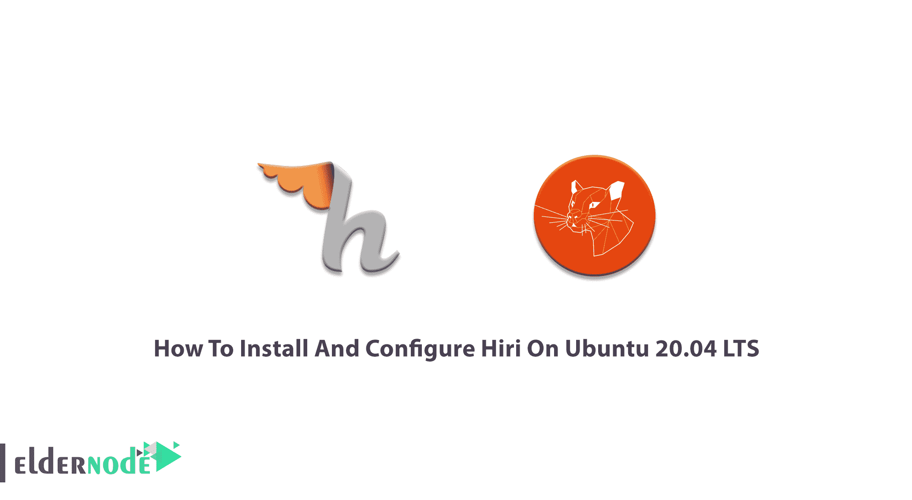
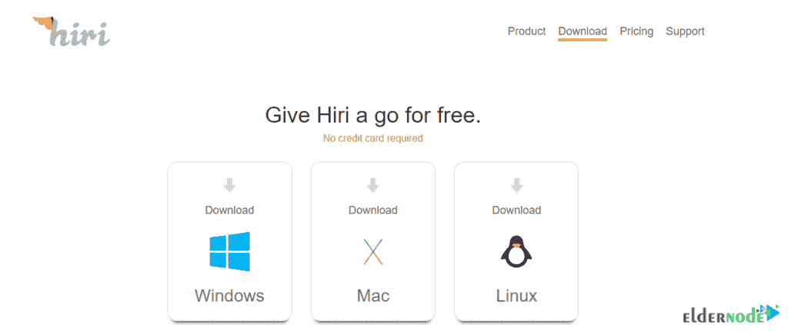

# 如何在 Ubuntu 20.04 上安装和配置 Hiri LTS-elder node 博客

> 原文：<https://blog.eldernode.com/install-and-configure-hiri-on-ubuntu-20-04/>



从节省时间的角度来说，在 Windows 中管理程序，Hiri 是最好的。虽然起初，这个应用程序主要是为商业用户做的，但家庭用户也很欣赏它的高效功能。Hiri 支持 Hotmail、Outlook 和 Exchange 等微软电子邮件服务。管理、阅读和回复邮件需要时间，Hiri 是一个理想的解决方案。使用智能仪表板，您可以查看有多少邮件尚未阅读，以及在查看之前需要等待多长时间。在这篇文章中。你将学习如何**在 LTS 的 Ubuntu 20.04** 上安装和配置 Hiri。成为幸运的顾客，用 2021 年 [Eldernode](https://eldernode.com/) 的优惠购买您自己的 [Linux VPS](https://eldernode.com/linux-vps/) 。

为了让本教程更好地发挥作用，请考虑以下**先决条件**:

拥有 sudo 权限的非 root 用户。

要进行设置，请遵循我们在 Ubuntu 20.04 上的[初始服务器设置。](https://blog.eldernode.com/initial-server-setup-on-ubuntu-20/)

## **教程在 Ubuntu 20.04 上安装配置 Hiri LTS**

使用 Hiri，你可以收发电子邮件和管理日历。您可以用现有的电子邮件客户端和日历应用程序来替换它。Hiri 支持 Windows、Mac 和 Linux。推荐你从 [Hiri 官网](https://www.hiri.com/download/)免费下载。



接下来，你将学习安装 Hiri snap。由于 Hiri 可以作为 snap 包在 [Linux](https://blog.eldernode.com/tag/linux/) 上获得，如果你的发行版支持 snap，你需要安装 Hiri。如果没有，应该下载并使用 tarball 归档文件。你将永远运行最新的稳定版本的 Hiri，因为你安装的所有快照每天都会自动更新。

### **在 Ubuntu 20.04 上安装 Hiri**

使用 Hiri 作为最佳电子邮件管理解决方案，组织您的收件箱、设置提醒并提高电子邮件效率。让我们通过这个指南的步骤来看看 Hiri 在 [Ubuntu](https://blog.eldernode.com/tag/ubuntu/) 上的安装过程。

*第一步:*

Snap 默认安装在 Ubuntu 20.04 上。但是，您可以通过运行以下命令在其他版本上安装:

```
sudo apt-get install snapd
```

*第二步:*

要安装快照软件包，请键入:

```
sudo snap install hiri
```

*第三步:*

你必须安装 *snaped-xdg-open* 才能打开邮件中的链接。要在 Ubuntu 上做到这一点，请使用以下命令:

```
sudo apt-get install snapd-xdg-open
```

***注意*** :当你没有运行 Ubuntu 时，检查你的发行版上是否存在这个包。

第四步:

要运行该应用程序，请在终端上键入 hiri。此外，您可以使用桌面启动器来完成此操作。

### **如何从 tarball 安装 Hiri**

因为下载包包含了 Hiri 的二进制构建，其中包含了所有的依赖项，所以您不需要安装其他任何东西。正如我们提到的，你也可以从 tarball 安装 Hiri。为此，您需要首先下载 tarball。所以，去[下载页面](https://www.hiri.com/download/)下载安装文件 Hiri.tar.gz。然后，在您的系统上提取它。

毕竟，打开一个终端，导航到文件夹(你解压 Hiri 的地方)。使用以下命令启动 Hiri。

```
cd ~/Downloads
```

```
tar xf Hiri.tar.gz
```

```
cd hiri
```

```
./hiri.sh
```

此外，要更容易地启动 Hiri，请通过以下方式从 Hiri 创建一个桌面条目:

设置>通用>创建桌面条目。

就是这样！现在，你应该在你的桌面启动器中看到 Hiri 图标。

## **结论**

在本文中，您学习了如何在 Ubuntu 20.04 LTS 版上安装和配置 Hiri。你可以把它安装在你的 Ubuntu 服务器上，享受它所有的出色功能，比如文件夹管理、对话视图和集成任务管理器。如果您有兴趣阅读更多内容，请在[教程中将 Cpanel 电子邮件帐户连接到 Gmail](https://blog.eldernode.com/tutorial-connect-cpanel-email-account-to-gmail/) 上找到我们的相关文章。