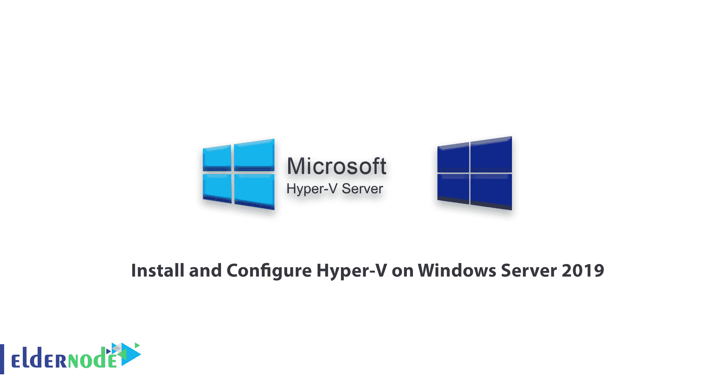

# 如何在 Windows Server 2019 上安装和配置 Hyper-V-elder node

> 原文：<https://blog.eldernode.com/install-and-configure-hyper-v-on-windows/>

如何在 [Windows Server 2019](https://eldernode.com/tag/windows-server-2019/) 上安装配置 [Hyper-V](https://en.wikipedia.org/wiki/Hyper-V) 。Hyper-V 是一款轻量级且功能强大的[微软](https://www.microsoft.com/)产品，在 Windows Server 上使用。这个**功能**只需点击几下就可以安装。安装完成后，你可以在上面轻松运行虚拟机。

**注意**在 Hyper-V 上安装虚拟机和在 [Windows Server 2012](https://eldernode.com/tag/windows-server-2012/) 和 [2016](https://eldernode.com/tag/windows-server-2016/) 上安装完全一样。需要注意的是桌面版的功能与 [Windows Server](https://eldernode.com/tag/windows-server/) 的版本类似。

在本文中，我们将教大家如何在 Windows Server 2019 中安装和配置 Hyper-V。请继续关注我们的这篇文章。

[**在 Eldernode**](https://eldernode.com/windows-vps/) 选择您的完美 Windows 虚拟专用服务器包

### 1。运行服务器管理器

按下键盘上的 Windows 键，键入服务器管理器并搜索。然后**运行**它。

打开服务器管理器后，点击**添加角色和功能**。然后在如下所示的下一个窗口中点击下一个。

*****

### 2。基于角色或基于功能的安装

在下一个**窗口选择安装类型**，选择基于角色或基于功能的安装按钮，然后点击下一步。

### 3。选择目的服务器

在此窗口中选择您希望**安装 Hyper-V** 的服务器。之后点击下一步。

### 4。选择 Hyper-V 服务器角色

该窗口为您提供了一个列表，其中包含许多您可以添加到服务器中的角色。既然你需要 Hyper-V ，那就选择 Hyper-V 盒子吧。

完成后点击下一个。

### 5。添加功能

点击**步骤 4** 上的下一步将弹出一个小窗口。在上面，只需点击添加功能选项卡，完成后点击下一步。

*

在接下来的两个连续窗口中点击下一个。

*

### 6。创建虚拟交换机

**虚拟交换机**使得虚拟机能够相互对话。

在这一步中，我们将**创建**一个，并将其与物理网络链接。

在您的物理主机服务器上选择**一个或多个可用的物理网络**。

### 7。虚拟机迁移

虚拟机的**配置**取决于你有没有集群。

在此步骤中，我们将保留默认值，因为它是一台独立的主机。

点击下一个的。

8。默认店铺

### 在这一步，你必须指定 Hyper-V 在哪里存储 **虚拟硬盘文件**和**虚拟机配置文件**。

完成后点击下一个。

9。确认步骤

### 为了**确认**您的安装选择，请确认您希望安装的所有内容是否出现在该窗口的列表中。

然后点击安装。

*

安装完成后，点击关闭。

最后，重启你的服务器。

**亦作，见:**

[1。 Windows Server 2019 安装配置教程](https://eldernode.com/windows-server-2019-install-and-config/)

[2。如何在 Windows Server 2019 上安装 Active Directory](https://eldernode.com/install-active-directory-on-windows-server/)

[3。教程在 Windows IIS Server 2019 上配置虚拟目录](https://eldernode.com/configure-virtual-directory-on-windows-server/)

[4。如何在 Windows Server 2019 上安装和配置 OpenSSH 服务器](https://eldernode.com/install-and-configure-openssh-server-on-windows-server/)

[5。教程在 Windows Server 2019 上启用 RDP](https://eldernode.com/enable-rdp-on-windows-server-2019/)

**尊敬的用户**，我们希望您能喜欢这个[教程](https://eldernode.com/category/tutorial/)，您可以在评论区提出关于本次培训的问题，或者解决[老年人节点培训](https://eldernode.com/blog/)领域的其他问题，请参考[提问页面](https://eldernode.com/ask)部分，并尽快提出您的问题。腾出时间给其他用户和专家来回答你的问题。

好运。

Goodluck.