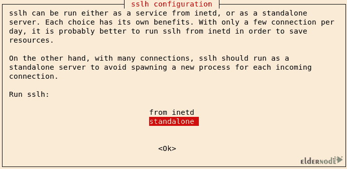

# 如何在 VPS - Eldernode 博客上安装和配置 Kali Linux

> 原文：<https://blog.eldernode.com/install-and-configure-kali-linux-on-vps/>


逐步了解如何在 VPS 上安装和配置 kali linux。Kali Linux 是基于 Debian 的 Linux 发行版，旨在开发渗透测试和识别各种计算机系统中的漏洞。Kali Linux 操作系统包括数百种不同的工具，用于执行安全测试和侵入计算机系统，每种工具都具有强大的功能和特殊的功能。这个强大的操作系统具有非常高的渗透能力，所有在黑客和安全领域工作的人都应该完全熟悉这个操作系统及其各种工具。在这篇文章中，我们试图教你**如何在 VPS** 上安装和配置 kali linux。你可以访问 [Eldernode](https://eldernode.com/) 到 [buy VPS](https://eldernode.com/vps/) 服务器中提供的包。

## 教程在 VPS 上安装和配置 Kali Linux

### 什么是 Kali Linux？

Kali Linux 为黑客提供了很好的工具，可以轻松地渗透到其他系统中。对于安全专业人员来说，使用这些工具识别漏洞并解决它们也是非常有用的。有关 Kali Linux 的完整介绍以及您需要了解的一切，请参考文章[介绍 Kali Linux 服务器及其应用](https://blog.eldernode.com/introduction-kali-linux-server-and-its-applications/)。在本文的其余部分，我们将教您如何在 VPS 服务器上安装和配置 Kali Linux。

## 在 VPS 上安装和配置 Kali Linux

在这篇文章中，我们将尝试教你如何在基于 Debian 的系统上安装和配置 Kali Linux。需要注意的是，本教程已经在基于 Debian 和 Ubuntu 的系统上进行了测试。要开始安装，请遵循以下步骤:

您可以在 Debian 和 Ubuntu 等非 Kali 系统上轻松运行 Kali Linux。第一步是更新系统。然后你需要安装最新版本的 Kali live-build 包。因此，请按顺序执行以下命令:

```
sudo apt update
```

```
sudo apt -y upgrade
```

```
wget https://http.kali.org/pool/main/k/kali-archive-keyring/kali-archive-keyring_2018.1_all.deb
```

```
wget https://archive.kali.org/kali/pool/main/l/live-build/live-build_20180618kali1_all.deb
```

下载完软件包后，就该安装下载的文件以及一些依赖项了。因此，您需要依次执行以下命令:

```
sudo apt -y install git live-build cdebootstrap debootstrap curl
```

```
sudo dpkg -i kali-archive-keyring_2018.1_all.deb
```

```
sudo dpkg -i live-build_20180618kali1_all.deb
```

现在，您需要使用以下命令执行构建脚本和构建配置设置，以启动实时构建过程:

```
cd /usr/share/debootstrap/scripts/  (echo "default_mirror http://http.kali.org/kali"; sed -e "s/debian-archive-keyring.gpg/kali-archive-keyring.gpg/g" sid) > kali  sudo ln -s kali kali-rolling    cd ~  git clone git://gitlab.com/kalilinux/build-scripts/live-build-config.git    cd live-build-config/
```

为了不检查版本，有必要跳过这一步。为此，您需要使用以下命令编辑 build.sh 脚本。在以下命令中，这是通过“exit 1”完成的:

```
# Check we have a good debootstrap  ver_debootstrap=$(dpkg-query -f '${Version}' -W debootstrap)  if dpkg --compare-versions "$ver_debootstrap" lt "1.0.97"; then  if ! echo "$ver_debootstrap" | grep -q kali; then  echo "ERROR: You need debootstrap >= 1.0.97 (or a Kali patched debootstrap). Your current version: $ver_debootstrap" >&2  exit 1  fi  fi
```

编辑完上面的 build.sh 脚本命令后，这些命令应该如下所示进行更改:

```
# Check we have a good debootstrap  ver_debootstrap=$(dpkg-query -f '${Version}' -W debootstrap)  if dpkg --compare-versions "$ver_debootstrap" lt "1.0.97"; then  if ! echo "$ver_debootstrap" | grep -q kali; then  echo "ERROR: You need debootstrap >= 1.0.97 (or a Kali patched debootstrap). Your current version: $ver_debootstrap" >&2  # exit 1  fi  fi
```

现在输入以下命令来轻松创建您的 ISO:

```
sudo ./build.sh --variant light --verbose
```

要在安装 Kali Linux 后测试 ISO，您可以使用以下命令在 Ubuntu 中安装和使用几个软件包:

```
sudo apt -y install qemu-kvm libvirt-bin ubuntu-vm-builder bridge-utils  sudo adduser $(id -un) kvm  newgrp kvm
```

现在您需要创建一个动态磁盘映像来维护 Kali Linux 安装。为此，您可以使用以下命令:

```
qemu-img create -f qcow2 kali-disk.img 100G  kvm --name Kali -m 1024 -hda kali-disk.img -cdrom kali-linux-light-rolling-amd64.iso -boot d
```

执行上述命令后，将出现下图，您可以在其中运行一个 Kali 实例。您也可以将其安装在虚拟磁盘上。


安装完成后，您可以使用以下命令运行创建的机器:

```
kvm --name Kali -m 1024 -hda kali-disk.img -boot c
```

## 了解如何在 VPS 上安装 kali Linux

在 VPS 服务器上安装 Kali Linux 的第二种方法是使用 Converto。这样，您可以在 VPS 上安装自动化的 Kali Linux 或 Parrot OS 安装程序。需要注意的是，这种方法已经在基于 Debian 和 Ubuntu 的系统上进行了测试。为此，您需要依次键入并执行以下命令:

```
sudo apt-get update    sudo apt-get install git    git clone https://github.com/developerkunal/Converto.git    cd Converto.    chmod +x converto.sh    ./converto.sh
```


正如你所看到的，你被问到是否要在服务器上安装 Kali Linux？键入 **1** 确认安装，键入 **2** 退出。如果你想阅读更多关于这方面的信息，你需要输入**注释**。

现在你必须键入 **1** 开始安装 Kali Linux，然后你可以进入下一步:


在下一步中，您将看到有多少选项可供选择。按 **Y** 到**安装软件包维护者版本**。


现在选择 **Yes** 重启系统一次:


是时候安装软件包维护者的版本了。所以选择想要的选项，然后按下**键进入**。


再次做同样的事情:


正如你在图中看到的，有几个选项提供给你。从可用选项中选择您想要的包:


下一步，选择**Kali Linux–所有软件包**:


下一步是选择您想要的**语言**:


在下一步中，您将会被问到类似下面的问题，您应该选择“**否**”:


然后会询问你 Mac 是否会自动更换。选择**是**:


按**键进入**:


要求你安装 kismet setuid root？选择**是**:


如果您不想**添加一个用户到 kismet 组**，您必须按**回车**:


您将在下一步看到以下窗口，您必须从 inetd 中选择**，然后按下**回车**:**



结论

如今，信息安全最重要的方面之一是拥有一个以安全为中心的操作系统。一个好的操作系统会提高你完成工作的效率。现在有很多基于 Linux 的操作系统，但是 Kali Linux 绝对是最好的选择之一。这种操作系统被进攻性安全公司的网络安全专家用于执行黑客攻击、道德黑客攻击和网络安全评估。在本文中，我们试图完整地教您如何在 VPS 上安装和配置 Kali Linux。

## Conclusion

Nowadays, one of the most important aspects of information security is having a security-focused operating system. A good operating system will increase your performance in getting things done. There are many Linux-based operating systems available right now, but Kali Linux is definitely one of the best options. This operating system is used by cybersecurity experts at offensive security to perform hacking, ethical hacking, and network security assessments. In this article, we tried to fully teach you how to install and configure Kali Linux on VPS.