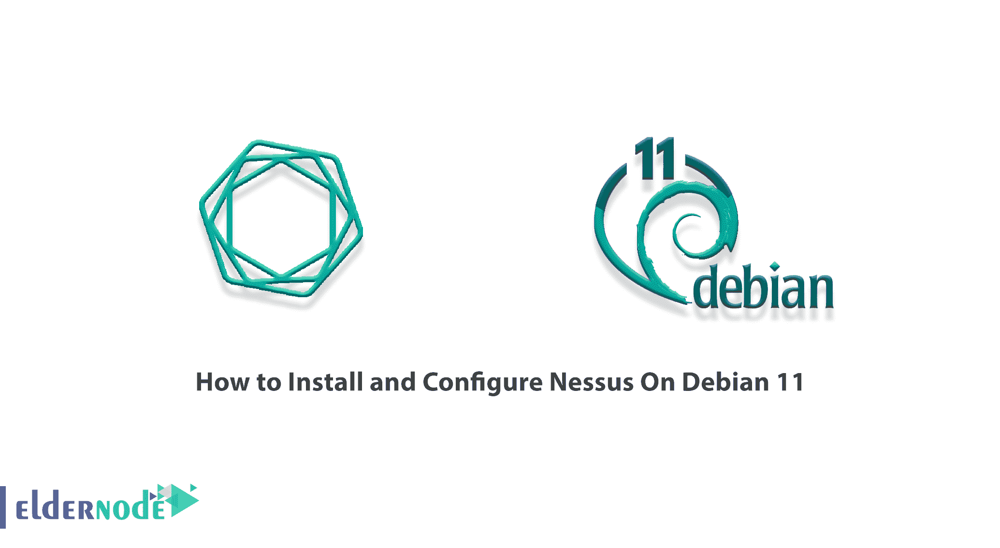
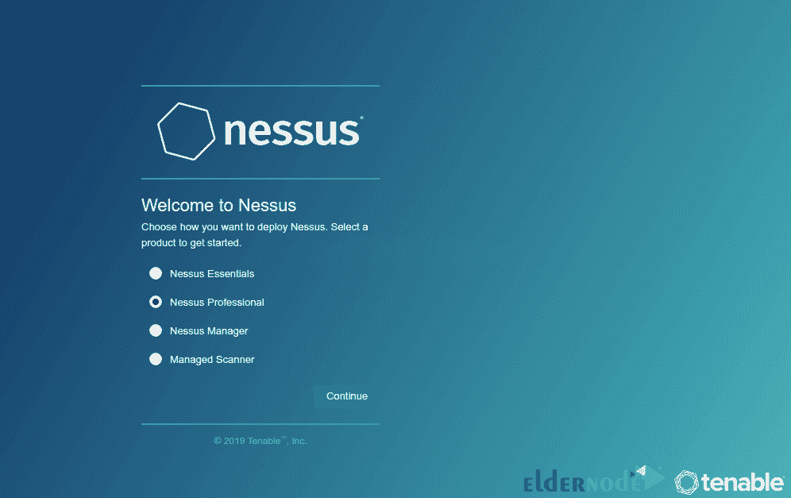
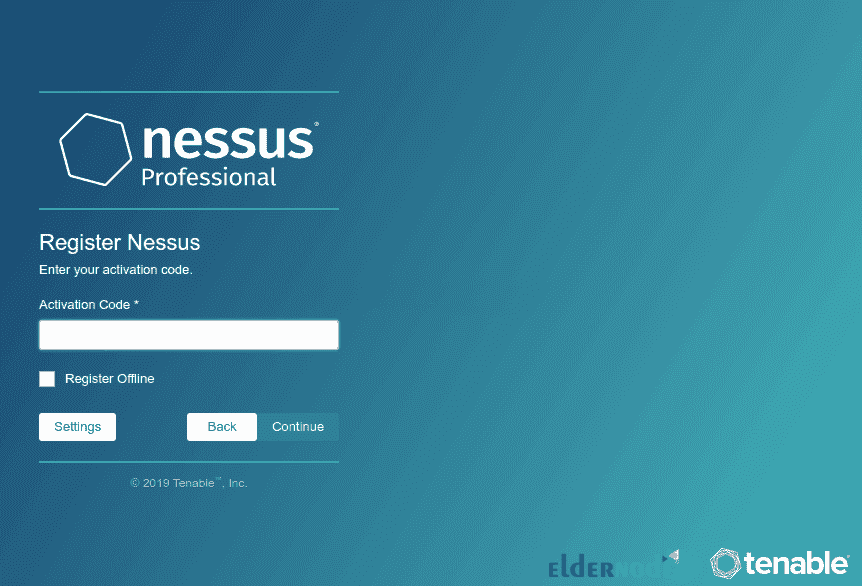
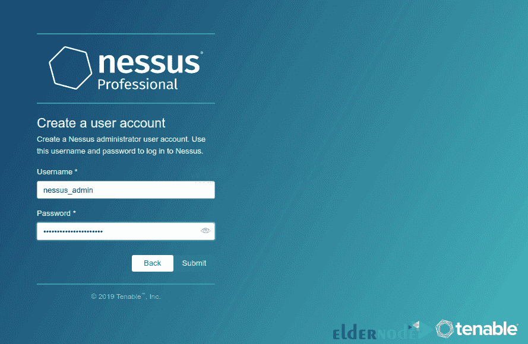
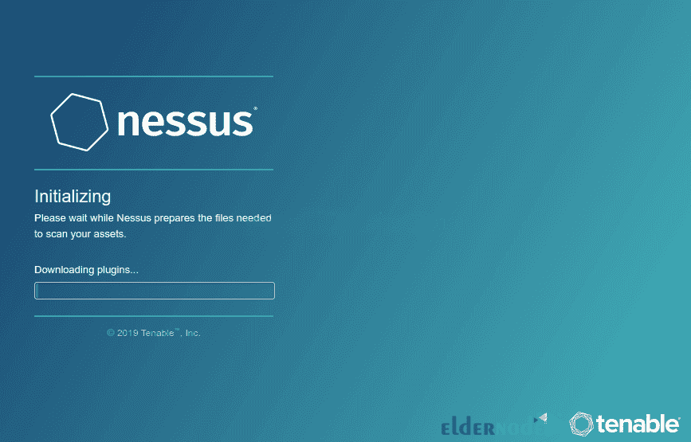
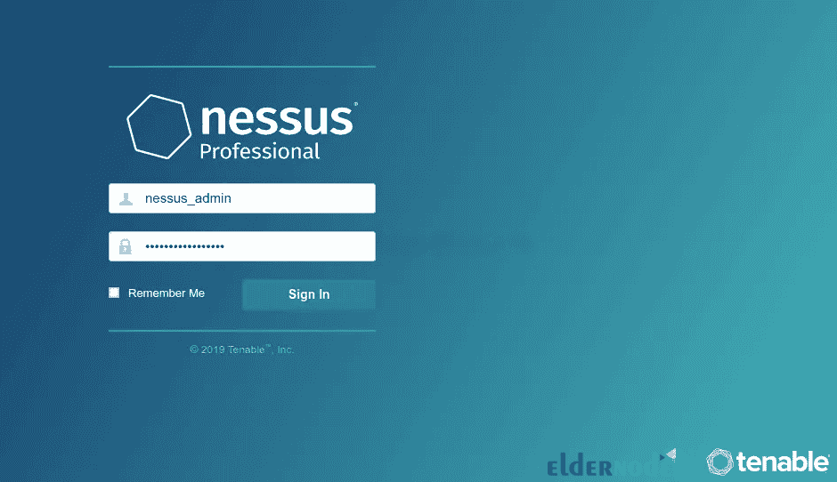
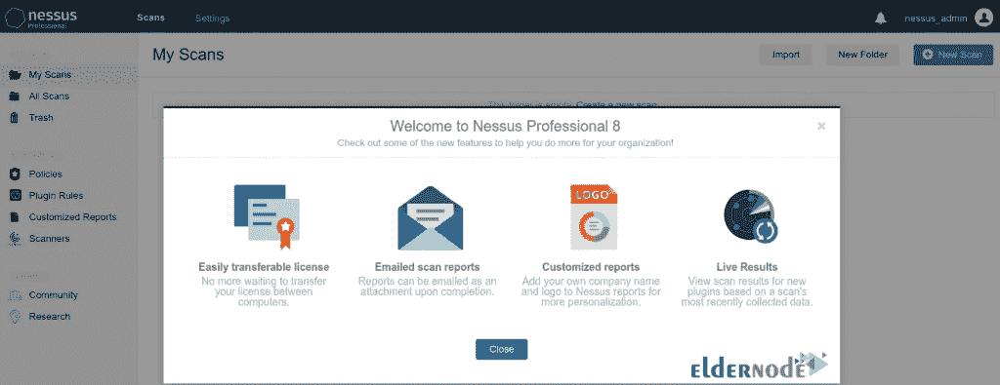

# 如何在 Debian 11 - Eldernode 博客上安装和配置 Nessus

> 原文：<https://blog.eldernode.com/install-and-configure-nessus-on-debian/>



Nessus 是一款远程安全扫描工具，可以扫描您的计算机。还应该注意的是，Nessus 警告恶意黑客可以用来访问任何连接到网络的计算机的任何漏洞。它通过在一台特定的计算机上运行 1200 多项检查来实现这一点，并测试这些攻击是否可以用来渗透或破坏计算机。在本文中，我们将教你如何在 Debian 11 上安装和配置 Nessus。如果你想买一个 [**Linux VPS**](https://eldernode.com/linux-vps/) 服务器，你可以在 [Eldernode](https://eldernode.com/) 看到可用的软件包。

## **教程在 Debian 11 上安装配置 Nessus**

### **介绍 Nessus 及其特点**

你可能想知道 Nessus 对他们有什么好处。与其他扫描器不同，Nessus 不预先假定您的服务器的配置(假设端口 80 应该是唯一的 web 服务器)，这可能会导致其他扫描器丢失真正的漏洞。

还应该注意的是，Nessus 是高度可扩展的，它为您提供了一种脚本语言，这样您可以在更加熟悉该工具之后编写自己的系统测试。Nessus 有一个插件界面，许多免费插件可以从 Nessus 插件网站获得。

Nessus 团队更新了应该每天监控的漏洞列表，以最大限度地缩短自然发生的漏洞之间的距离。所以你可以用 Nessus 来识别它。

在接下来的章节中，加入我们来教你如何在 Debian 11 上安装和配置 Nessus。

## **在 Debian 11 上安装 Nessus**

在这一节中，我们想向您展示如何在 [Debian 11](https://blog.eldernode.com/initial-server-setup-on-debian-11/) 上安装 Nessus。为此，只需遵循以下步骤。

第一步，你需要打开一个你想要的浏览器。然后进入 **[Nessus 下载](https://www.tenable.com/downloads/nessus?loginAttempted=true)** 页面，下载 **64 位 Debian 二进制安装程序**。

现在，您需要通过执行以下命令来更新系统包:

```
apt update
```

```
apt upgrade
```

最后，您可以使用下面的命令**在 Debian 11 上安装 Nessus** :

```
apt install ./Nessus-8.15.1-debian6_amd64.deb
```

### **如何在 Debian 11 上运行 Nessus**

在您成功安装 Nessus 之后，我们现在想教您如何运行它。

首先，使用以下命令**启动 Nessus** :

```
/etc/init.d/nessusd start
```

应该注意，您可以简单地使用以下命令来开始:

```
systemctl start nessusd
```

在下一步中，您需要使用下面的命令**启用 Nessus** 来重启系统:

```
systemctl enable nessusd
```

最后，您可以使用以下命令来检查 Nessus 的**状态:**

```
systemctl status nessusd
```

### **如何在 Debian 11 上配置 Nessus**

在这一节中，我们将讨论基本设置以及如何在 Debian 11 上配置 Nessus。

在第一个配置步骤中，防火墙中必须允许 Nessus。由于 Nessus 监听 **TCP 端口 8834** ，要从外部访问它，您必须使用以下命令在 UFW 打开该端口:

```
ufw allow 8834/tcp
```

下面，我们将讨论如何**激活和设置 Nessus** 。为此，您需要使用地址**https://server-hostname:8834/**访问 web 界面。

在下一步中，在接受 SSL 警告并启动 Nessus 后，您必须继续并选择 **Nessus professional** 并再次继续:



现在您需要输入[激活码](https://www.tenable.com/products/nessus/activation-code)，激活后继续:



接下来，要创建 Nessus 管理员帐户，您必须指定并提交所需的用户名和密码:



如下图所示，Nessus 开始下载和编译所需的插件:



现在，您将进入登录页面:



在登录页面上成功输入信息并成功进行身份验证后，您可以看到 Nessus Professional 控制面板:



## 结论

如果你是一组连接到互联网的计算机的管理员，你应该知道 Nessus 是一个很好的工具，可以使他们的域远离容易被黑客和病毒利用的漏洞。在本文中，我们试图教您如何在 Debian 11 上安装和配置 Nessus。如果你愿意，可以参考文章[教程 Setup，在 Ubuntu 20.10](https://blog.eldernode.com/setup-and-configure-nessus-on-ubuntu/) 上配置 Nessus。