# 如何在 Windows - Eldernode 博客上安装和配置 Nessus

> 原文：<https://blog.eldernode.com/install-and-configure-nessus-on-windows/>

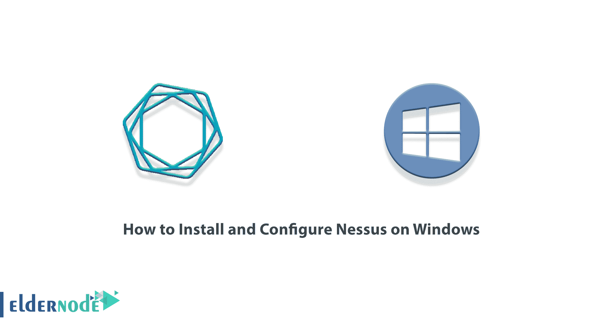

Nessus 是一个漏洞扫描器，可以在任何设备上搜索不同类型的漏洞。这种扫描器可以在最快的时间内检测到大范围的漏洞，具有可靠性和准确性。Nessus 是目前世界上最流行和最先进的漏洞扫描器之一。在本文中，我们试图一步一步地教你如何在 Windows 上安装和配置 Nessus。如果你想买一台 [**Windows VPS**](https://eldernode.com/windows-vps/) 服务器，你可以在 [Eldernode](https://eldernode.com/) 看到可用的软件包。

## **教程在 Windows 上安装和配置 Nessus**

### **Nessus**简介

说到网络安全，大多数安全测试工具都非常复杂。Nessus 并不是什么新东西，但是它确实简化了这个过程。它非常容易使用，工作迅速，可以迅速为您提供网络安全报告。

如果有人想黑你的局域网，他们做的第一件事就是进行漏洞扫描。然后，它会执行渗透测试。它扫描网络上各种设备的漏洞，并寻找潜在漏洞，如开放端口、具有已知漏洞的过期软件或设备上的默认密码。如果他们发现了什么，黑客会测试这些漏洞，然后找到利用它们的方法。测试这些漏洞是一个两步过程，因为扫描只显示问题的可能性。渗透测试证实这实际上是可利用的。

Nessus 是一款开发漏洞的专有软件，但免费家庭版也提供了许多工具来帮助您发现和加强您的网络。该漏洞扫描器由 Tenable Network Security 开发和支持。从成立至今，Tenable Network Security 只为个人和非公司环境免费提供 Nessus 工具。

### **尼斯湖水怪**

Nessus 的一些最重要的特性是:

1.高速资产发现

2.配置审计

3.目标剖析

4.恶意软件检测

5.敏感数据发现

6.弱点分析

Nessus 可以扫描的漏洞和暴露示例包括:

–可能对系统上的敏感数据进行未经授权的控制或访问的漏洞。

–错误的配置

–默认密码、一些常用密码以及一些系统帐户上的空白/不存在的密码。Nessus 也可以联系 Hydra(外部工具)攻击字典。

–拒绝服务漏洞！

–Nessus 扫描涵盖广泛的技术，包括操作系统、网络设备、应用程序、数据库、web 服务器和关键基础设施。

## **在 Windows 上安装 Nessus**

在这一节中，我们将讨论如何在 [Windows](https://blog.eldernode.com/tag/windows/) 上安装 Nessus。为此，只需遵循以下步骤。

首先，你必须打开你最喜欢的浏览器之一，进入 Nessus 网站[下载 Nessus](https://www.tenable.com/downloads/nessus?loginAttempted=true) :

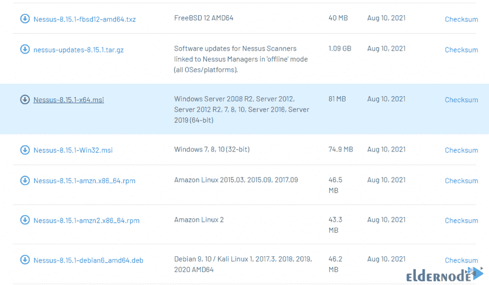

在打开的窗口中单击**我同意**以确认许可协议。这样做将开始下载安装文件。

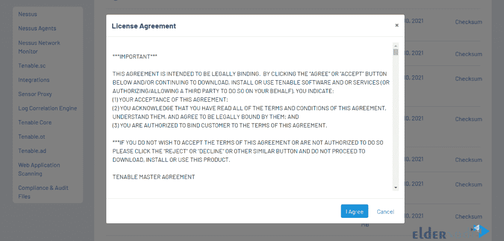

现在，您需要转到下载文件的位置，双击它开始安装过程。要在打开的窗口中开始安装，请点击**运行**:

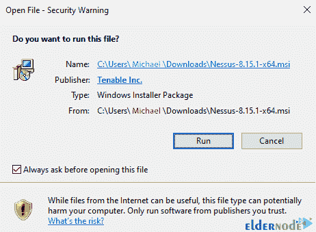

点击**下一个**开始安装:

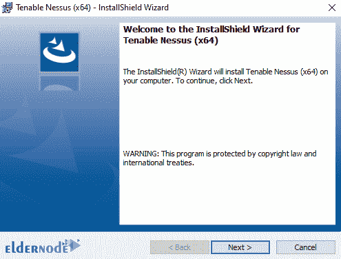

下一步，勾选**我接受条款……**选项，点击**下一步**:

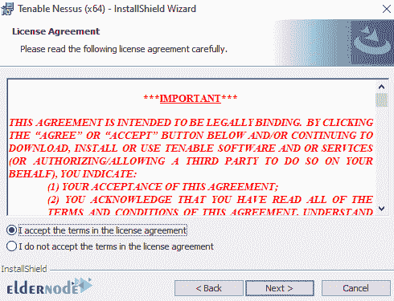

在这里您可以点击 **Chang…** 来确定 Nessus 的安装位置。完成后，点击**下一个**:

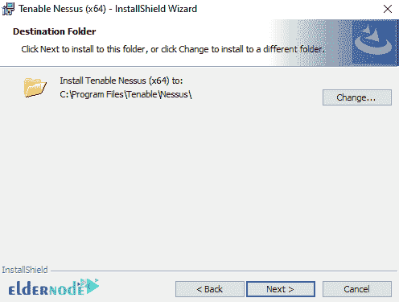

现在你需要点击**安装**:

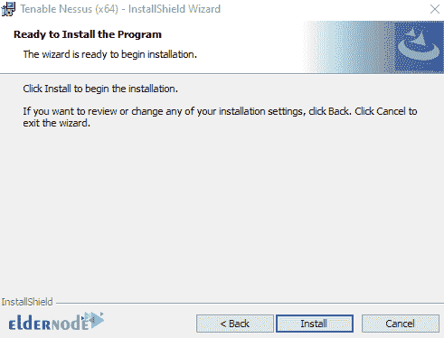

*

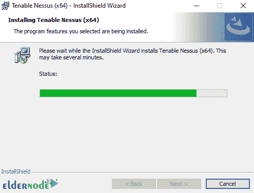

最后，点击**完成**以完成 Nessus 安装过程:

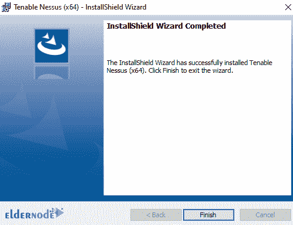

单击完成后，您将在浏览器中看到以下图像:

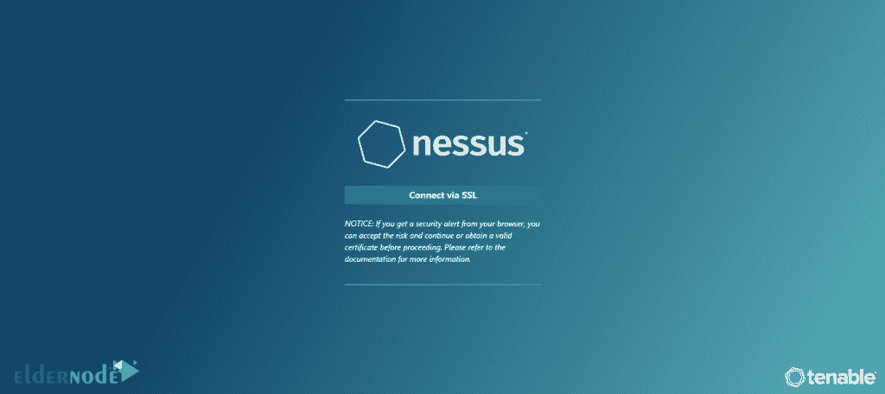

***注意:*** 如果您的系统上还没有安装 WinPcap，您应该按照下面的步骤安装 WinPcap。

### **如何在 Windows 上安装 WinPcap**

在这一节中，我们想教你如何在 Windows 上安装 WinPcap 来使用 Nessus。要[下载 WinPcap](https://www.winpcap.org/default.htm) ，首先打开一个你想要的浏览器，进入 WinPcap 网站。点击**下载**，如下图所示:

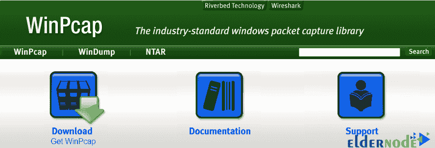

然后点击【Windows 安装程序:

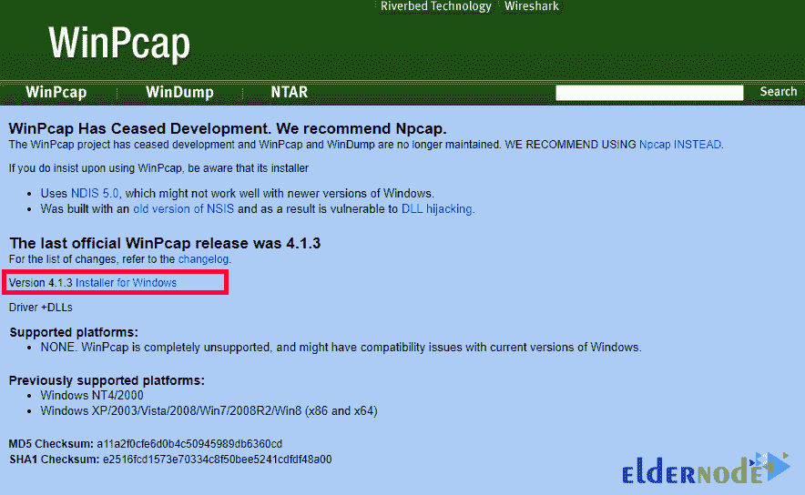

现在转到您下载安装文件的位置，在打开的窗口中双击它，然后单击**运行**:

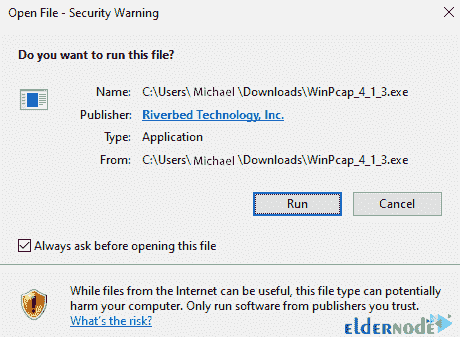

点击**下一步**开始安装过程:

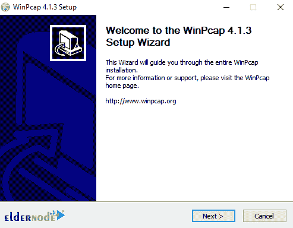

下一步，点击**我同意**:

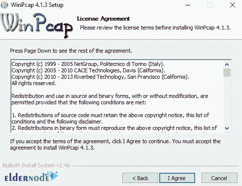

现在点击**安装**:

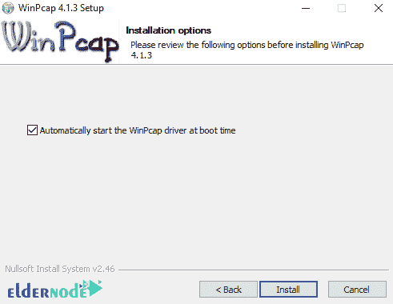

*

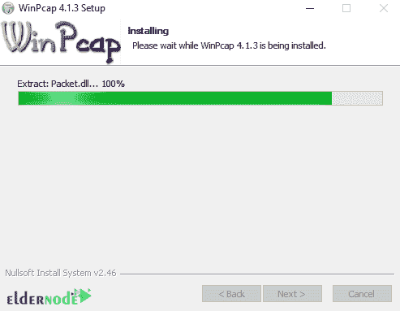

最后，点击**完成**:

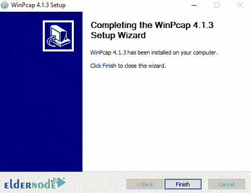

### **如何在 Windows 上配置 Nessus**

在您成功安装了 Nessus 之后，我们现在将教您如何配置它。

1_ 第一步是在“欢迎使用 Nessus”页面上选择如何安装 Nessus。( **Nessus Essentials** 、 **Nessus Professional** 和 **Nessus Manager**

2_ 在下一步中，您必须点击**继续**。

请注意，如果您在上一部分选择了 **Nessus Professional** 或 **Nessus Manager** ，则会出现**注册 Nessus** 页面。

此外，如果您选择 **Nessus Essentials** ，将出现**激活码下载屏幕**。

3_ 现在，如果您选择了 **Nessus Essentials** ，请执行以下操作之一:

如果您需要**激活码**，请在激活码下载页面输入您的姓名和电子邮件地址。然后点击**邮箱**。您现在可以检查您的电子邮件中的免费激活码。

请注意，如果您已经有激活码，请点击**跳过**。

4_ 完成上述步骤后，您现在必须在“注册 Nessus”页面上键入激活码。

5_ 点击**继续**创建账户页面。

6_ 您现在可以创建一个用于登录 Nessus 的 **Nessus 管理员帐户**。在这里你必须在输入一个**用户名**和**密码**后点击**提交**。

Nessus 通过执行上述操作完成了配置过程。

## 结论

扫描结果可以各种格式报告，包括纯文本、XML、HTML 和 LaTeX。结果也可以存储在知识库中用于调试。在 UNIX 中，可以使用命令行客户端自动进行扫描。Unix 和 Windows 都有各种商业、免费和开源工具来管理 Nessus 个人或分布式扫描仪。在本文中，我们试图教您如何在 Windows 上安装和配置 Nessus。如果你愿意，可以参考文章[教程 Setup，在 Ubuntu 20.10](https://blog.eldernode.com/setup-and-configure-nessus-on-ubuntu/) 上配置 Nessus。