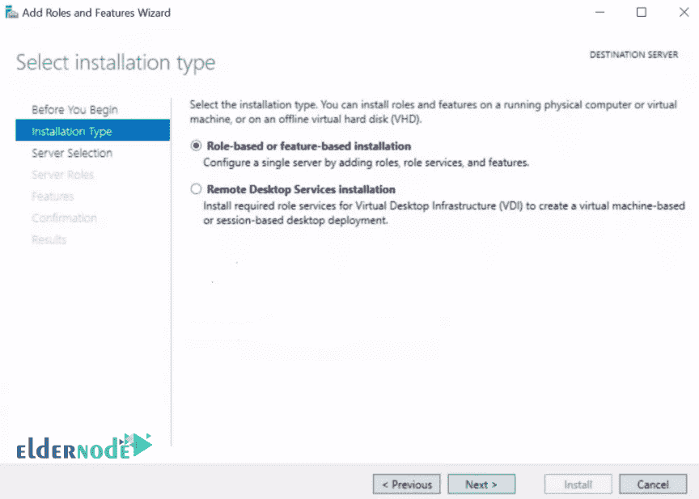

# 如何在 Windows Server 2019 上安装和配置 NFS 客户端- Eldernode

> 原文：<https://blog.eldernode.com/install-and-configure-nfs-client/>

如何在 [Windows Server 2019](https://eldernode.com/tag/windows-server-2019/) 上安装配置 NFS 客户端？其中一项服务是 [NFS](https://en.wikipedia.org/wiki/Network_File_System) 存储空间共享。 NFS 代表**网络文件系统**并允许它创建一个可以在网络上的其他服务器或客户端上共享的存储空间。该服务作为服务器 / 客户端运行，通过它可以创建中央存储。

在我们之前的指南中，我们在 Windows 服务器上安装了 [NFS 服务器，并创建了一个可以连接的共享。在这篇文章中，我们将教你如何在 Windows Server 2019 上安装和配置 NFS 客户端。](https://eldernode.com/install-and-configure-nfs-server-on-windows-server/)

和我们在一起。

[***elder node 中可用的 VPS 服务器***](https://eldernode.com/vps/)

A) 服务器管理器

## 打开服务器管理器，点击添加角色和功能，点击向导上的下一步。

*

B) 基于角色的

## 在选择安装类型页面中，选择基于角色或基于功能的安装，点击下一步。

C) 选择服务器

## 选择您将安装 NFS 的服务器，然后点击下一步。

D) 选择服务器角色

## 在此选择服务器角色部分，点击下一步。

E) 特性

## 在此**选择功能**页面中，勾选NFS 客户端框，点击下一步。

F) 确认并安装

## 确认您的安装选择并点击安装。

让它完成安装，然后点击关闭，你就完成了 **NFS 客户端安装**过程。

**

***

G) 如何使用 umount.exe 连接到 NFS 服务器的共享

## 以管理员权限打开您的 [Powershell](http://eldernode.com/tag/powershell-commands/) 并执行下面的命令。

确保用于标记共享的驱动器尚未在客户端上使用。

**——**10 . 10 . 20 . 2 是你的 NFS 服务器的 IP。

**——**test Share 是你给自己的份额取的名字。

**—** E:\是在步骤 h 中确认的您的 NFS 客户上您的股票的标签

H) 在文件管理器中确认份额

## 打开文件浏览器并检查共享是否成功挂载。

通过添加文件和目录，同时确认它们反映在父目录中，来试验一下**共享**。

**亦作，见:**

[1。如何在 Windows Server 2019 上安装和配置 DNS 服务器](https://eldernode.com/install-and-configure-dns-server-on-windows/)

[2。如何在 Windows 服务器上安装和配置 Windows 管理中心](https://eldernode.com/install-and-configure-windows-admin-center-on-windows-server/)

[3。如何在 Windows Server 2019 上安装和配置 Hyper-V](https://eldernode.com/install-and-configure-hyper-v-on-windows/)

[4。如何在 Windows Server 2019 上安装 Active Directory](https://eldernode.com/install-active-directory-on-windows-server/)

[5。如何在 windows server 2019 上安装 FTP 服务器](https://eldernode.com/install-ftp-server-on-windows-server/)

[6。如何在 windows server 2019 上配置 FTP 服务器](https://eldernode.com/configure-ftp-server-on-windows-server/)

**尊敬的用户**，我们希望您能喜欢这个[教程](https://eldernode.com/category/tutorial/)，您可以在评论区提出关于本次培训的问题，或者解决[老年人节点培训](https://eldernode.com/blog/)领域的其他问题，请参考[提问页面](https://eldernode.com/ask)部分，并尽快提出您的问题。腾出时间给其他用户和专家来回答你的问题。

好运。

Goodluck.