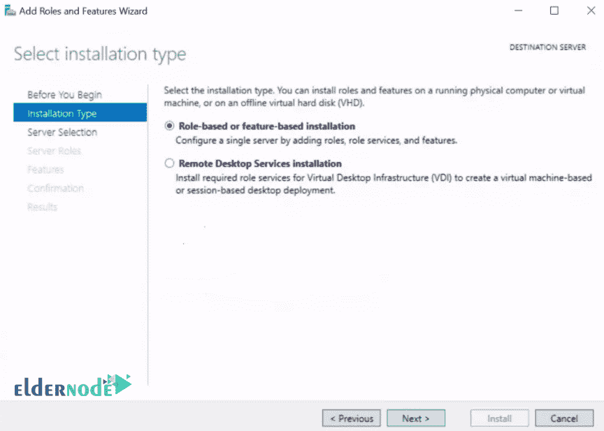
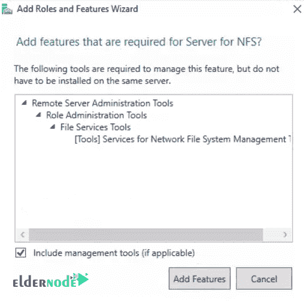

# 如何在 Windows Server 2019 上安装和配置 NFS 服务器- Eldernode

> 原文：<https://blog.eldernode.com/install-and-configure-nfs-server-on-windows-server/>

如何在 [Windows Server 2019](http://eldernode.com/tag/windows-server-2019/) 上安装配置 NFS 服务器？其中一项服务是 [NFS](https://en.wikipedia.org/wiki/Network_File_System) 存储空间共享。 NFS 代表**网络文件系统**并允许它创建一个可以在网络上的其他服务器或客户端上共享的存储空间。该服务作为服务器//客户端运行，并且通过它可以创建中央存储。也可以在新版本中通过 acl 进行**保护**。

在本文中，我们将安装和配置 NFS 服务器并创建 NFS 共享。这是与组织中的其他客户机共享一个目录的有效方式。

[***elder node 中可用的 VPS 服务器***](https://eldernode.com/vps/)

### 1) 打开服务器管理器

点击 Windows 键，搜索服务器管理器。

打开后，点击添加角色和功能。

在添加角色和功能向导的首页，点击下一步。

在选择安装类型页面，选择基于角色或基于功能的安装，点击下一步。

选择您将安装 NFS 的服务器，然后点击下一步。

在选择服务器角色部分，展开**文件和存储服务**，进一步展开文件和 iSCSI 服务。

然后**对照服务器为 NFS 勾选**框。

将出现一个弹出窗口。

在弹出窗口中，只需点击添加功能，然后点击下一步。

在**选择功能**页面中，只需点击下一个。

**确认**您的安装选择，并点击安装。

点击关闭完成安装过程。

### 2) 配置 NFS 共享文件夹

现在您必须配置一个导出到客户端的文件夹。

在你想要的磁盘分区中创建一个目录/文件夹。(我们将在 C 分区中创建**测试共享**。)

打开服务器管理器。

单击文件和存储服务，并从展开的菜单中选择共享。

之后，点击任务下拉菜单，选择“新股……”。

一个新共享向导将会打开。

*****

在向导的第一页，选择 NFS 快手，点击下一步，如下图所示。

在下面的页面中，选择输入自定义路径，浏览您的**目录**，点击下一步。

为您的共享键入一个名称，然后点击下一个按钮。

根据您的组织使用的身份验证方法，您可以在此阶段做出选择。

选择一个适合您的用例，然后点击下一步。

单击下面窗口中的添加，现在您有许多选项来选择访问共享的主机。

你可以只放置一个主机，一个网络组，客户端组或者所有可以到达它的服务器。

做出选择，点击下一个。

******

你可以**调整**的权限以适合你的场景。

完成后，点击下一个的。

确认您的选择并点击创建。

### 3) 确认您的共享已创建

返回服务器管理器 > > 文件和存储服务 > > 股份

现在**在 Windows 客户端上安装**和**设置** NFS 客户端。

**亦作，见:**

[1。如何在 Windows Server 2019 上安装和配置 DNS 服务器](https://eldernode.com/install-and-configure-dns-server-on-windows/)

[2。如何在 Windows 服务器上安装和配置 Windows 管理中心](https://eldernode.com/install-and-configure-windows-admin-center-on-windows-server/)

[3。如何在 Windows Server 2019 上安装和配置 Hyper-V](https://eldernode.com/install-and-configure-hyper-v-on-windows/)

[4。如何在 Windows Server 2019 上安装 Active Directory](https://eldernode.com/install-active-directory-on-windows-server/)

[5。如何在 windows server 2019 上安装 FTP 服务器](https://eldernode.com/install-ftp-server-on-windows-server/)

[6。如何在 windows server 2019 上配置 FTP 服务器](https://eldernode.com/configure-ftp-server-on-windows-server/)

**尊敬的用户**，我们希望您能喜欢这个[教程](https://eldernode.com/category/tutorial/)，您可以在评论区提出关于本次培训的问题，或者解决[老年人节点培训](https://eldernode.com/blog/)领域的其他问题，请参考[提问页面](https://eldernode.com/ask)部分，并尽快提出您的问题。腾出时间给其他用户和专家来回答你的问题。

好运。