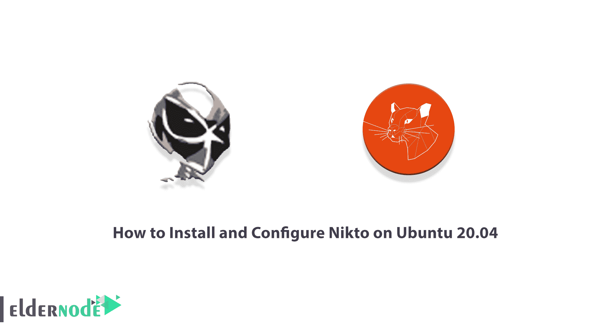
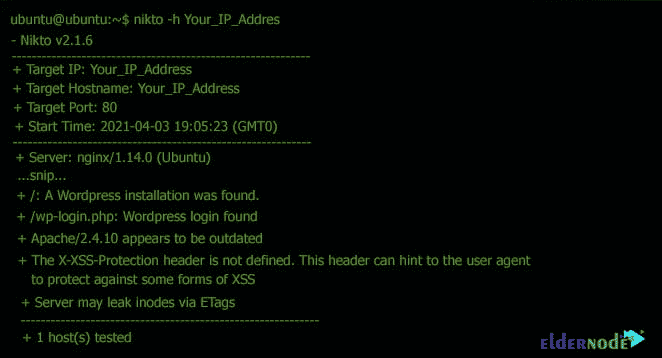

# 如何在 Ubuntu 20.04 上安装和配置 Nikto-elder node

> 原文：<https://blog.eldernode.com/install-and-configure-nikto-on-ubuntu/>



Nikto 工具是一个用 Perl 编写的开源 web 服务器扫描器，可以检测 web 服务器上的 6700 多个漏洞。该扫描程序扫描过时的服务器软件和其他安全问题。Nikto 工具执行特定的公共和服务器类型的检查。它还记录并显示每个收到的 cookie。Nikto 检查服务器配置，如 HTTP 服务器设置、多个文件的存在，并尝试识别已安装的 web 服务器和软件。该工具旨在以最快的速度执行所有扫描。在本文中，我们将教你如何在 Ubuntu 20.04 上安装和配置 Nikto。你可以在 [Eldernode](https://eldernode.com/) 看到购买 [Ubuntu VPS](https://eldernode.com/ubuntu-vps/) 服务器的套餐。

## **教程在 Ubuntu 20.04 上安装配置 Nikto**

Nikto 是一个开源网站(GPL)扫描器，可以在多个 web 服务器上执行全面的测试。Nikto 还检查服务器配置，如多个文件的存在、HTTP 服务器设置，并尝试识别 web 服务器和安装的软件。扫描的项目和插件会定期更新，并且可以自动更新。在本文的其余部分，我们将讨论什么是 Nikto 以及它做什么。然后我们会一步步教你如何在 [Ubuntu](https://blog.eldernode.com/tag/ubuntu/) 20.04 上安装 Nikto。请加入我们。

### **Nikto 是什么，是做什么的？**

有许多工具和程序可以找到网站中的漏洞，但其中最简单的一个工具是 Nikto 工具。尽管 Nikto 工具非常古老，但它仍然是最受欢迎的扫描仪之一。这个简单的小工具测试目标网站，并向您报告发现的潜在漏洞。可以用来攻击目标网站的漏洞。另外，Nikto 是[安全](https://blog.eldernode.com/tag/security/)行业常见的漏洞搜索工具。

虽然 Nikto 工具非常有用和有效，但像许多其他扫描工具一样，它有一个主要缺点。使用 Nikto 工具进行扫描是不隐藏的，不会秘密地做任何事情。任何具有 IDS 入侵检测系统或其他安全特性和功能的网站都将通过 Nikto 工具检测您的扫描。这样做的原因是 Nikto 不应该秘密地做任何事情，因为从一开始它就只是为了安全测试(而不是秘密入侵)而设计和创建的！

## **在 Ubuntu 20.04 上安装 Nikto**

在前面的步骤中熟悉了 Nikto 工具后，现在我们将在这一步安装它。要在 Ubuntu 20.04 上安装 Nikto，只需遵循以下步骤。第一步是使用以下命令更新系统存储库:

```
sudo apt-get update
```

```
sudo apt-get upgrade
```

您现在可以通过运行以下命令轻松地**安装 Nikto** :

```
sudo apt-get install nikto -y
```

要检查 Nikto 是否安装正确及其版本，可以运行以下命令:

```
nikto
```

### **如何在 Ubuntu 20.04 上配置 Nikto**

在本节中，我们将讨论各种 Nikto 设置。如果同一台主机服务器上有多个虚拟主机监听不同的端口，则可以指定多个端口:

```
nikto -h Your_IP_Address -p 8080,8888
```

请注意，您可以按 port1-portN 格式指定一系列端口:

```
nikto -h Your_IP_Address -p 8080-8888
```

您也可以输入您想要的 URL，而不是 IP 地址:

```
nikto -h example.com
```

```
nikto -h https://example.com
```

请注意，您也可以在使用 URL 时指定端口:

```
nikto -h example.com -p 8080
```

```
nikto -h https://example.com -p 8443
```

现在我们要去代理设置。如果使用代理服务器，可以使用 **-useproxy** 选项要求 Nikto 使用代理。请注意，您可以在 Nikto 配置文件 **/etc/nikto/config.txt** 中设置代理详细信息。您也可以在命令行上设置它，如下所示:

```
PROXYHOST=Your_IP_Address  PROXYPORT=3128  PROXYUSER=username  PROXYPASS=password
```

一旦配置了 Nikto 代理，现在就可以按如下方式运行它:

```
nikto -h Your_IP_Address -useproxy
```

在下一步中，您必须执行以下操作来确定命令行上代理连接的详细信息:

```
nikto -h Your_IP_Address -useproxy http://id:[[email protected]](/cdn-cgi/l/email-protection)_IP_Address:3128/
```

```
nikto -h Your_IP_Address -useproxy http://@Your_IP_Address:3128/
```

有趣的是，Nikto 可以导出各种格式的扫描结果，如 CSV、HTML、XML、NBE、文本。为此，您必须使用如下的**-o/-输出**和**-格式**命令:

```
nikto -h YOUR_IP_Address -o test.html -F html
```

## **如何在 Ubuntu 20.04 上使用 Nikto**

现在您已经成功地安装和配置了 Nikto，下面是它的使用方法。请注意，您有一个主机地址来扫描您的设备。在以下命令中，您必须输入所需的 IP 地址，而不是 IP 地址:

```
nikto -h Your_IP_Address
```

或者

```
nikto -host Your_IP_Address
```



结论

## Nikto 是一个用于扫描 web 服务器的开源工具，它执行大量测试来查找漏洞。在本文中，我们试图让您全面了解 Nikto 扫描工具。然后我们教你如何在 Ubuntu 20.04 上安装和配置 Nikto。

Nikto is an open-source tool for scanning web servers that performs numerous tests to find vulnerabilities. In this article, we have tried to fully acquaint you with Nikto scanning tools. Then we taught you how to Install and Configure Nikto on Ubuntu 20.04.