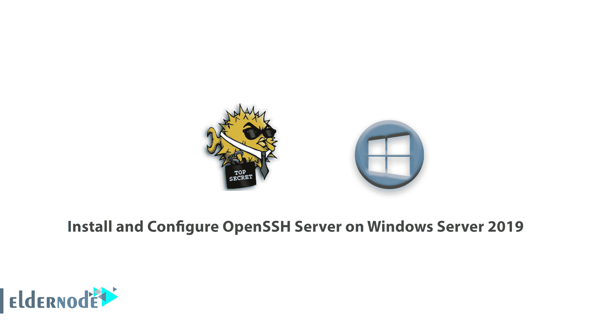
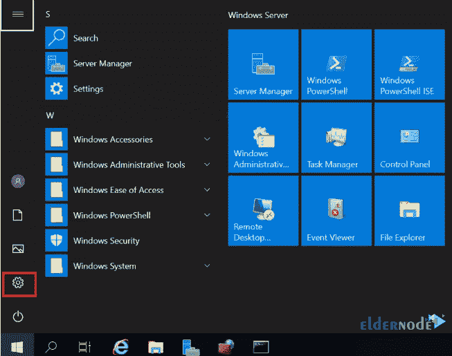
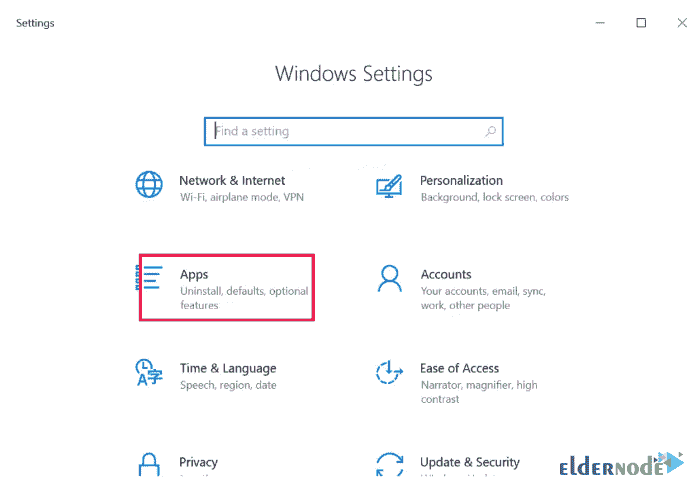
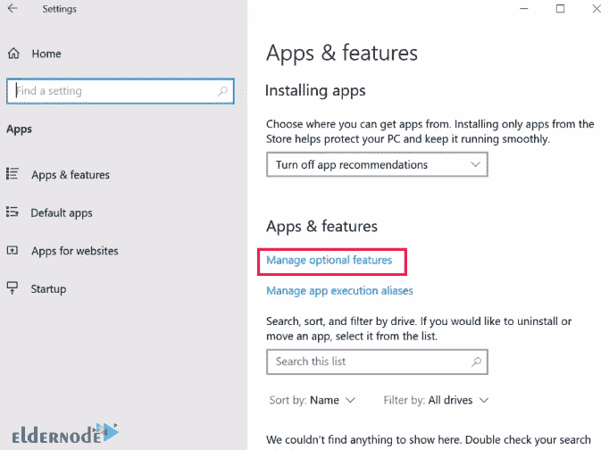
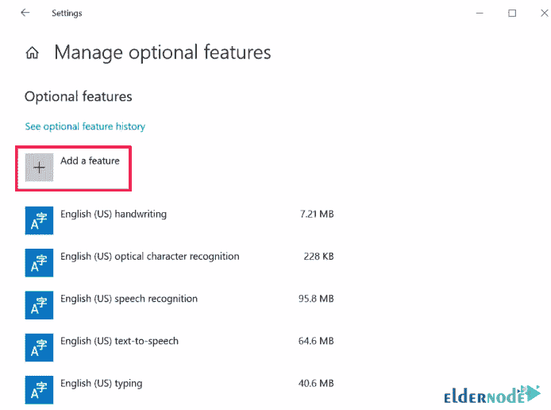
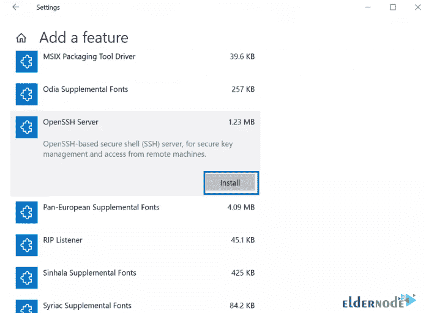
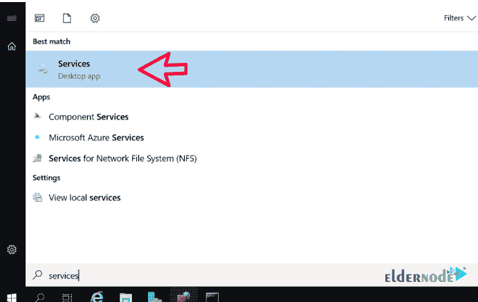
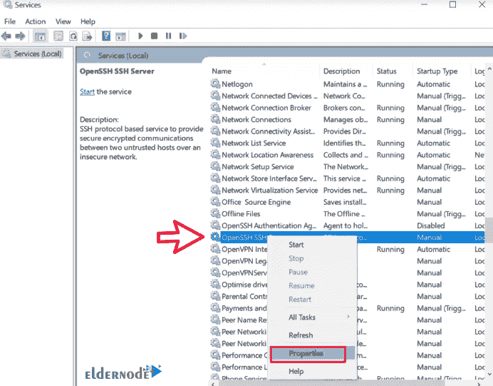
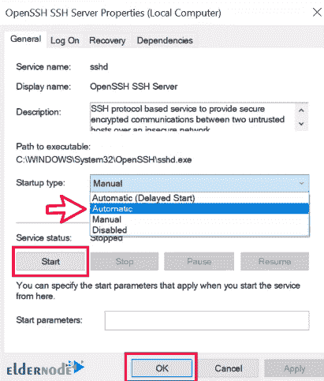

# 如何在 Windows Server 2019 上安装和配置 OpenSSH 服务器- Eldernode

> 原文：<https://blog.eldernode.com/install-and-configure-openssh-server-on-windows-server/>

如何在 Windows Server 2019 上安装和配置 OpenSSH 服务器？Linux 和 Windows 服务器都提供了广泛的特性。Linux 和 Windows 操作系统在[虚拟服务器](https://eldernode.com/vps/) / [专用服务器](https://eldernode.com/dedicated-server/)上都有自己的风扇，但两者的一个主要区别是如何访问它们。SSH 用于连接 Linux 服务器，RDP 通常用于连接 Windows 服务器。

在 Windows Server 2019 中， [OpenSSH 功能](https://en.wikipedia.org/wiki/OpenSSH) 可供安装，可以通过 SSH 服务连接到服务器。在本文中，我们将教您如何在 Windows 2019 服务器上安装和配置 OpenSSH。

**1。**T3 从**开始菜单**中选择设置。

**2。** 打开**设置**后，选择 App 选项，然后点击管理可选功能。

*

**3。T3 点击添加一个特性。**

**4。T3 在下一个窗口中，选择 OpenSSH 服务器，点击安装。**

**5。** 现在从**开始菜单**搜索服务。打开页面后，选择 OpenSSH Server 选项，在属性上**右键**。

**

**6。** 将**启动类型**选项改为自动，点击启动，然后点击下一个。

**7。** 如果你的服务器上有防火墙，允许 TCP 端口 22 ，这样客户端就可以连接到服务器。你可以跟随[学习如何在 Windows 防火墙上打开端口](https://eldernode.com/open-a-port-on-a-windows-firewall/)。

**另请参见:**

**尊敬的用户**，我们希望您能喜欢这个[教程](https://eldernode.com/category/tutorial/)，您可以在评论区提出关于本次培训的问题，或者解决[老年人节点培训](https://eldernode.com/blog/)领域的其他问题，请参考[提问页面](https://eldernode.com/ask)部分，并尽快提出您的问题。腾出时间给其他用户和专家来回答你的问题。

好运。

**尊敬的用户**，我们希望您能喜欢这个[教程](https://eldernode.com/category/tutorial/)，您可以在评论区提出关于本次培训的问题，或者解决[老年人节点培训](https://eldernode.com/blog/)领域的其他问题，请参考[提问页面](https://eldernode.com/ask)部分，并尽快提出您的问题。腾出时间给其他用户和专家来回答你的问题。

好运。