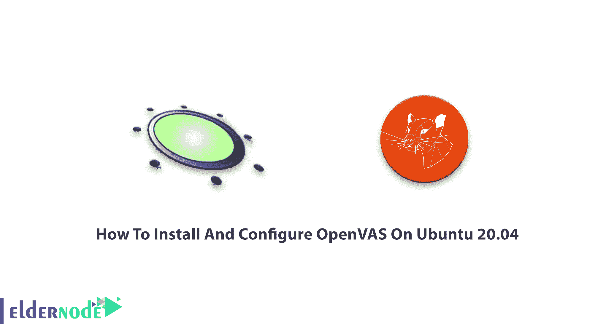
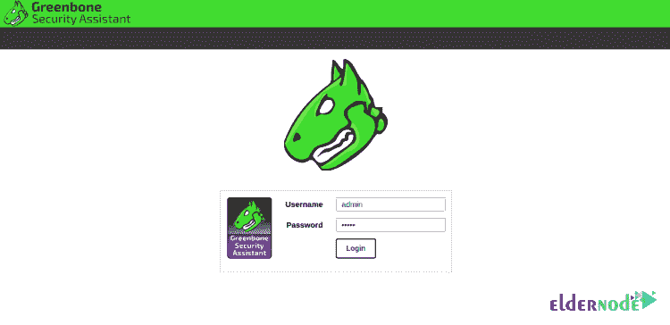
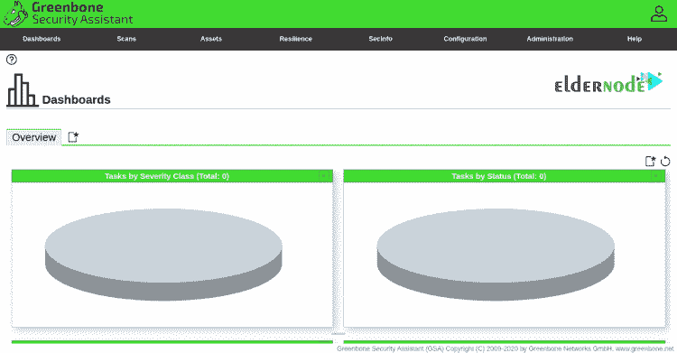

# 如何在 Ubuntu 20.04 上安装和配置 open vas-elder node

> 原文：<https://blog.eldernode.com/install-and-configure-openvas-on-ubuntu/>



**Open V**vulnerability**A**assessment**S**system 是一款免费的漏洞扫描软件。OpenVAS 的大多数组件都是在 GNU 通用公共许可证(GPL)下授权的。OpenVAS 9 框架发布后，它被重命名为**G**reebone**V**vulnerability**M**management，并作为 Greenbone 源代码版本发布。OpenVAS 设计为在 Linux 环境中运行，也可以作为独立的虚拟机安装。在这篇文章中，你将学习如何在 Ubuntu 20.04 上安装和配置 OpenVAS。要购买您自己的 [Ubuntu VPS](https://eldernode.com/ubuntu-vps/) ，请访问 [Eldernode](https://eldernode.com/) 上根据您的需求定制的可用软件包。

为了让本教程更好地发挥作用，请考虑以下**先决条件**:

–拥有 Sudo 权限的非 root 用户。

–要进行设置，请遵循我们在 Ubuntu 20.04 上的[初始服务器设置。](https://blog.eldernode.com/initial-server-setup-on-ubuntu-20/)

–至少 4 GB 内存。

–至少 4 个 vCPUs。

–超过 8 GB 的磁盘空间。

## **教程在 Ubuntu 20.04 上安装配置 open vas**

GVM 以前称为 OpenVAS，是一个用于漏洞扫描和漏洞管理的开源解决方案。安全专家和普通用户使用这一整套工具。OpenVAS 被广泛用于使用自己的已知弱点和漏洞数据库对客户端计算机进行测试。请确保您的服务器免受攻击，并与我们一起查看 OpenVAS 在 [Ubuntu](https://blog.eldernode.com/tag/ubuntu/) 20.04 上的安装。

## **如何在 Ubuntu 20.04 上安装 GVM |**Ubuntu 18.04

让我们浏览一下本指南的步骤，成为 OpenVAS 安装专家。一如既往，从更新您的系统包开始。使用以下命令将您的系统软件包更新到最新版本:

```
apt-get update -y
```

### **如何安装先决条件**

首先你需要安装下面的**依赖包**。

```
sudo su -
```

```
apt update &&\
```

```
apt -y dist-upgrade &&\
```

```
apt -y autoremove &&\
```

```
apt install -y software-properties-common &&\
```

```
apt install -y build-essential cmake pkg-config libglib2.0-dev libgpgme-dev libgnutls28-dev uuid-dev libssh-gcrypt-dev libldap2-dev doxygen graphviz libradcli-dev libhiredis-dev libpcap-dev bison libksba-dev libsnmp-dev gcc-mingw-w64 heimdal-dev libpopt-dev xmltoman redis-server xsltproc libical-dev postgresql postgresql-contrib postgresql-server-dev-all gnutls-bin nmap rpm nsis curl wget fakeroot gnupg sshpass socat snmp smbclient libmicrohttpd-dev libxml2-dev python3-polib gettext rsync xml-twig-tools python3-paramiko python3-lxml python3-defusedxml python3-pip python3-psutil python3-impacket virtualenv vim git &&\
```

```
apt install -y texlive-latex-extra --no-install-recommends &&\
```

```
apt install -y texlive-fonts-recommended &&\
```

```
curl -sS https://dl.yarnpkg.com/debian/pubkey.gpg | apt-key add - &&\
```

```
echo "deb https://dl.yarnpkg.com/debian/ stable main" | tee /etc/apt/sources.list.d/yarn.list &&\
```

```
apt update &&\
```

```
apt -y install yarn &&\
```

```
yarn install &&\
```

```
yarn upgrade
```

### **如何创建 GVM 用户**

现在，您必须创建 GVM 用户。打开终端，粘贴下面的命令来创建 GVM 用户。然后，将在安装和编译过程中使用它。

```
echo 'export PATH="$PATH:/opt/gvm/bin:/opt/gvm/sbin:/opt/gvm/.local/bin"' | tee -a /etc/profile.d/gvm.sh &&\
```

```
chmod 0755 /etc/profile.d/gvm.sh &&\
```

```
source /etc/profile.d/gvm.sh &&\
```

```
bash -c 'cat < /etc/ld.so.conf.d/gvm.conf
```

```
# gmv libs location
```

```
/opt/gvm/lib
```

```
EOF'
```

```
mkdir /opt/gvm &&\
```

```
adduser gvm --disabled-password --home /opt/gvm/ --no-create-home --gecos '' &&\
```

```
usermod -aG redis gvm &&\
```

```
chown gvm:gvm /opt/gvm/
```

现在，您可以登录 GVM 用户:

```
sudo su - gvm
```

## **如何下载安装 GVM**

在这一步中，您将通过创建 src 文件夹来下载和安装软件，并由 git 克隆 GVM 源代码。因此，导航到上面创建的临时目录并运行后续命令。

```
mkdir src &&\ 
```

```
cd src &&\
```

```
export PKG_CONFIG_PATH=/opt/gvm/lib/pkgconfig:$PKG_CONFIG_PATH
```

```
git clone -b gvm-libs-20.08 --single-branch https://github.com/greenbone/gvm-libs.git &&\
```

```
git clone -b openvas-20.08 --single-branch https://github.com/greenbone/openvas.git &&\
```

```
git clone -b gvmd-20.08 --single-branch https://github.com/greenbone/gvmd.git &&\
```

```
git clone -b master --single-branch https://github.com/greenbone/openvas-smb.git &&\
```

```
git clone -b gsa-20.08 --single-branch https://github.com/greenbone/gsa.git &&\
```

```
git clone -b ospd-openvas-20.08 --single-branch https://github.com/greenbone/ospd-openvas.git &&\
```

```
git clone -b ospd-20.08 --single-branch https://github.com/greenbone/ospd.git
```

### **如何安装 gvm-libs**

是时候从 GitHub 安装和编译 gvm-libs 了。使用下面的命令将目录更改为 gvm-libs，导出配置路径并创建一个构建目录。

```
cd gvm-libs &&\
```

```
export PKG_CONFIG_PATH=/opt/gvm/lib/pkgconfig:$PKG_CONFIG_PATH &&\
```

```
mkdir build &&\
```

```
cd build &&\
```

```
cmake -DCMAKE_INSTALL_PREFIX=/opt/gvm .. &&\
```

```
make &&\
```

```
make doc &&\
```

```
make install &&\
```

```
cd /opt/gvm/src
```

### **如何安装 openvas-smb**

使用下面的命令进入 Openvas-smb 目录并编译源代码。

```
cd openvas-smb &&\
```

```
export PKG_CONFIG_PATH=/opt/gvm/lib/pkgconfig:$PKG_CONFIG_PATH &&\
```

```
mkdir build &&\
```

```
cd build/ &&\
```

```
cmake -DCMAKE_INSTALL_PREFIX=/opt/gvm .. &&\
```

```
make &&\
```

```
make install &&\
```

```
cd /opt/gvm/src
```

### **如何安装 OpenVAS 扫描仪**

同样，您需要构建并安装 OpenVas 扫描仪。

```
cd openvas &&\
```

```
export PKG_CONFIG_PATH=/opt/gvm/lib/pkgconfig:$PKG_CONFIG_PATH &&\
```

```
mkdir build &&\
```

```
cd build/ &&\
```

```
cmake -DCMAKE_INSTALL_PREFIX=/opt/gvm .. &&\
```

```
make &&\
```

```
make doc &&\
```

```
make install &&\
```

```
cd /opt/gvm/src
```

### **如何为 OpenVAS 安装修复 Redis**

要注销当前会话以返回特权用户，您应该在终端中键入“exit”。然后，粘贴以下代码。

```
export LC_ALL="C" &&\
```

```
ldconfig &&\
```

```
cp /etc/redis/redis.conf /etc/redis/redis.orig &&\
```

```
cp /opt/gvm/src/openvas/config/redis-openvas.conf /etc/redis/ &&\
```

```
chown redis:redis /etc/redis/redis-openvas.conf &&\
```

```
echo "db_address = /run/redis-openvas/redis.sock" > /opt/gvm/etc/openvas/openvas.conf &&\
```

```
systemctl enable [[email protected]](/cdn-cgi/l/email-protection) &&\
```

```
systemctl start [[email protected]](/cdn-cgi/l/email-protection)
```

```
sysctl -w net.core.somaxconn=1024 &&\
```

```
sysctl vm.overcommit_memory=1 &&\
```

```
echo "net.core.somaxconn=1024" >> /etc/sysctl.conf &&\
```

```
echo "vm.overcommit_memory=1" >> /etc/sysctl.conf
```

```
systemctl daemon-reload &&\
```

```
systemctl start disable-thp &&\
```

```
systemctl enable disable-thp &&\
```

```
systemctl restart redis-server
```

此时，您应该将 ***/opt/gvm/sbin*** 路径添加到 secure_path 变量中:

```
sed 's/Defaults\s.*secure_path=\"\/usr\/local\/sbin:\/usr\/local\/bin:\/usr\/sbin:\/usr\/bin:\/sbin:\/bin:\/snap\/bin\"/Defaults secure_path=\"\/usr\/local\/sbin:\/usr\/local\/bin:\/usr\/sbin:\/usr\/bin:\/sbin:\/bin:\/snap\/bin:\/opt\/gvm\/sbin\"/g' /etc/sudoers | EDITOR='tee' visudo
```

现在，使用以下命令允许运行 ospd-openvas 的用户使用 **root** 权限启动。

```
echo "gvm ALL = NOPASSWD: /opt/gvm/sbin/openvas" > /etc/sudoers.d/gvm
```

```
echo "gvm ALL = NOPASSWD: /opt/gvm/sbin/gsad" >> /etc/sudoers.d/gvm
```

### **如何更新 NVT**

在本节中，您将更新漏洞文件定义。为此，应该运行 greenbone-nvt。但是首先，切换回 GVM 用户会话。

```
sudo su – gvm
```

然后，键入:

```
greenbone-nvt-sync
```

您可能会因为防火墙而面临超时错误。打开 TCP 端口 873，如果你得到连接被拒绝的错误，去喝杯咖啡，然后再回来。这需要很长时间。

### **用 GVM** 将插件上传到中继站

使用 OpenVAS 在 [Redis](https://blog.eldernode.com/configure-redis-on-linux-ubuntu-20-04/) 中上传插件将会很耗时，这取决于您的硬件。此外，当您运行该命令时，您将不会收到任何反馈。

```
sudo openvas -u
```

如果您遇到缺失库错误，请运行以下命令。

```
exit
```

```
echo "/opt/gvm/lib > /etc/ld.so.conf.d/gvm.conf
```

```
ldconfig
```

```
sudo su - gvm
```

### **安装 green bonemanager**

要构建和安装 Greenbone Manager，请进入 gvmd 目录:

```
cd /opt/gvm/src/gvmd &&\
```

```
export PKG_CONFIG_PATH=/opt/gvm/lib/pkgconfig:$PKG_CONFIG_PATH &&\
```

```
mkdir build &&\
```

```
cd build/ &&\
```

```
cmake -DCMAKE_INSTALL_PREFIX=/opt/gvm .. &&\
```

```
make &&\
```

```
make doc &&\
```

```
make install &&\
```

```
cd /opt/gvm/src
```

### **如何配置 PostgreSQL**

要配置 [PostgreSQL](https://blog.eldernode.com/tutorial-postgresql-installation-ubuntu-20/) ，请切换到 sudoers 中的一个用户。用户会话将使用下面的“sudo -u postgres bash”命令进行切换。

***注意*** :不要使用 root 或者 gvm，一次执行一行。

```
exit
```

```
cd /
```

```
sudo -u postgres bas
```

```
export LC_ALL="C"
```

```
createuser -DRS gvm
```

```
createdb -O gvm gvmd
```

```
psql gvmd
```

```
create role dba with superuser noinherit;
```

```
grant dba to gvm;
```

```
create extension "uuid-ossp";
```

```
create extension "pgcrypto";
```

```
exit
```

```
exit
```

### **如何固定证书**

要修复 GVM 证书，请一次键入一行:

```
sudo su - gvm
```

```
gvm-manage-certs -a
```

### **如何创建管理员用户**

运行以下命令创建初始用户名和密码，但不要忘记更改它。

```
gvmd --create-user=admin --password=admin
```

### **如何配置和更新提要**

将“提要导入所有者”设置为管理员的 UUID。它可以让提要完全更新。要查找新管理员用户的 UUID，请键入:

```
gvmd --get-users --verbose
```

在那里，你会得到如下的东西:

```
admin fb019c52-75ec-4cb6-b176-5a55a9b360bf
```

然后，运行:

```
gvmd --modify-setting 78eceaec-3385-11ea-b237-28d24461215b --value (output string from the above command fb019c52-75ec-4cb6-b176-5a55a9b360bf)
```

```
So the example command would be:
```

```
$ gvmd --get-users --verbose
```

管理员 FB 019 c 52-75ec-4cb 6-b176-5a 55 a9 b 360 BF

```
$ gvmd --modify-setting 78eceaec-3385-11ea-b237-28d24461215b --value fb019c52-75ec-4cb6-b176-5a55a9b360bf
```

接下来，一次一行地运行以下命令。您可能会得到连接被拒绝的错误，但再次运行，直到它成功。考虑到这些命令可能需要一些时间。

```
greenbone-feed-sync --type GVMD_DATA
```

```
greenbone-feed-sync --type SCAP
```

```
greenbone-feed-sync --type CERT
```

### **如何安装 GSA**

要安装 GSA (GVM)，进入 GSA 文件夹并编译 GSA 源代码。

```
cd /opt/gvm/src/gsa &&\
```

```
export PKG_CONFIG_PATH=/opt/gvm/lib/pkgconfig:$PKG_CONFIG_PATH &&\
```

```
mkdir build &&\
```

```
cd build/ &&\
```

```
cmake -DCMAKE_INSTALL_PREFIX=/opt/gvm .. &&\
```

```
make &&\
```

```
make doc &&\
```

```
make install &&\
```

```
touch /opt/gvm/var/log/gvm/gsad.log &&\
```

```
cd /opt/gvm/src
```

### **设置 OSPD-OpenVAS 并安装 virtualenv**

```
cd /opt/gvm/src &&\
```

```
export PKG_CONFIG_PATH=/opt/gvm/lib/pkgconfig:$PKG_CONFIG_PATH &&\
```

```
virtualenv --python python3.8 /opt/gvm/bin/ospd-scanner/ &&\
```

```
source /opt/gvm/bin/ospd-scanner/bin/activate
```

***注意*** :要匹配你安装的 python 版本，可能要改 _python python3.8

### **如何安装 ospd**

使用 pip 安装程序安装 ospd，如下所示:

```
mkdir /opt/gvm/var/run/ospd/ &&\
```

```
cd ospd &&\
```

```
pip3 install . &&\
```

```
cd /opt/gvm/src
```

### **安装 ospd-open vas**

同样，使用 pip 安装程序来安装 ospd-openvas。

```
cd ospd-openvas &&\
```

```
pip3 install . &&\
```

```
cd /opt/gvm/src
```

### **如何创建启动脚本**

要创建启动脚本(root ),请粘贴下面的命令。在此之前，您应该键入 exit 退出根会话。

```
cat << EOF > /etc/systemd/system/gvmd.service
```

```
[Unit]
```

```
Description=Open Vulnerability Assessment System Manager Daemon
```

```
Documentation=man:gvmd(8) https://www.greenbone.net
```

```
Wants=postgresql.service ospd-openvas.service
```

```
After=postgresql.service ospd-openvas.service
```

```
[Service]
```

```
Type=forking
```

```
User=gvm
```

```
Group=gvm
```

```
PIDFile=/opt/gvm/var/run/gvmd.pid
```

```
WorkingDirectory=/opt/gvm
```

```
ExecStart=/opt/gvm/sbin/gvmd --osp-vt-update=/opt/gvm/var/run/ospd.sock
```

```
ExecReload=/bin/kill -HUP $MAINPID
```

```
KillMode=mixed
```

```
Restart=on-failure
```

```
RestartSec=2min
```

```
KillMode=process
```

```
KillSignal=SIGINT
```

```
GuessMainPID=no
```

```
PrivateTmp=true
```

```
[Install]
```

```
WantedBy=multi-user.target
```

```
EOF
```

```
cat << EOF > /etc/systemd/system/gsad.service
```

```
[Unit]
```

```
Description=Greenbone Security Assistant (gsad)
```

```
Documentation=man:gsad(8) https://www.greenbone.net
```

```
After=network.target
```

```
Wants=gvmd.service
```

```
[Service]
```

```
Type=forking
```

```
PIDFile=/opt/gvm/var/run/gsad.pid
```

```
WorkingDirectory=/opt/gvm
```

```
ExecStart=/opt/gvm/sbin/gsad --drop-privileges=gvm
```

```
Restart=on-failure
```

```
RestartSec=2min
```

```
KillMode=process
```

```
KillSignal=SIGINT
```

```
GuessMainPID=no
```

```
PrivateTmp=true
```

```
[Install]
```

```
WantedBy=multi-user.target
```

```
EOF
```

### **如何启用和启动服务**

作为 root 用户，启用并启动 GVM 服务:

```
systemctl daemon-reload &&\
```

```
systemctl enable gvmd &&\
```

```
systemctl enable gsad &&\
```

```
systemctl enable ospd-openvas &&\
```

```
systemctl start gvmd &&\
```

```
systemctl start gsad &&\
```

```
systemctl start ospd-openvas
```

### **如何查看服务**

一次一行地运行以下命令，并确保所有三个服务都在运行。

```
systemctl status gvmd
```

```
systemctl status gsad
```

```
systemctl status ospd-openvas
```

### **如何修改默认扫描仪**

要修改默认扫描仪(GVM)，请切换回您的 GVM 会话。

```
sudo su - gvm
```

要获取具有套接字(ospd.sock)的扫描仪的 UUID，请运行:

```
gvmd --get-scanners
```

接下来，使用下面的命令修改扫描仪。

```
gvmd --modify-scanner=(INSERT SCANNER UUID HERE) --scanner-host=/opt/gvm/var/run/ospd.sock
```

### **如何访问 GVM 网页界面**

您可以使用 URL**https://your-server-IP**访问 GVM web 接口，因为它已安装并监听端口 80 和 443。因此，您将被重定向到 GVM 登录页面，如下所示:



要登录 GVM，请提供您的管理员用户名和密码，然后单击登录按钮。然后，您将看到如下 GVM 仪表板:



默认登录是上面设置的 admin/admin。OpenVAS 的 web 界面在其配置选项卡中提供了许多操作。浏览选项，进行必要的修改，并使用不同的目标、扫描配置和凭据运行高级扫描。

### **如何使用高级扫描选项**

如果您希望更好地控制您的扫描，高级任务向导就是为您设计的。您可以通过浏览以下路径来访问它:

扫描>>任务并单击紫色按钮

高级向导将为您提供一些扫描选项，例如:设置任务名称、选择扫描配置、设置目标 IP 地址、计划未来扫描以及使用凭证扫描。

OpenVAS 提供了几个默认扫描配置，允许您创建自定义配置。浏览至配置>>扫描配置以查看扫描配置的描述并创建新的扫描配置。如果您单击它们，还可以看到每个扫描配置的详细信息。点击左上角的蓝色星形按钮，创建配置，然后点击进行编辑，以便能够**创建新的扫描**。

## 结论

在本文中，您了解了如何在 Ubuntu 20.04 上安装和配置 OpenVAS。您应该已经成功安装并设置了 GVM。使用您的 IP 地址登录，开始扫描您的系统漏洞，并将您的反馈发送给您在[社区长者节点](https://community.eldernode.com/)上的朋友。如果您有兴趣了解更多信息，请参考[在 CentOS 7 Linux 上安装 open vas](https://blog.eldernode.com/install-openvas-centos-7/)。