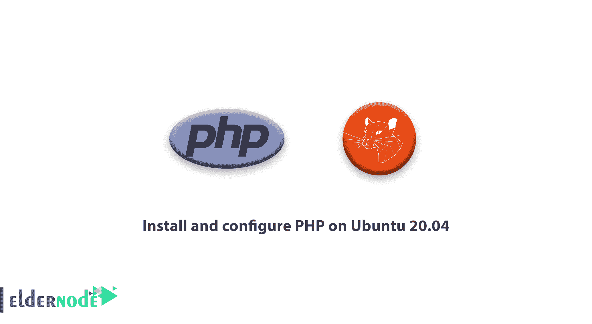

# 如何在 Ubuntu 20.04 | Eldernode 上安装和配置 PHP

> 原文：<https://blog.eldernode.com/install-and-configure-php-on-ubuntu-20-04/>



## **如何在 Ubuntu 20.04 Linux 服务器上安装和配置 PHP。**

在这个[教程](https://eldernode.com/category/tutorial/)中，我们将看看如何**在 Ubuntu 20.04** 和 [Linux 虚拟服务器](https://eldernode.com/linux-vps/)上安装和配置 PHP。在 PHP 7.2、7.3 和 7.4 版本中，安装并配置。

## 如何在 Ubuntu 20.04 上运行、安装和配置 PHP

安装完 PHP 完整版后，可以根据需要在 Ubuntu 系统上安装多个版本的 PHP 来更改 PHP 版本。

### 步骤 1)用下面的两个命令添加 PHP PPA

首先，需要更新软件包:

```
sudo apt update 
```

然后，您需要在系统上配置存储库:

```
sudo apt install software-properties-common  sudo add-apt-repository ppa:ondrej/php 
```

如果您成功更新并完成安装，我们将进入第二步。

### 步骤 2)安装所需的 PHP 版本(PHP 7.2、PHP 7.3、PHP 7.4)

您可以按照以下步骤安装所需的版本:

安装 PHP 7.2

要安装这个版本需要的是运行下面的命令:

```
sudo apt install php7.2 
```

安装 PHP 7.3

PHP 7.3 是 Ubuntu 上当前活跃的 [PHP](https://www.php.net/) 版本。要安装此版本，请运行以下命令:

```
sudo apt install php7.3 
```

安装 PHP 7.4

PHP 7.4 是可供安装的最新稳定版本。要在 Ubuntu [VPS](https://eldernode.com/vps/) 服务器上安装该版本，请运行以下命令:

```
sudo apt install php7.4 
```

注意:建议您在安装 PHP 版本之前升级您的程序，这样您就不会有任何问题。

### 步骤 3)检查 PHP 版本

完成安装步骤后，您可以使用以下命令检查 php 版本:

```
php -v 
```

### 步骤 4)在 PHP 版本之间切换

要使用 update-alternatives 命令设置默认 PHP 版本，请使用下面的命令:

```
update-alternatives --config php 
```

恭喜你，可以在 [Ubuntu 20.04](https://eldernode.com/tag/ubuntu-20-04/) 上成功安装配置 PHP 了。