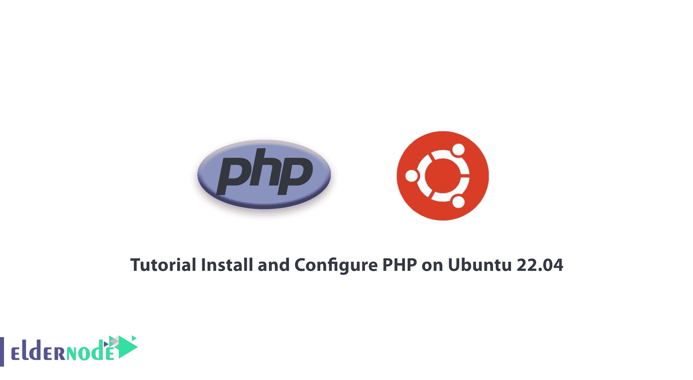
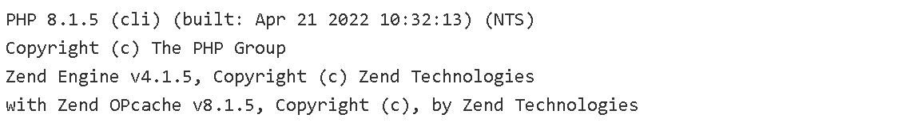
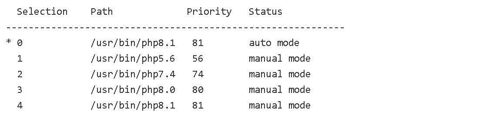

# 教程在 Ubuntu 22.04 上安装和配置 PHP-elder node 博客

> 原文：<https://blog.eldernode.com/install-and-configure-php-on-ubuntu-22-04/>



网站每天都在扩大，受众也越来越多。到目前为止，已经有超过 125000000 个域名在互联网上注册，这表明了互联网的快速发展。随着网站受众的增长，HTML 不再满足网站管理员的需求，需要一种像桌面软件一样的、易于扩展的编程语言。PHP、Asp、Java 等语言是为了服务网站而产生的。在这篇文章中，我们将教你如何在 Ubuntu 22.04 上安装和配置 PHP。

## **什么是 PHP？**

PHP 是设计动态网站最流行的编程语言，是一种免费的开源语言。这种脚本语言可以与 HTML 集成，其语法类似于 C 和 Perl 语言。PHP 是一种服务器端语言，这意味着 PHP 代码在服务器上被解释，并生成 HTML 输出或其他用户可见的输出。PHP 是拉斯马斯·勒德尔夫在 1994 年用 C 语言编写的，用于监控在线简历和相关个人信息。

### **PHP 特性**

*   简单易学
*   与 asp 等其他类似编程语言相比，服务速度更快
*   资源和内存的最佳使用
*   能够访问多个免费资源
*   专业网络编程语言
*   在不同平台上运行
*   能够在价格更低、功能更多的 Linux VPS 或 Linux 主机上运行
*   故障排除的速度和简易性

## **如何在 Ubuntu 22.04 上安装 PHP**

在做任何事情之前，通过控制台登录到 Ubuntu 22.04。

首先，您应该通过输入以下命令来更新系统的软件包:

```
sudo apt update && sudo apt upgrade
```

然后会要求您按下 **Y** 确认安装。

在安装 PHP 之前，您需要安装所需的依赖项。为此，请运行以下命令:

```
sudo apt install software-properties-common ca-certificates lsb-release apt-transport-https
```

翁德雷·PPA 是一名 PHP 和 Debian 开发者，维护 Ubuntu 系统的所有版本的 PHP 包。您可以使用以下命令将翁德雷 PPA 添加到您的系统中:

```
sudo add-apt-repository ppa:ondrej/php
```

接下来，通过输入以下命令再次更新系统:

```
sudo apt update
```

SURY 库有 PHP 8.1，8.0，7.4，7.3，7.2，7.1，7.0，5.6。您可以使用以下命令来安装任何所需的 PHP 版本。

**安装 PHP 8.1:**

```
sudo apt install php8.1
```

**安装 PHP 7.4:**

```
sudo apt install php7.4
```

**安装 PHP 5.6:**

```
sudo apt install php5.6
```

如果应用程序需要其他 PHP 扩展，您可以添加以下语法:

```
sudo apt install php8.1-[extension]
```

请注意，您应该替换您想要的扩展名，而不是[extension]。如果您想要添加多个扩展名，您可以执行以下操作:

```
sudo apt install php8.1-mysql php8.1-mbstring php8.1-xml php8.1-curl
```

## **如何在 Ubuntu 22.04 上配置 PHP**

您可以通过输入以下命令来验证 PHP 安装:

```
php -version
```

输出应该如下所示:



PHP 配置文件存储在/etc/php 目录下的一个带有版本号的目录中。主 PHP 配置文件位于以下位置:

```
PHP CLI: /etc/php/version/cli/php.ini
```

```
Apache: /etc/php/version/apache2/php.ini
```

```
PHP FPM: /etc/php/version/fpm/php.ini
```

PHP 模块存储在/etc/PHP/version/MODS-available 目录中。PHP 活动模块配置目录位于如下位置:

```
PHP CLI: /etc/php/version/cli/conf.d/
```

```
Apache: /etc/php/version/apache2/conf.d/
```

```
PHP FPM: /etc/php/version/fpm/conf.d/
```

如果你想检查 PHP 的任何版本的文件，只需把 PHP 版本号而不是版本放在文件和目录的路径中。

您可以通过运行以下命令列出所有 PHP 扩展:

```
php -m
```

要设置 PHP 的默认版本，请运行以下命令。你可以阅读更多关于为 CLI 和 Apache 切换 PHP 版本的内容。

```
sudo update-alternatives --config php
```

您将有 4 个备选 php 选项，分别是:
有 4 个备选 PHP 选项(提供/usr/bin/php)


按保持当前选择[*]，或者键入选择号:2
你收到的输出应该显示你系统上安装的所有版本的 PHP。PHP 7.4 被命令行的选项 2 设置为 PHP 的默认版本。

## **如何在 Ubuntu 22.04 上卸载 PHP**

您可以通过输入以下命令从系统中删除任何 PHP 版本:

```
sudo apt remove php-version
```

这释放了磁盘空间和系统安全性。

通过运行以下命令卸载所需版本的所有模块:

```
sudo apt remove php-version-*
```

记住在命令中用-version 替换您想要的版本。

## 结论

在本文中，我们教你如何在 ubuntu 22.04 上安装和配置 PHP。也解释了如何卸载 PHP。我们使用 Ondrej PPA，它允许你在一个系统上安装多个 PHP 版本，也可以快速安装 PHP。如有疑问，可在评论中联系我们。