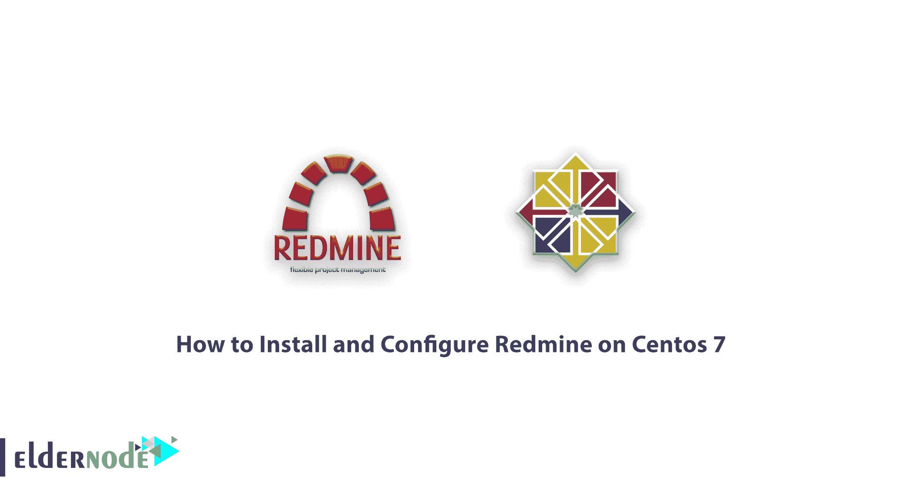

# 如何在 Centos 7 - Eldernode 博客上安装和配置 Redmine

> 原文：<https://blog.eldernode.com/install-and-configure-redmine-on-centos-7/>



逐步了解如何在 Centos 7 上安装和配置 Redmine。Redmine 是一个很棒的基于 web 的项目管理工具，用 Ruby on Rails 框架编写。Redmine 是开源的，并在 [GPL](https://en.wikipedia.org/wiki/GNU_General_Public_License) 下获得许可，被设计为跨平台和跨数据库。在本文中，我们将讨论如何在 CentOS 7 中安装和配置这个强大的项目管理器。你可以访问 [Eldernode](https://eldernode.com/) 提供的包来购买 [CentOS VPS](https://eldernode.com/centos-vps/) 服务器。

## 教程在 Centos 7 上安装和配置 red mine

### 安装 Redmine 的先决条件

在 Centos 7 上开始安装 Redmine 之前，您需要确保以下先决条件:

**1)** 指向你服务器公共 IP 的域名。在本教程中，我们考虑了域名【eldernode.com】**。所以你要输入你想要的域名。**

**在 Centos 7 上安装 Redmine 的下一个先决条件是一个 [Ruby](https://blog.eldernode.com/install-ruby-centos8/) 应用服务器，我们将使用带有 [Nginx](https://blog.eldernode.com/install-nginx-on-ubuntu-20-04-lts/) 的 Passenger。**

**最后，你需要有一个数据库。在本教程中，我们使用了 [MariaDB](https://blog.eldernode.com/whats-mariadb-how-it-works/) 数据库。您可以根据需要拥有自己的数据库。**

## **在 Centos 7 上安装和配置 red mine**

**准备安装 Redmine 的第一步是安装必要的 ruby 和 Redmine 包。要安装这些软件包，您必须键入并执行以下命令:**

```
`$ sudo yum install curl gpg gcc gcc-c++ make patch autoconf automake bison libffi-devel libtool`
```

```
`$ sudo yum install readline-devel sqlite-devel zlib-devel openssl-develh readline glibc-headers glibc-devel` 
```

```
`$ sudo yum install mariadb-devel zlib libyaml-devel bzip2 iconv-devel ImageMagick ImageMagick-devel`
```

**在下一步中，您必须安装所需的数据库。在本教程中，我们将在 CentOS 7 上安装 MariaDB:**

```
`$ sudo yum install mariadb-server`
```

**现在，您需要键入并执行以下命令来激活数据库(MariaDB):**

```
`$ sudo systemctl start mariadb`
```

```
`$ sudo systemctl enable mariadb`
```

**安装数据库后，可以使用以下命令检查其安装状态:**

```
`$ sudo systemctl status mariadb`
```

**现在，您必须键入并执行以下命令来安装安全脚本。执行以下命令后，将会询问您几个问题。输入“ **Y** 以响应它们:**

```
`$ sudo mysql_secure_installation`
```

### **教程创建 MySQL 数据库**

**要创建一个 [MySQL](https://blog.eldernode.com/install-mysql-on-linux-ubuntu-20-04/) 数据库，您首先需要使用以下命令登录到您的 MySQL shell:**

```
`$ sudo mysql`
```

**现在，您需要键入并运行以下命令，在 MySQL shell 中创建新的数据库:**

```
`mysql> CREATE DATABASE redmine CHARACTER SET utf8;`
```

**在 MySQL shell 中成功创建了一个新数据库之后，现在必须使用下面的命令在 MySQL 中创建一个帐户。您还需要为该用户提供访问数据库的权限。在下面的命令中，您需要键入您想要的密码，而不是 **EnterPasswordHere** 。**

```
`mysql> GRANT ALL ON redmine.* TO 'redmine'@'localhost' IDENTIFIED BY 'EnterPasswordHere';`
```

### **了解如何安装乘客和 Nginx**

**在本文的其余部分，我们将尝试教您如何为 [Nginx](https://blog.eldernode.com/install-nginx-on-ubuntu-20-04-lts/) 安装乘客模块。Passenger 是一个开源的 web 和应用服务器，它极大地简化了 Ruby 应用、 [Python](https://blog.eldernode.com/install-python-3-8-on-centos/) 和 [Node.js](https://blog.eldernode.com/install-node-js-centos-7/) 的部署。Passenger 是一种在所有 DreamHost 服务器上部署和托管 Ruby on Rails 应用程序的便捷方式。应该注意的是，乘客在每个 DreamHost 托管计划中都是免费的。**

**在第一步中，您必须使用以下命令来安装 EPEL 系统信息库:**

```
`$ sudo yum install epel-release yum-utils pygpgme`
```

```
`$ sudo yum-config-manager --enable epel`
```

**在安装了所需的包之后，您现在应该激活 Phusionpassenger 存储库。**

```
`$ sudo yum-config-manager --add-repo https://oss-binaries.phusionpassenger.com/yum/definitions/el-passenger.repo`
```

**现在是时候键入并运行以下命令来安装 Passenger 和 Nginx 了:**

```
`$ sudo yum install nginx passenger passenger-devel`
```

**在这篇文章的后续部分，在我们教你如何在 CentOS 7 上安装 Redmine 之前，我们将教你如何创建一个新的系统用户以及如何安装 Ruby。请加入我们。**

### **如何创建新的系统用户**

**创建新系统用户的目的是为了能够运行 Redmine。因此，您必须键入并执行以下命令:**

```
`$ sudo useradd -m -U -r -d /opt/redmine redmine`
```

**下一步，您需要将 Nginx 用户添加到新的用户组中。因此，您必须键入并执行以下命令:**

```
`$ sudo usermod -a -G redmine nginx`
```

**要访问 Nginx，请输入以下命令:**

```
`$ sudo chmod 750 /opt/redmine`
```

### **教程安装 Ruby**

**准备在 CentOS 7 发行版上安装 Redmine 的最后一件事是安装 Ruby。在第一步中，您必须通过键入以下命令转到 Redmine 用户:**

```
`$ sudo su - redmine`
```

**在第二步中，您必须通过键入并执行以下命令来输入 **GPG 键**:**

```
`$ gpg --keyserver hkp://pool.sks-keyservers.net --recv-keys 409B6B1796C275462A1703113804BB82D39DC0E3 7D2BAF1CF37B13E2069D6956105BD0E739499BDB`
```

**现在你需要安装 [RVM](https://en.wikipedia.org/wiki/Ruby_Version_Manager) :**

```
`$ curl -sSL https://get.rvm.io | bash -s stable`
```

**安装 RVM 后，在下一步中，您必须找到 RVM 文件才能使用它。为此，键入并运行以下命令:**

```
`$ source /opt/redmine/.rvm/scripts/rvm`
```

**现在输入下面的命令行来安装 Ruby。需要注意的是，在下面的命令中，2.7.2 表示的是 Ruby 的最新版本，如果有新版本可以更改。**

```
`$ rvm install 2.7.2`
```

```
`$ rvm --default use 2.7.2`
```

## **如何在 CentOS 7 上安装 red mine**

**首先以 Redmine 用户的身份登录。然后，您需要使用下面的 Curl 命令下载 Redmine 归档文件:**

```
`$ curl -L http://www.redmine.org/releases/redmine-4.1.1.tar.gz -o redmine.tar.gz`
```

**现在您需要解压缩下载的文件:**

```
`$ tar -xvf redmine.tar.gz`
```

**下一步是配置 Redmine 数据库，您可以使用以下示例来完成:**

```
`$ cp /opt/redmine/redmine-4.1.1/config/database.yml.example /opt/redmine/redmine-4.1.1/config/database.yml`
```

**然后使用文本编辑器打开文件:**

```
`nano /opt/redmine/redmine-4.1.1/config/database.yml`
```

**通过在生产部分进行搜索，输入创建的数据库信息。请注意，您必须输入您想要的密码，而不是在此输入密码。然后**救**它。**

****制作:**
**适配器:** mysql2
**数据库:** redmine
**主机:** localhost
**用户名:** redmine
**密码:**【enter password here】
**编码:** utf8**

**接下来，您需要安装所有的 ruby 依赖项和 bundler。为此，请转到 redmine-4.1.1 目录，打开终端，输入以下命令:**

```
`$ cd ~/redmine-4.1.1`
```

```
`$ gem install bundler --no-rdoc --no-ri`
```

```
`$ bundle install --without development test postgresql sqlite`
```

**在下一步中，通过键入以下命令，您必须生成密钥并移动数据库:**

```
`$ bundle exec rake generate_secret_token`
```

```
`$ RAILS_ENV=production bundle exec rake db:migrate`
```

**在运行 Redmine 之前，您必须做的另一个步骤是配置 Nginx。只需切换到您的 sudo 用户:**

```
`$ exit`
```

**通过重新打开您喜欢的文本编辑器来创建 Nginx 服务器块:**

```
`$ sudo nano /etc/nginx/conf.d/example.com.conf`
```

**在用下面文本中的 www.example.com 替换您想要的 Redmine 域后，将其复制并粘贴到您打开的文件中:**

```
`passenger_root /usr/share/ruby/vendor_ruby/phusion_passenger/locations.ini;  passenger_ruby /opt/redmine/.rvm/gems/default/wrappers/ruby;  passenger_instance_registry_dir /var/run/passenger-instreg;    server {  listen 80;  server_name example.com www.example.com;    root /opt/redmine/redmine-4.1.1/public;    # log files  access_log /var/log/nginx/example.com.access.log;  error_log /var/log/nginx/example.com.error.log;    passenger_enabled on;  passenger_min_instances 1;    client_max_body_size 10m;  }`
```

**如果您成功完成了所有任务和步骤，您应该会看到以下输出:**

```
`nginx: the configuration file /etc/nginx/nginx.conf syntax is ok`
```

```
`nginx: configuration file /etc/nginx/nginx.conf test is successful`
```

**最后重启 Nginx 服务器:**

```
`sudo systemctl restart nginx`
```

**完整安装 Redmine 的最后一步是用 SSL 加密 [Nginx](https://blog.eldernode.com/install-nginx-debian-10/) 。为此，您必须首先使用下面的命令行打开 Nginx 配置文件:**

```
`$ sudo nano /etc/nginx/conf.d/example.com.conf`
```

**然后，您需要编辑您的 Redmine 域，而不是下面命令中的**example.com**。这样就完成了 Redmine 的安装，您可以访问它:**

```
`passenger_root /usr/share/ruby/vendor_ruby/phusion_passenger/locations.ini;  passenger_ruby /opt/redmine/.rvm/gems/default/wrappers/ruby;  passenger_instance_registry_dir /var/run/passenger-instreg;    # Redirect HTTP -> HTTPS  server {  listen 80;  server_name www.example.com example.com;    include snippets/letsencrypt.conf;  return 301 https://example.com$request_uri;  }    # Redirect WWW -> NON WWW  server {  listen 443 ssl http2;  server_name www.example.com;    ssl_certificate /etc/letsencrypt/live/example.com/fullchain.pem;  ssl_certificate_key /etc/letsencrypt/live/example.com/privkey.pem;  ssl_trusted_certificate /etc/letsencrypt/live/example.com/chain.pem;  include snippets/ssl.conf;    return 301 https://example.com$request_uri;  }    server {  listen 443 ssl http2;  server_name example.com;    root /opt/redmine/redmine-4.1.1/public;    # SSL parameters  ssl_certificate /etc/letsencrypt/live/example.com/fullchain.pem;  ssl_certificate_key /etc/letsencrypt/live/example.com/privkey.pem;  ssl_trusted_certificate /etc/letsencrypt/live/example.com/chain.pem;  include snippets/ssl.conf;  include snippets/letsencrypt.conf;    # log files  access_log /var/log/nginx/example.com.access.log;  error_log /var/log/nginx/example.com.error.log;    passenger_enabled on;  passenger_min_instances 1;  client_max_body_size 10m;  }`
```

## **结论**

**在本文中，我们首先介绍作为项目控制程序的免费开源 Redmine 程序。然后，在解释了安装该软件的必要先决条件后，我们教您如何在 Centos 7 上安装和配置 Redmine。**