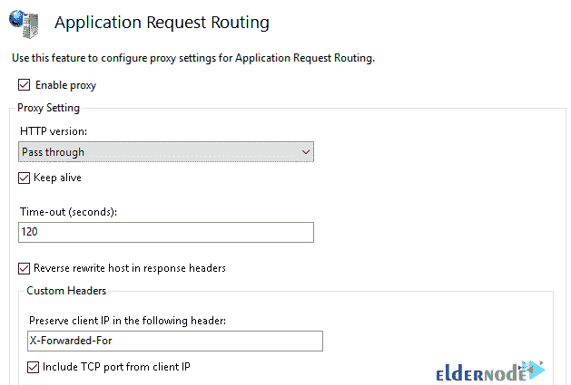

# 教程在 IIS - Eldernode 博客上安装和配置反向代理

> 原文：<https://blog.eldernode.com/install-and-configure-reverse-proxy-on-iis/>

IIS 代表互联网信息服务。它是一个 web 服务器软件包，是为 Windows Server 设计的。作为网站管理员，您需要 IIS 来创建、配置和发布网站。Internet 信息服务允许您修改网站的默认页面、错误页面、日志记录设置和安全设置。本文介绍了在 IIS 上安装和配置反向代理的教程**。访问 [Eldernode](https://eldernode.com/) 将满足您购买自己的 [Windows VPS](https://eldernode.com/windows-vps/) 主机的愿望。**

## **在 IIS 上安装并配置反向代理**

IIS 主要用于托管 ASP.NET web 应用程序和静态网站。由于 IIS 提供标准 HTML 网页和动态网页，它能够将 HTML 和相关图像发送到用户的浏览器。IIS 可以在使用 Mono 的 Linux 和 Mac 上运行，但是建议你在 Windows 服务器操作系统上运行 IIS，因为它更加灵活和稳定。

一个正向代理位于一组客户端机器的前面，而一个**反向代理**是一个位于 web 服务器前面的服务器，将客户端请求转发到那些 web 服务器。本指南将教你如何在 [Windows](https://blog.eldernode.com/tag/windows/) 服务器上**安装和配置带有 IIS** 的反向代理。

## **如何在 IIS 上安装反向代理**

首先，您需要学习下载和安装扩展，因为默认情况下 IIS 没有反向代理路由功能。让我们来看一下本节的步骤，并回顾一下路由扩展的安装过程。

*第一步:*

***注:*** 如你所知，必须先**启用 IIS** 。这里是[应用程序请求路由](https://www.iis.net/downloads/microsoft/application-request-routing)和 [URL 重写](https://www.iis.net/downloads/microsoft/url-rewrite)链接，让您手动安装某些扩展。

当您安装扩展时，您将看到 URL 重写选项被添加到 IIS 仪表板的默认网站下。您必须查看如下内容:

*第二步:*

现在，您可以**添加一个反向代理规则**。在 URL 重写选项内单击，并遵循以下路径来完成此操作:

**右边工具栏** > >选择**动作** > > **添加规则** (s)… > > **入库规则** s > > **空白规则或反向代理规则**。

然后，您应该会看到如下所示:

让我们看看上图的选项是什么意思。

**图案:**

匹配反向代理路由的正则表达式形式的 URL 模式。它使用正则表达式格式。

**条件:**

补充模式的额外条件。(可选)

**服务器变量:**

如有必要，添加自定义服务器变量。(可选)

**动作:**

URL 匹配时要执行的操作

**重写网址:**

匹配时要路由到的 URL。

***模式注意:*** 在**模式**的字段中，必须检查反向路由 URL 的属性是否匹配。如果是，暗示将模式设置为*(。*)* 。用括号括起来的**模式**中的所有内容都可以在后面的**重写 URL** 框中依次引用( *{R:1}* 、 *{R:2}* 等等)。 *{R:0}* 指整个 URL。

如上图所示，**http://api.myserver.com/myapi/auth/login**的请求作为**http://localhost:8080/auth/log in**被路由到 **http://localhost:8080** 。

这样就创建了***{ R:0 }—myapi/API/log in**和 **{R:1} — auth/login*** 变量。

修改完**模式**和**重写 URL** 后，点击**应用**即可应用修改。

**如何在 IIS 上配置反向代理**

### 正如您在前面读到的，默认情况下，IIS 是不启用的。因此，在本节中，您将学习如何启用 IIS 代理设置。按照下面的简单步骤继续在 IIS 上配置反向代理。

1-打开 **IIS 管理器**并点击服务器。

2-双击**应用请求路由**选项。

3-在右侧工具栏，选择服务器**代理设置…**

4-检查**启用代理。**

5-点击**应用**并继续 URL 重写配置。

***注:*** 启用转发代理未得到 404 未找到。如果只应用 URL 重写规则，就会发生这种情况。

就是这样！您刚刚回顾了在 Windows IIS 中启用反向代理路由所需的所有步骤。反向代理设置现在即将完成。

结论

在本文中，您了解了如何在 IIS 上安装和配置反向代理。我们不希望你遇到严重的问题。IIS 将能够捕获传入流量并将其转发到后端服务器，检查来自后端服务器的响应，并重写响应中的 URL 链接，以匹配 IIS 用于发布网站的主机头。

## Conclusion

In this article, you learned How to Install And Configure Reverse Proxy on IIS. We do not expect you to encounter serious issues. IIS will be able to capture incoming traffic and forward it to the backend server and inspect responses from the backend server and rewrite URL links inside the responses to match the host headers that IIS uses to publish the site.