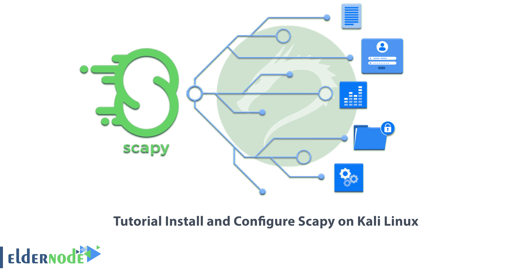

# 教程在 Kali Linux 上安装和配置 Scapy

> 原文：<https://blog.eldernode.com/install-and-configure-scapy-on-kali-linux/>



如果你正在寻找一个解密和记录数据的工具，我们推荐 Scapy。Scapy 工具欺骗来自源的数据包，解密然后捕获它们。在本文中，您将熟悉 Scapy，并学习如何在 Kali Linux 上安装和配置 Scapy。如果你想购买一台 [**Linux VPS**](https://eldernode.com/linux-vps/) 服务器，你可以查看 [Eldernode](https://eldernode.com/) 网站上提供的软件包。

## **如何在 Kali Linux 上安装和配置 Scapy**

### **什么是 Scapy？**

Scapy 是一个免费的开源工具，用于基于 Python 的交互式包操作。该工具可用作外壳，与传入和传出的网络流量进行交互。您还可以使用 Scapy 通过内置模块进行路由。

### **Scapy 可以做什么？**

使用 Scapy，您可以轻松地执行经典任务，如扫描、跟踪、探索、单元测试、攻击或网络发现。可以用这个工具代替 **hping** 、 **nmap** 、 **arpspoof** 、 **apr-sk** 、 **arping** 、 **tcpdump** 、 **Wireshark** 、 **P0f** 。

Scapy 还可用于特殊任务，如发送无效帧、VLAN 跳频+ ARP 缓存中毒、WEP 保护通道中的 VoIP 解码。

在这篇来自 [Kali Linux 培训](https://blog.eldernode.com/tag/kali-linux/)系列的文章的续篇中，我们打算教你如何在 Kali Linux 上安装和配置 Scapy。

## **在 Kali Linux 上安装 Scapy**

您可以使用以下命令**在 Kali Linux 上安装 Scapy** :

```
apt install python3-scapy
```

### **如何在 Kali Linux 上配置 Scapy**

在下文中，我们将回顾 Scapy 的各种工具，并学习如何在 Kali Linux 上配置它们。

这是一个交互式包操作工具。运行以下命令对其进行配置:

```
scapy -h
```

另一个交互式包操作工具是 **Scapy3** 。您可以通过运行以下命令来配置它:

```
scapy3 -h
```

## 常见问题解答

[sp _ easy agreement]

## 结论

这样，您就知道 Scapy 是一个操作交互式包的工具。在本文对 Scapy 做了简短介绍之后，您了解了如何在 Kali Linux 上安装 Scapy，以及如何配置 Scapy 的不同工具。