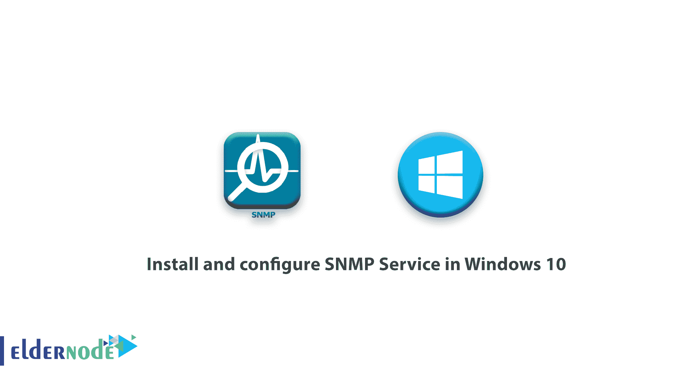

# 如何在 Windows 10 - Eldernode 中安装和配置 SNMP 服务

> 原文：<https://blog.eldernode.com/install-and-configure-snmp-service/>



简单网络管理协议(SNMP)用于监控、报告事件和管理网络上的设备。该协议包括一组网络管理标准，包括应用层协议和一组对象数据。一般来说，SNMP 的工作原理是让代理向 SNMP 管理器发送和监控客户机信息。默认情况下，端口 UDP 161 用于发送和接收 SNMP 消息，端口 162 用于交换 SNMP 陷阱。当然，这些端口是可以更改的。在本文中，您将了解如何在 Windows 10 中安装和配置 SNMP 服务。不要错过 2021 年 [Eldernode](https://eldernode.com/) 上的优惠活动，购买您自己的 [Windows VPS](https://eldernode.com/windows-vps/) 。

## **教程在 Windows 10 中安装和配置 SNMP 服务**

SNMP 可以从不同的设备接收多种不同的信息，如交换机、服务器、路由器或安装了 SNMP 代理的计算机(如系统启动时)、性能计数器和设备参数等。在 Windows 10 中，SNMP 服务是一个独立的组件，默认情况下不会安装。

默认情况下，SNMP 协议在 Windows XP、Vista、7、8、10 以及 Windows Servers 2003、2008、2012、2016 上是禁用的，您必须启用并配置它。在本教程中跟随我们。

### **如何在 Windows 10 中安装 SNMP 服务**

使用 Get-Service **PowerShell** 命令，您可以检查 Windows 上是否启用了 SNMP 服务:

```
Get-Service -Name snmp
```

您可以从**控制面板**安装 SNMP 服务。

进入**控制面板>程序和功能>打开或关闭 Windows 功能**。

在 Windows 功能列表中，选择简单网络管理协议(选择 SNMP 和 **WMI SNMP 提供商**，然后点击**确定**。

要点:此服务通过 Windows Management Instrumentation 界面提供对 SNMP 信息的访问。


此外，您可以使用 **PowerShell** 来**启用** SNMP 服务:

```
Enable-WindowsOptionalFeature -online -FeatureName SNMP
```

### **如何在 Windows 10 中配置 SNMP**

安装后，SNMP 服务会自动启动。打开服务管理( **services.msc** )控制台。

服务列表中应显示两项新服务:

**–SNMP 服务:**这是跟踪活动和发送信息的主要 SNMP 代理服务。

**–SNMP 陷阱:**从本地或远程 SNMP 代理接收陷阱消息，并将消息转发给运行在该计算机上的 SNMP 管理软件。

打开 SNMP 服务的**属性**。如果处于停止模式，点击**启动**按钮，将其启动类型改为**自动**。


点击**代理**标签。填写联系人和位置字段(您可以指定计算机的用户名和位置)，并选择您要从中收集数据并将其发送到显示器的服务列表。有五种类型的服务要收集:

1.身体的

2.应用程序

3.互联网

4.端到端

5.数据链和子网


点击**安全**标签。在这里您可以为 **SNMP 服务器** 配置几种不同类型的设置。

接受的团体名称列表包括 SNMP 设备的名称。

**社区名**有类似用户名和密码的功能。

点击**添加**并选择社区名称和四个访问级别之一(无、通知、只读、读写和读取创建)

***注意:*** 读写是 SNMP 中最大的访问级别。

**如何在 Windows 10 中使用 SNMP 服务监控系统**

### 要监控系统，您可以使用**只读**，它不会对系统应用任何更改。

在这个例子中，我们将**社区命名为** public，**访问** **只读**。

然后，在**接受来自这些主机**的 SNMP 包部分，输入您想要从其接收 **SNMP 包**的监控服务器列表(**名称或 IP 地址**)。


您可以选择接受来自任何主机的 SNMP 数据包选项，但这不是很安全。

保存更改并重置 SNMP 服务。如果要在**多台主机**或**远程服务器**上启用 SNMP，可以使用 **PowerShell** 或**组策略**。

结论

## 在本文中，您了解了如何在 Windows 10 中安装和配置 SNMP 服务。在 Windows 10 中安装 SNMP 服务首先是使用 PowerShell 命令和控制面板来教授的。然后，你看到了如何在 Windows 10 中配置 SNMP。最后举例说明了在 Windows 10 中使用 SNMP 服务监控系统的方法。通过安装 SNMP，监控系统可以从操作系统接收必要的信息。花些有用的时间在 [Windows 教程](https://blog.eldernode.com/tag/windows/)上，完善你的 Windows 知识。

In this article, you learned How To Install And Configure SNMP Service In Windows 10\. Installing SNMP Service in Windows 10 was taught firstly using PowerShell commands as well as the control panel. Then, you saw how to configure SNMP in Windows 10\. Finally, the way of monitoring the system using the SNMP service in Windows 10 was explained with an example. By installing SNMP monitoring systems can receive the necessary information from the operating system. Complete your knowledge of Windows by spending useful time on [Windows tutorials](https://blog.eldernode.com/tag/windows/).