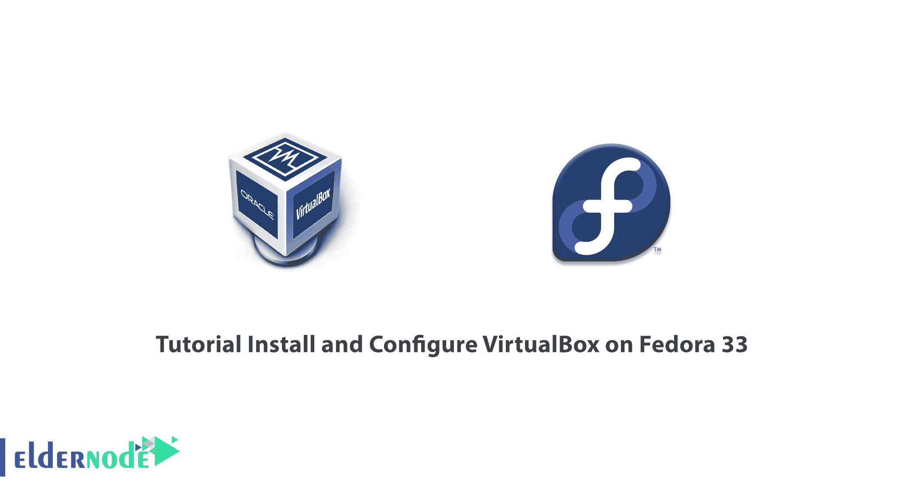
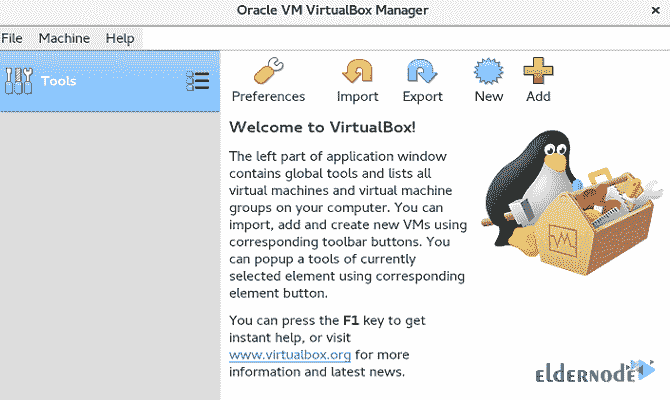
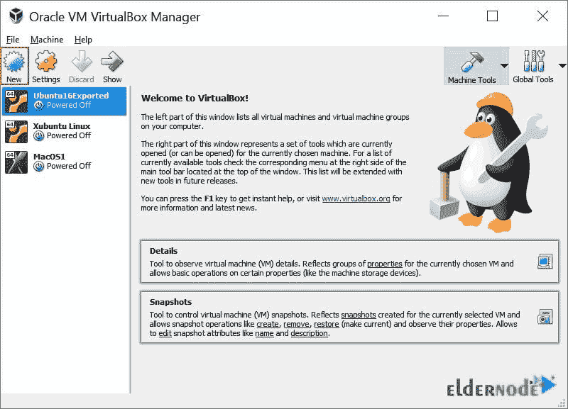

# 教程在 Fedora 33 - Eldernode 博客上安装和配置 VirtualBox

> 原文：<https://blog.eldernode.com/install-and-configure-virtualbox-on-fedora/>



VirtualBox 是一个面向 x86 硬件的强大的通用全虚拟化器，面向服务器、桌面和嵌入式应用。根据您的硬件配置，VirtualBox 将运行许多客户操作系统。它不是单独安装，而是通过在上配置多个操作系统来节省系统内存。所以，你可以在上面安装一些设置和服务。它设计用于企业和家庭。VirtualBox 是根据 GNU 通用公共许可证(GPL)第 2 版条款作为开源软件提供的唯一专业免费解决方案。企业客户发现它是一款功能极其丰富的高性能产品。加入我们的**教程在 Fedora 33** 上安装和配置 VirtualBox。此外，如果你打算购买自己的 **[Linux VPS](https://eldernode.com/linux-vps/)** ，可用的 [Eldernode](https://eldernode.com/) 软件包将是你所需要的。

## **在 Fedora 上安装并配置 VirtualBox 33**

VirtualBox 运行在 [Windows](https://blog.eldernode.com/tag/windows/) 、 [Linux](https://blog.eldernode.com/tag/linux/) 、Macintosh 和 Solaris 主机上，并支持大量的客户操作系统。让我们浏览一下本指南的步骤，并了解如何在 Fedora 33 上安装和配置 VirtualBox。

**先决条件注意事项**:如果您以普通用户或管理用户的身份使用系统，请使用 [Sudo 命令](https://blog.eldernode.com/sudoers-configurations-setting-sudo/)获得运行本指南大部分(如果不是全部)命令的 root 权限。

### **VirtualBox 的特性**

Oracle VM VirtualBox 提供的技术和功能在以下情况下非常有用:

–同时运行多个操作系统

–更简单的软件安装

–测试和灾难恢复

–基础设施整合

## **在 Fedora 33 上安装 VirtualBox | Fedora 32**

大多数 Linux 平台软件包仓库都支持 VirtualBox 6.1。因为 VirtualBox 在默认的 Fedora 33 存储库中不可用，所以重新构建可用的 Fedora 32 rpm。

首先从他们的[官网](https://www.virtualbox.org/wiki/Downloads)下载适用于 Fedora 32 的 VirtualBox 6.1。

```
wget https://download.virtualbox.org/virtualbox/6.1.16/VirtualBox-6.1-6.1.16_140961_fedora32-1.x86_64.rpm
```

然后，您可能会面临一个错误，这意味着 **Python 3.8** 被绑定到这个 rpm 包(=3.8)，并且在系统上找不到它。因此，使用下面的命令来检查可用的 Python 版本:

```
ls /usr/bin/python*
```

由于最新版本是 Python 3.9，您需要避免降级到 Python 3.8，因为这会影响依赖于 3.9 版本的其他包。因此，需要重新构建包才能使用 Python 3.9 及以上版本。

要安装所需的软件包，请运行以下命令:

```
sudo dnf -y install rpmrebuild binutils gcc make patch libgomp glibc-headers glibc-devel kernel-headers kernel-devel dkms qt5-qtx11extras libxkbcommon
```

### **如何重建 VirtualBox**

要使用 rpm 重建编辑 Python 3.8 要求，请导航到您下载 rpm 文件的位置，在我的例子中是当前工作目录:

```
ls
```

```
VirtualBox-6.1-6.1.16_140961_fedora32-1.x86_64.rpm
```

然后，键入:

```
sudo rpmrebuild --change-spec-preamble='sed -e "s/32/33/"' --change-spec-requires='sed -e "s/python(abi) = 3.8/python(abi) >= 3.8/"' --package VirtualBox-6.1-6.1.16_140961_fedora32-1.x86_64.rpm
```

该命令将运行几分钟。完成后，您将看到类似于下面的最后一行:

```
result: /root/rpmbuild/RPMS/x86_64/VirtualBox-6.1-6.1.16_140961_fedora33-1.x86_64.rpm
```

### **如何在 Fedora 33 上安装 VirtualBox 6.1**

新的 rpm 位于上面一行所示的目录中:

```
cd ~/rpmbuild/RPMS/x86_64/
```

```
sudo dnf -y install ./VirtualBox-6.1-6.1.16_140961_fedora33-1.x86_64.rpm
```

现在，您可以看到安装过程。然后，为这个新包重新构建内核模块:

```
sudo /usr/lib/virtualbox/vboxdrv.sh setup
```

### **将用户添加到 vboxusers 组**

使用以下命令将当前用户添加到 vboxusers 组:

```
sudo usermod -aG vboxusers $USER
```

## **如何在 Linux 上配置 VirtualBox 环境**

VirtualBox 安装需要内核源代码来安装需要的模块。让我们配置 VirtualBox 获取内核源代码的环境变量 **KERN_DIR** 。确保您使用的是正确的源路径:

```
export KERN_DIR=/usr/src/kernels/`uname -r`
```

```
echo $KERN_DIR
```

```
/usr/src/kernels/4.16.5-300.fc28.x86_64
```

### 如何在 Fedora 33 上安装开发工具

要运行 Oracle VM VirtualBox 图形用户界面，首先，您应该安装 **Qt** 和 **SDL** 包。安装程序在系统上创建内核模块。因此，您需要安装开发工具(GNU compiler (GCC)，GNU Make (make))和包含用于构建过程的内核头文件的包:

```
dnf install @development-tools
```

```
dnf install kernel-devel kernel-headers dkms qt5-qtx11extras elfutils-libelf-devel zlib-devel
```

### **如何在 Fedora 上运行 VirtualBox 33**

如果通过了以上步骤，现在应该已经在 Fedora 33 上成功安装了 VirtualBox 6.1。因此，**从桌面应用程序启动**,或者在终端中运行以下命令:

```
VirtualBox
```

这样，您可以在初次启动后查看 VirtualBox 管理器窗口，如下所示:



左侧窗格稍后将列出您的所有虚拟机。由于您尚未创建任何虚拟机，因此该列表为空。**工具**按钮提供对用户工具的访问，例如虚拟媒体管理器。

### **如何在 Fedora 上使用 VirtualBox 33**

安装完成后，您可以部署新的虚拟机。打开应用程序，查看 VirtualBox 的图形用户界面，该界面适用于所有受支持的主机操作系统。此外，如果需要，还可以使用命令行界面和 VBoxManage。

在 VirtualBox 管理器窗口中点击**新建**。将显示一个向导，指导您设置新的虚拟机(VM)。



## 结论

在本文中，在 [Fedora](https://blog.eldernode.com/tag/fedora/) 33 上安装和配置 VirtualBox。从现在开始，您可以为自己选择的操作系统创建虚拟机，并在其上工作。