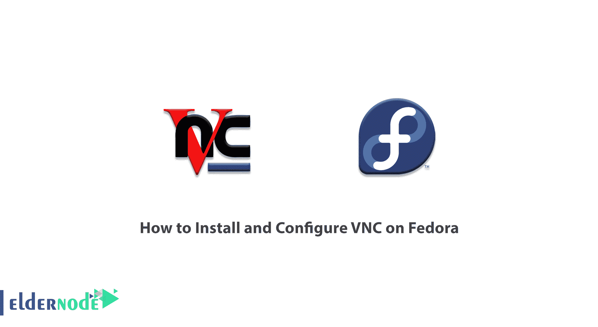

# 如何在 Fedora - Eldernode 博客上安装和配置 VNC

> 原文：<https://blog.eldernode.com/install-and-configure-vnc-on-fedora/>



VNC 代表虚拟网络计算，一种在网络中断和不可用时监控服务器状态的软件。您可以使用 VNC 查看和检查服务器的当前状态。VNC 充当操作系统图形界面的用户界面(远程桌面)。换句话说，VNC 将服务器监视器图像发送到您的计算机。该软件还提供有关您按下的键盘或鼠标键的信息。有了这个软件，你可以很容易地连接到服务器，并把它当作你自己的电脑来使用。加入我们这篇文章，学习如何在 Fedora 上安装和配置 VNC。你也可以访问 [Eldernode](https://eldernode.com/) 中可用的包来购买 [Linux VPS](https://eldernode.com/linux-vps/) 服务器。

## **教程在 Fedora** 上安装和配置 VNC

VNC 也被称为控制台，用于在网络中断和无法访问时监控服务器状态。有了 VNC，你可以看到你的服务器的状态。你也可以检查无法访问你的服务器的问题。许多服务器在启动时挂起，或者 SSHD 服务可能无法在 [Linux](https://blog.eldernode.com/tag/linux/) 服务器上正常工作，远程桌面可能在 [Windows VPS](https://eldernode.com/windows-vps/) 服务器上被禁用，以及许多其他软件问题。有了 VNC，你可以进入服务器，用它来检查和解决问题。

请继续关注我们的这篇文章。

### **【VNC 应用程序(在 Fedora 33 上安装和配置 VNC)**

VNC 应用程序包括以下内容:

**1-在 Linux 远程图形环境中工作**

由于 Linux 操作系统的高度稳定性，Linux 发行版经常在服务器上使用。一些 Linux 发行版没有图形界面。所以首先你需要在上面安装 KDE 或者 Gnome 图形界面。现在 Linux 有了图形界面，您需要以某种方式连接到它。然后在服务器上安装和配置 VNC。现在，您可以使用建立 VNC 连接的程序来访问和管理您的 Linux 服务器图形环境。

**2-当网络中断或 SSH 服务不可用时访问 VPS 服务器**

有时由于虚拟机无法识别网卡等各种问题。，您与 [VPS 服务器](https://eldernode.com/vps/)的网络连接中断。或者 SSH 服务器服务由于任何原因不可用。在这些情况下，VNC 可以充当到服务器的桥梁并连接到服务器。

**3-在 VPS 服务器上安装操作系统**

在 VPS 服务器上安装操作系统最简单的方法之一是使用 VNC。使用 VNC，您可以在 VPS 服务器上轻松启动操作系统并执行安装步骤。

### **将 VNC 一步步安装在 Fedora 上**

在本节中，我们决定安装一个轻量级的 VNC 服务器包， **TigerVNC** 。需要注意的是，这个包甚至适用于低速互联网。然后，我们使用 SSH 来创建到 VNC 服务器安全隧道。这篇文章将指导您完成 **XFCE** 桌面环境的安装，您可以使用它从远程位置连接 VNC。

第一步是使用以下命令在 Fedora 服务器上安装 XFCE:

```
dnf install @xfce-desktop-environment
```

然后，在下一步中，您必须通过执行以下命令来安装 TigerVNC 服务器软件包:

```
dnf install tigervnc-server
```

### **如何在 Fedora 上创建 VNC 用户 33**

应该注意的是，出于安全原因，您必须以 root 用户的身份登录您的服务器。相反，通过其他拥有 **Sudo** 权限的用户远程登录。然后需要创建一个拥有 Sudo 权限的新用户。这个新用户可以远程访问 VNC 服务器。使用以下命令，您可以创建新用户并设置服务器密码:

```
sudo useradd -m -s /bin/bash myvncuser
```

```
sudo passwd myvncuser
```

在下一步中，您必须使用以下命令将新用户添加到轮组，以授予 root 权限:

```
sudo usermod -a -G wheel myvncuser
```

最后，您可以通过运行以下命令以新用户身份登录:

```
su - myvncuser
```

### 如何运行 VNC 服务器

在本节中，我们将首次运行 VNC 服务器来创建安装文件。在本教程中，云服务器名称为 **Elder-puffin-86** 。您可以使用以下命令首次为您的用户运行 VNC 服务器的初始值:

```
[[email protected]](/cdn-cgi/l/email-protection):~$ vncserver
```

正如您在下面的输出中看到的，您将被要求创建一个仅查看的密码。仅查看密码用于为用户提供共享屏幕视图，但他们将无法控制鼠标或键盘:

```
You will require a password to access your desktops.    Password:  Warning: password truncated to the length of 8\.  Verify:  Would you like to enter a view-only password (y/n)? y  Password:  Warning: password truncated to the length of 8\.  Verify:  xauth: file /home/myvncuser/.Xauthority does not exist  xauth: (argv):1: bad display name "Elder-puffin-86:1" in "add" command  xauth: file /home/myvncuser/.Xauthority does not exist    New 'X' desktop is Elder-puffin-86:1  127.0.0.1 localhost    Creating default startup script /home/myvncuser/.vnc/xstartup  Starting applications specified in /home/myvncuser/.vnc/xstartup  Logfile is /home/myvncuser/.vnc/Elder-puffin-86:1.log
```

### **如何在 Fedora** 上配置 VNC

既然您已经能够第一次设置 VNC 服务器，那么您需要配置一些基本文件。执行这些设置，以便在设置 VNC 服务器时自动运行。

第一步是停止正在运行的 VNC 服务器进程:

```
vncserver -kill :1
```

***注:*** 由于 VNC 默认运行在服务器端口 5901 上，所以在使用 VNC 服务器时，命令行如下 **:1** 。VNC 也可以在多个显示端口上运行。这样，5902 可以标记为 **:2，** 5903 可以标记为 **:3，**等。

接下来，您需要使用以下命令备份默认启动脚本文件:

```
mv ~/.vnc/xstartup ~/.vnc/xstartup.bak
```

然后，您可以使用您喜欢的文本编辑器创建一个新的“ **xstartup** 文件，例如 [nano](https://blog.eldernode.com/how-to-work-with-nano-editor-in-linux/) 或 [vim](https://blog.eldernode.com/use-vi-full-text-editor/) :

```
vim ~/.vnc/xstartup
```

现在，您需要将以下命令放入您创建的新文件中。然后**保存**它。

```
#!/bin/bash
```

```
xrdb $HOME/.Xresources
```

```
startxfce4 &
```

因为我们要求 VNC 服务器在启动期间执行其他命令，所以您必须向新的启动文件授予可执行权限:

```
sudo chmod +x ~/.vnc/xstartup
```

## 结论

通常，因为 VNC 工具以监控服务器状态而闻名，所以可能不清楚这是否是一个监控工具。你要注意，这个工具是一个图形界面，实际上是一个服务器屏幕。在本文中，我们试图教如何在 Fedora 上安装和配置 VNC。如果想在 [CentOS](https://blog.eldernode.com/install-vnc-on-centos-linux/) 、 [Ubuntu 20.04](https://blog.eldernode.com/install-vnc-ubuntu-20/) 、 [Debian](https://blog.eldernode.com/install-vnc-on-debian-10/) 上安装配置 VNC，可以参考这些文章。