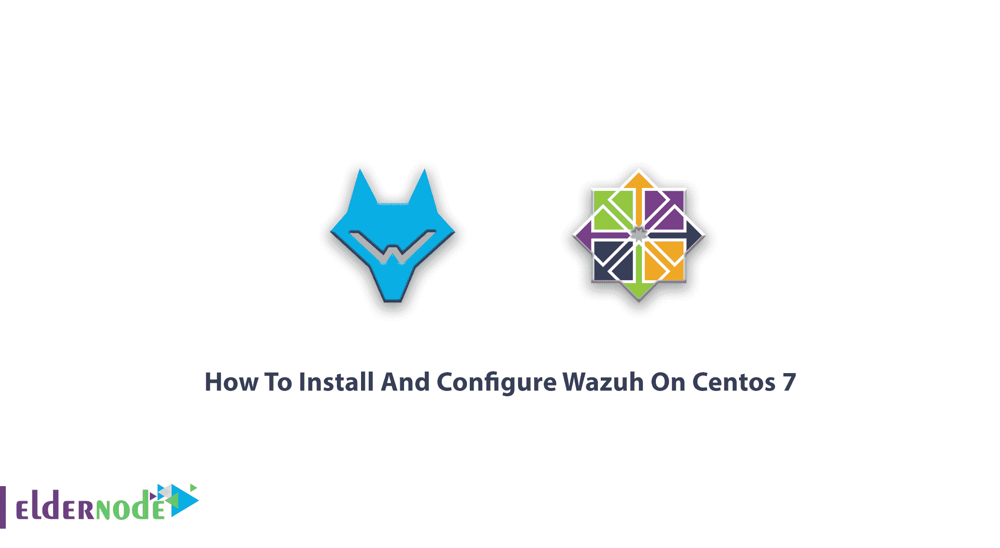
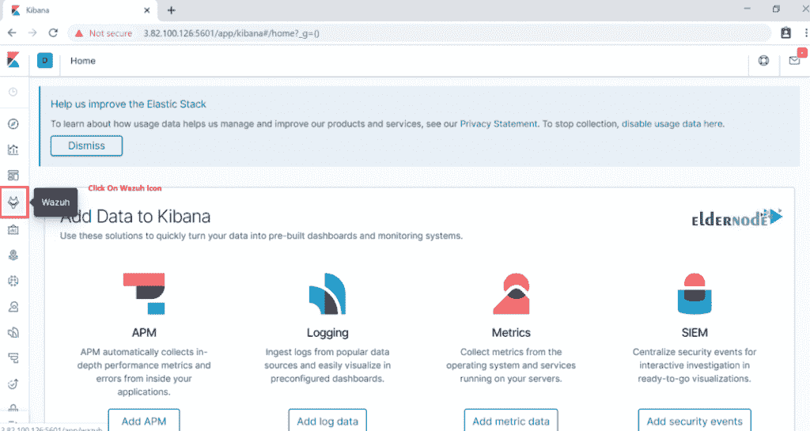
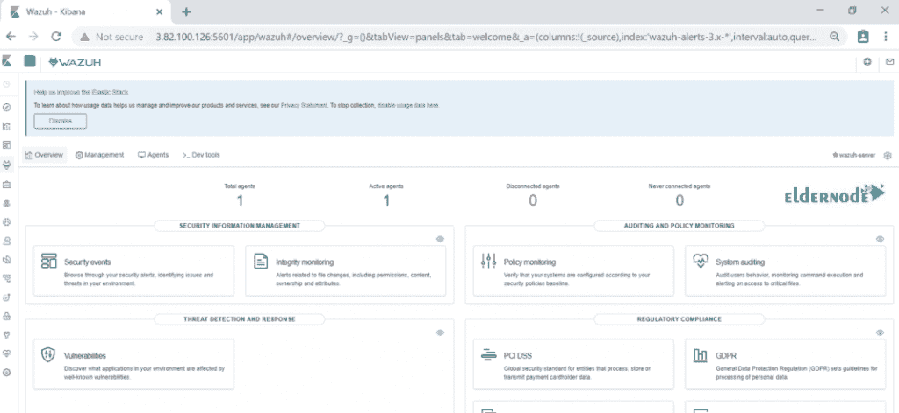
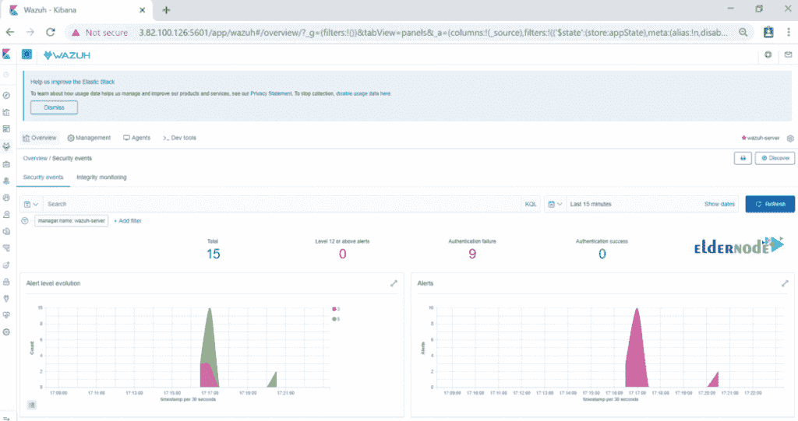

# 如何在 Centos 7 - Eldernode 博客上安装和配置 Wazuh

> 原文：<https://blog.eldernode.com/install-and-configure-wazuh-on-centos-7/>



了解如何在 Centos 7 上逐步安装和配置 Wazuh。Wazuh 是一个开源的入侵检测系统，可以让你自动记录数据分析和监测的完整性。现在，你可以在 [Eldernode](https://eldernode.com/) 上买到所有便宜的 [CentOS VPS 7](https://eldernode.com/centos-vps/) 来享受它的 24/7 支持和 Wazuh 功能。无论您使用的是 Linux、OpenBSD、FreeBSD、macOS、Solaris 还是 Windows，它都能为您的操作系统提供入侵检测。

## 教程在 Centos 7 上安装和配置 Wazuh

您可以使用 Wazuh 作为威胁预防、检测和响应的开源平台。类似于世界各地成千上万的组织，你将学习如何安装和使用 Wazuh，无论你是一个小型或大型企业。跟随这个指南成为它的一部分。此外，Slack 频道、谷歌集团和 GitHub 库也是它的资源。

### Wazuh 主要特性(在 Centos 7 上配置 Wazuh)

1-安全分析

2-入侵分析

3-测井数据分析

4-文件完整性监控

5-漏洞检测

6-配置评估

7-事件响应

8-法规遵从性

9-云安全

10-集装箱安全

### 瓦祖赫组件

瓦祖赫系统由几个部分组成:

**1-**OSSEC HIDS-基于主机的入侵检测系统

**2-**OpenSCAP–开放漏洞评估语言

**3-** Elastic Stack – Filebeat, Elasticsearch, Kibana

**4-** Wazuh 装载了许多有价值的功能。

## 在 Centos 7 上安装 Wazuh 服务器

1)首先，设置主机名和启动终端:

```
hostnamectl set-hostname wazuh-server
```

2)与往常一样，您应该更新 CentOS 和包:

```
yum update -y
```

3)使用以下命令安装 NTP 并检查其服务状态:

```
yum install ntp
```

```
systemctl status ntpd
```

4)您可能会遇到服务未启动的情况，因此运行以下命令来启动它:

5)要在系统启动时启用 NTP，请键入以下命令:

```
systemctl enable ntpd
```

6)现在您需要修改规则以允许 NTP 服务，因此，键入以下命令以启用服务:

```
firewall-cmd --add-service=ntp --zone=public --permanent
```

```
firewall-cmd --reload
```

### 安装 Wazuh 管理器

使用以下命令添加密钥:

```
rpm --import https://packages.wazuh.com/key/GPG-KEY-WAZUH
```

使用以下命令编辑 Wazuh 存储库:

```
vim /etc/yum.repos.d/wazuh.repo
```

接下来，将以下内容添加到文件中。

```
[wazuh_repo]  gpgcheck=1  gpgkey=https://packages.wazuh.com/key/GPG-KEY-WAZUH  enabled=1  name=Wazuh repository  baseurl=https://packages.wazuh.com/3.x/yum/  protect=1
```

现在，您可以保存并退出该文件。

然后键入以下命令列出存储库:

```
yum repolist
```

要安装 Wazuh 管理器，请运行:

```
yum install wazuh-manager -y
```

是时候安装 Wazuh 管理器了。不要忘记检查它的状态。

```
systemctl status wazuh-manager
```

### 如何安装 Wazuh API

在这一部分中，您将添加正式的 NodeJS 存储库:

```
curl --silent --location https://rpm.nodesource.com/setup_8.x | bash -
```

*注意*:要运行 Wazuh API，需要 NodeJS > = 4.6.1。关注我们关于[如何在 CentOS 7](https://blog.eldernode.com/install-node-js-centos-7/) 上安装 Node.js 的文章。

或者安装 node.js

如果您安装 Wazuh API，它将在需要时更新 NodeJS:

然后，检查 wazuh-api 的状态。

```
systemctl status wazuh-api
```

您可以使用以下命令手动更改默认凭据:

```
cd /var/ossec/api/configuration/auth
```

然后，运行以下命令为用户设置密码:

```
node htpasswd -Bc -C 10 user darshana
```

您可以随时键入以下内容来重新启动 API:

```
systemctl restart wazuh-api
```

此外，如果需要，您可以手动更改端口。文件/var/ossec/API/configuration/config . js 包含参数:

```
// TCP Port used by the API.  config.port = "55000";
```

### 如何安装 Filebeat

Filebeat 是什么？它是 Wazuh 服务器上的工具，可以安全地将警报和存档事件转发给 Elasticsearch。

要安装它，请键入:

```
rpm --import https://packages.elastic.co/GPG-KEY-elasticsearch
```

设置存储库:

```
vim /etc/yum.repos.d/elastic.repo
```

向服务器添加以下内容:

```
[elasticsearch-7.x]  name=Elasticsearch repository for 7.x packages  baseurl=https://artifacts.elastic.co/packages/7.x/yum  gpgcheck=1  gpgkey=https://artifacts.elastic.co/GPG-KEY-elasticsearch  enabled=1  autorefresh=1  type=rpm-md
```

要安装 Filebeat:

```
yum install filebeat-7.5.1
```

Filebeat 配置是预先配置的，可以将 Wazuh 警报转发给 Elasticsearch，但您可以从 Wazuh 存储库下载:

```
curl -so /etc/filebeat/filebeat.yml https://raw.githubusercontent.com/wazuh/wazuh/v3.11.0/extensions/filebeat/7.x/filebeat.yml
```

如果需要更改文件权限，请使用下面的命令:

```
chmod go+r /etc/filebeat/filebeat.yml
```

现在，下载 Elasticsearch 的提醒模板:

```
curl -so /etc/filebeat/wazuh-template.json https://raw.githubusercontent.com/wazuh/wazuh/v3.11.0/extensions/elasticsearch/7.x/wazuh-template.json
```

```
chmod go+r /etc/filebeat/wazuh-template.json
```

键入以下命令下载用于 Filebeat 的 Wazuh 模块:

```
curl -s https://packages.wazuh.com/3.x/filebeat/wazuh-filebeat-0.1.tar.gz | sudo tar -xvz -C /usr/share/filebeat/module
```

现在，您必须添加 Elasticsearch 服务器 IP。编辑“filebeat.yml”

```
vim /etc/filebeat/filebeat.yml
```

并修改下面一行:

```
output.elasticsearch.hosts: ['http://ELASTIC_SERVER_IP:9200']
```

运行以下命令以启用并启动 Filebeat 服务:

```
systemctl daemon-reload  systemctl enable filebeat.service  systemctl start filebeat.service
```

### 如何安装弹性堆栈

在本步骤中，您将使用 ELK 配置第二台 Centos 服务器。您可以在您的弹性堆栈服务器上做到这一点。

正如您所猜测的，第一步是设置-hostname:

```
hostnamectl set-hostname elk
```

并使用以下命令更新系统:

```
yum update -y
```

### 如何安装 ELK

在这一部分中，您需要做的就是安装带有 RPM 包的弹性堆栈，然后添加弹性存储库及其 GPG 键:

```
rpm --import https://packages.elastic.co/GPG-KEY-elasticsearch
```

接下来，创建一个存储库文件:

```
vim /etc/yum.repos.d/elastic.repo
```

将以下内容添加到文件中:

```
[elasticsearch-7.x]  name=Elasticsearch repository for 7.x packages  baseurl=https://artifacts.elastic.co/packages/7.x/yum  gpgcheck=1  gpgkey=https://artifacts.elastic.co/GPG-KEY-elasticsearch  enabled=1  autorefresh=1  type=rpm-md
```

### 如何安装 Elasticsearch

对 Elasticsearch 包运行以下命令:

```
yum install elasticsearch-7.5.1.
```

默认情况下，Elasticsearch 监听环回接口(localhost)。因此，您需要通过编辑/etc/Elasticsearch/elastic search . yml 并取消对 network.host 配置的注释，将 elastic search 配置为侦听非环回地址。调整您想要连接的 IP 值:

```
network.host: 0.0.0.0
```

顺便说一下，你可以改变防火墙规则。

```
firewall-cmd --permanent --zone=public --add-rich-rule='  rule family="ipv4"  source address="34.232.210.23/32"  port protocol="tcp" port="9200" accept'
```

并重新加载防火墙规则:

```
firewall-cmd --reload
```

但是，弹性搜索配置文件需要进一步的配置。

编辑“elasticsearch.yml”文件。

```
vim /etc/elasticsearch/elasticsearch.yml
```

现在，更改或编辑“节点.名称”和“群集.初始 _ 主节点”。

```
node.name: <node_name>
```

```
cluster.initial_master_nodes: ["<node_name>"]
```

接下来，运行以下命令来启用并启动 Elasticsearch 服务:

```
systemctl daemon-reload
```

并在系统启动时启用。

```
systemctl enable elasticsearch.service
```

要启动弹性搜索服务，请使用以下命令:

```
systemctl start elasticsearch.service
```

要检查弹性搜索的状态，请键入:

```
systemctl status elasticsearch.service
```

您需要检查日志文件中的任何问题。

```
tail -f /var/log/elasticsearch/elasticsearch.log
```

运行 Elasticsearch 后需要加载 Filebeat 模板。因此，在 Wazuh 服务器上运行以下命令。

```
filebeat setup --index-management -E setup.template.json.enabled=false
```

### 如何安装 Kibana

要安装 Kibana 软件包，请键入:

```
yum install kibana-7.5.1
```

并为 Kibana 安装 Wazuh 应用程序插件:

```
sudo -u kibana /usr/share/kibana/bin/kibana-plugin install https://packages.wazuh.com/wazuhapp/wazuhapp-3.11.0_7.5.1.zip
```

此时，请注意，Kibana 插件需要修改 Kibana 配置，以便从外部访问 Kibana。您可以编辑 Kibana 配置文件。

```
vim /etc/kibana/kibana.yml
```

此外，您可以更改下面的行。

```
server.host: "0.0.0.0"
```

然后，配置 Elasticsearch 实例的 URL。

```
elasticsearch.hosts: ["http://localhost:9200"]
```

再次运行下面的命令来启用和启动 Kibana 服务:

```
systemctl daemon-reload  systemctl enable kibana.service  systemctl start kibana.service
```

### 如何将 Wazuh API 添加到 Kibana 配置中

首先，你需要编辑“wazuh.yml。”

```
vim /usr/share/kibana/plugins/wazuh/wazuh.yml
```

记得编辑主机名、用户名和密码。然后，您可以保存并退出该文件，并重新启动 Kibana 服务。

```
systemctl restart kibana.service
```

这样，您就安装了 Wazuh 服务器和 ELK 服务器。因此，让我们使用代理添加主机。

### 安装 Wazuh 代理

在这一步中，您需要传递两个部分:

**1-** 添加 Ubuntu 服务器

**2-** 安装所需的软件包

```
apt-get install curl apt-transport-https lsb-release gnupg2
```

要安装瓦祖赫库 GPG 密钥，请使用:

```
curl -s https://packages.wazuh.com/key/GPG-KEY-WAZUH | apt-key add -
```

运行以下命令添加存储库，然后更新存储库。

```
echo "deb https://packages.wazuh.com/3.x/apt/ stable main" | tee /etc/apt/sources.list.d/wazuh.list
```

```
apt-get update
```

### 教程安装 Wazuh 代理(在 Centos 7 上配置 Wazuh)

blow 命令的作用是在安装 wazuh-agent 时自动将“waz uh _ MANAGER”IP 添加到 waz uh-agent 配置中。

```
WAZUH_MANAGER="52.91.79.65" apt-get install wazuh-agent
```

### 如何添加 CentOS 主机

通过运行下面的命令，您将添加 Wazuh 存储库。

```
rpm --import http://packages.wazuh.com/key/GPG-KEY-WAZUH
```

然后，编辑并添加到存储库中:

```
vim /etc/yum.repos.d/wazuh.repo
```

增加以下内容:

```
[wazuh_repo]  gpgcheck=1  gpgkey=https://packages.wazuh.com/key/GPG-KEY-WAZUH  enabled=1  name=Wazuh repository  baseurl=https://packages.wazuh.com/3.x/yum/  protect=1
```

使用以下命令安装代理。

```
WAZUH_MANAGER="52.91.79.65" yum install wazuh-agent
```

### 如何访问 Wazuh 仪表盘

首先，使用 IP 浏览 Kibana。

```
http://IP or hostname:5601/
```

下面的界面应该显示:



如果你点击“Wazuh”图标，你会去它的仪表板，你可以看到“Wazuh”仪表板如下。



现在，您应该看到连接的代理、安全信息管理等。单击安全事件以查看事件的图形视图。



### 卸载代理:

```
apt-get remove wazuh-agent
```

由于某些软件包管理器不会从文件系统中删除这些文件，因此您应该运行以下命令来提供完整的文件删除:

```
apt-get remove --purge wazuh-agent 
```

至此，您已经完成了在 CentOS 上安装和配置 Wazuh 服务器所需的全部学习。

## 结论

在本文中，您了解了如何在 Centos 7 上安装和配置 Wazuh。由于您的操作系统以及您是否希望从源代码进行构建，安装 Wazuh 服务器有几种选择。如果你有兴趣阅读更多内容，可以找到我们关于如何在 CentOS 7 上安装 CWP 的文章。