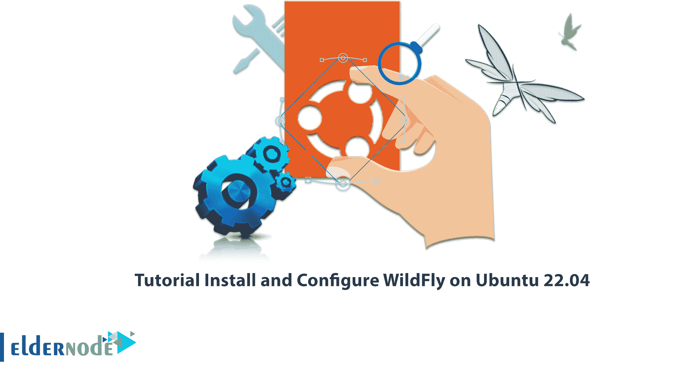
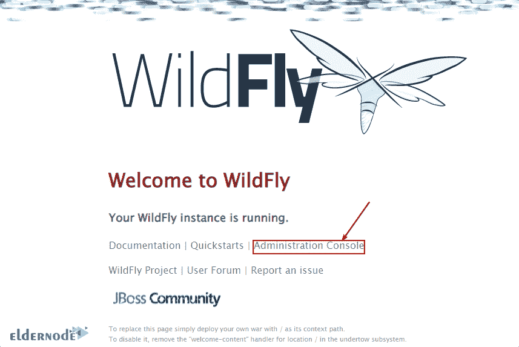
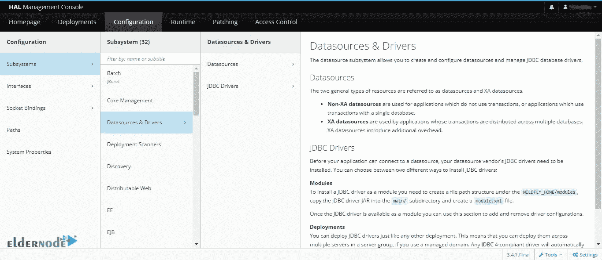

# 教程在 Ubuntu 22.04 上安装和配置 WildFly

> 原文：<https://blog.eldernode.com/install-and-configure-wildfly-on-ubuntu-22-04/>



WildFly 是一个强大的免费开源服务器，可以帮助你构建令人惊叹的应用程序。可以认为是下一代 JBoss AS 服务器。在这篇文章中，我们将回顾 wildly 的特性，并帮助你了解如何在 Ubuntu 22.04 上安装和配置 wildly。可以在 [Eldernode](https://eldernode.com/) 网站上查看购买 [**Ubuntu VPS**](https://eldernode.com/ubuntu-vps/) 服务器包。

## **如何在 Ubuntu 上安装配置 wildly**

### **野花的特征**

–>配置 WildFly 简单且以用户为中心。

–> wild fly 对内存管理采取了积极的方法。它可以在现有的 JVM 设置下运行，也可以在小型设备上运行，同时为应用程序数据留出更多空间，并支持更高的可伸缩性。

–> wildly 实现了最新的 Jakarta EE 和 Eclipse micro profile enterprise Java 标准。这使您能够专注于应用程序的核心业务需求。

在这篇来自 [Ubuntu 培训](https://blog.eldernode.com/tag/ubuntu/)系列的文章的续篇中，我们打算一步一步地教你如何在 Ubuntu 22.04 上安装 WildFly。

## **如何在 Ubuntu 22.04 上安装 wildly**

首先**在开始安装之前，使用以下命令更新系统**:

```
sudo apt update
```

然后**使用以下命令安装 Open Java** 的默认版本，该版本可通过 Ubuntu 22.04 OpenJDK 11 存储库获得:

```
sudo apt install default-jdk
```

然后**用下面的命令确认 Java 版本**:

```
java --version
```

现在点击**下载 TGZ** 按钮，从 [**野火网站**](https://www.wildfly.org/downloads/) 下载最新存档文件。也可以右键选择“**复制链接地址**”。您可以通过以下命令使用它。

```
wget https://github.com/wildfly/wildfly/releases/download/26.0.0.Final/wildfly-26.0.0.Final.tar.gz
```

运行以下命令**提取下载的文件**:

```
tar -xf wildfly-*.Final.tar.gz
```

要防止文件被删除，请运行以下命令:

```
sudo mv wildfly-*Final /opt/wildlfy
```

要运行 WildFly，我们创建一个单独的用户，他只能访问它的文件和文件夹。运行以下命令来**添加用户和组**:

```
sudo useradd -r -g wildfly -d /opt/wildfly -s /sbin/nologin wildfly
```

```
sudo groupadd -r wildfly
```

运行以下命令**允许 WildFly 用户**访问 **/opt** 目录:

```
sudo chown -RH wildfly:wildfly /opt/wildfly
```

### **如何在 Ubuntu 22.04 上配置 wild fly**

要配置 WilFly，**在 **/etc** 下创建一个 WilFly 目录**:

```
sudo mkdir -p /etc/wildfly
```

然后**将重要的配置文件**复制到系统后台:

```
sudo cp /opt/wildfly/docs/contrib/scripts/systemd/wildfly.conf /etc/wildfly/
```

```
sudo cp /opt/wildfly/docs/contrib/scripts/systemd/wildfly.service /etc/systemd/system/
```

```
sudo cp /opt/wildfly/docs/contrib/scripts/systemd/launch.sh /opt/wildfly/bin/
```

使用以下命令使脚本文件可执行:

```
sudo chmod +x /opt/wildfly/bin/*.sh
```

### **如何在 Ubuntu 22.04 上启用 wild fly**

要使用系统引导运行 WildFly，请使用以下命令:

```
sudo systemctl enable --now wildfly
```

```
sudo systemctl daemon-reload
```

运行以下命令**检查状态**:

```
systemctl status wildfly
```

然后运行以下命令来**重启或停止 WildFly** :

```
sudo systemctl restart wildfly
```

```
sudo systemctl stop wildfly
```

要配置现有的**管理员**用户或**创建新用户**，请运行以下命令:

```
sh /opt/wildfly/bin/add-user.sh
```

### **如何配置 WildFly Admin Hal 管理控制台**

如果您尝试默认访问管理界面，将会遇到以下错误:

```
Unable to redirect.  An automatic redirect to the Administration Console is not currently available. This is most likely due to the administration console being exposed over a network interface different from the one to which you are connected to.  To access the Administration console you should contact the administrator responsible for this WildFly installation and ask them to provide you with the correct address.
```

应编辑配置文件以消除上述错误，并登录到管理控制台，为此运行以下命令:

```
sudo nano /etc/wildfly/wildfly.conf
```

然后**应用更改**，如下所示:

```
WILDFLY_BIND= 127.0.0.1
```

收件人:

```
WILDFLY_BIND= 0.0.0.0
```

然后运行下面的命令来**重启 WildFly** 服务:

```
sudo systemctl restart wildfly
```

接下来，打开防火墙的端口并运行以下命令:

```
sudo ufw allow 8080/tcp
```

```
sudo ufw allow 9090/tcp
```

在服务器或桌面浏览器中打开以下地址:

```
http://127.0.0.1:8080
```

点击**管理控制台**，如下图所示:



登录以访问 Hal 管理界面:



### **如何在 Ubuntu 22.04 上远程访问 wildly**

要在某些 Ubuntu 22.04 服务器上访问该软件，您应该首先编辑配置文件:

```
sudo nano /opt/wildfly/standalone/configuration/standalone.xml
```

从文件的**接口**部分，将 **IP 地址**从 **127.0.0.1** 更改为 **0.0.0.0** 。然后按 **Ctrl+O** 保存文件，按**回车**，再按 **Ctrl+X** 退出。这样，所有可以访问服务器 IP 地址的机器都可以远程接收 WilFly web 界面。

如果您想允许访问管理控制台中的特定机器，在界面的**公共**部分，将其**地址**链接到所选系统的 **IP 地址**:

```
<interfaces>  <interface name="management">  <inet-address value="${jboss.bind.address.management:0.0.0.0}"/>  </interface>  <interface name="public">  <inet-address value="${jboss.bind.address:0.0.0.0}"/>  </interface>  </interfaces>
```

根据以下命令编辑前端配置文件，然后将地址改为 **0.0.0.0** 并保存文件:

```
sudo nano /etc/wildfly/wildfly.conf
```

最后**使用下面的命令重启服务器**:

```
sudo systemctl restart wildfly
```

## 结论

在本文中，我们介绍了 WildFly 的特性，它是一个强大的免费开源服务器。您还学习了如何在 Ubuntu 22.04 上安装和配置 wildly，并回顾了在 Ubuntu 22.04 上访问 wildly 的方法。