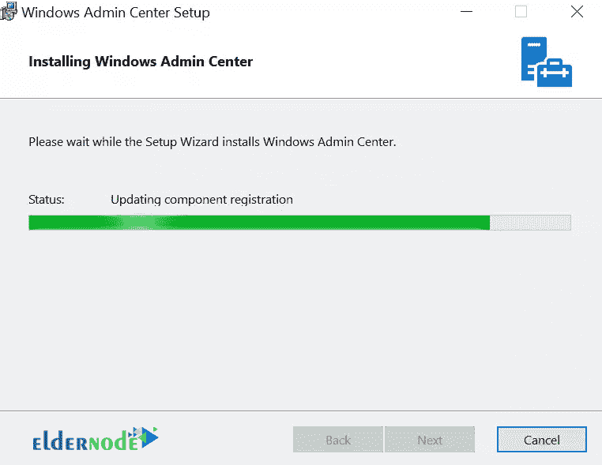
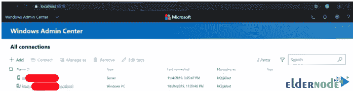

# 如何在 Windows Server - Eldernode 上安装和配置 Windows 管理中心

> 原文：<https://blog.eldernode.com/install-and-configure-windows-admin-center-on-windows-server/>

如何在 Windows Server 2019 上安装和配置 Windows 管理中心。随着 [Windows Server 2019](https://eldernode.com/tag/windows-server-2019/) 推出的 [Microsoft](https://www.microsoft.com/) 的最新功能之一是管理中心。该控制台，也被称为檀香山项目，提供了一个**基于网络的**环境，用于控制和管理服务器以及客户端

通过管理中心，您可以轻松管理所有系统。

在本文中，我们将教大家如何在 Windows Server 2019 和 [Windows 10](http://eldernode.com/tag/windows-10/) 中**安装和配置** Windows 管理中心。

**注:** Admin Center 只能安装在 [Windows Server 2016](https://eldernode.com/tag/windows-server-2016/) 及以上版本和 Windows 10 上，但也具有控制 [Windows Server 2012](https://eldernode.com/tag/windows-server-2012/) 、Windows Server 2016、Windows Server 2019 和 Windows 10 的能力。

跟随我们的教程，在 Windows Server 2019 和 Windows 10 上安装管理中心。

[**在 Eldernode**](https://eldernode.com/windows-vps/) 选择您的完美 Windows 虚拟专用服务器包

## 先决条件

要[下载管理中心](https://www.microsoft.com/en-us/evalcenter/evaluate-windows-admin-center)，请到管理中心网站下载您想要的**版本**。

### 如何安装 Windows 管理中心

**1。双击刚刚下载的可执行应用程序上的**，按照如下提示进行操作。然后点击下一个。

**2。** 下一步，你可以用微软更新也可以不用。

**–**点击下一个。

**3。** 再次点击下一步。

**4。** 选择一个端口或者可以使用默认端口然后点击安装。

**5。T3 按照安装流程进行到底。**

**6。最后**，点击完成。

### 加载浏览器并运行管理中心

您现在可以通过您的**浏览器**加载管理中心，并开始使用它来添加您想要管理的系统。

**a)** 进入您的浏览器，加载以下地址:

https://localhost(或者 IP)。

**b)** 然后从**提示**中选择证书，点击 OK 。

**c)** 管理中心现在将加载如下所示:

### 如何添加服务器以使用 Windows 管理中心进行管理

最终加载时唯一可用的系统是本地主机。现在，您可以开始添加更多内容了。

**1。** 点击 **+添加** 按钮。

您可以添加服务器、Windows 电脑、故障转移集群等等。

**2。** 选择适合你场景的一个。

**3。** 你现在可以逐个添加，导入列表，或者从活动目录中搜索。

这是相当灵活的。

**4。** 您添加的服务器将被添加到 **所有连接** 部分。

**5。** 通过**点击**在任一服务器上，大量的信息和功能被填充。

您将能够通过 [Powershell](http://eldernode.com/tag/powershell-commands/) 、[远程桌面](http://eldernode.com/tag/remote-desktop/)连接到服务器。然后你会查看它的注册表、 CPU 性能、磁盘和卷状态、已安装内存、服务、事件，已安装应用、角色、功能、已安装文件等等

**6。** 你可以从这个管理中心节点全面管理你的服务器。

我们希望你已经在最后利用了关于 Windows Server 2019 和 Windows 10 的管理中心安装教程。

**亦作，见:**

[1。 Windows Server 2019 安装配置教程](https://eldernode.com/windows-server-2019-install-and-config/)

[2。教程在 Windows Server 2019 中配置 NTP 服务器](https://eldernode.com/configure-ntp-server-in-windows-server/)

[3。如何在 Windows Server 2019 上安装和配置 OpenSSH 服务器](https://eldernode.com/install-and-configure-openssh-server-on-windows-server/)

[4。教程在 Windows IIS Server 2019 上配置虚拟目录](https://eldernode.com/configure-virtual-directory-on-windows-server/)

[5。如何在 Windows Server 2019 上安装和配置 Hyper-V](https://eldernode.com/install-and-configure-hyper-v-on-windows/)

[6。如何在 Windows Server 2019 上安装 Active Directory](https://eldernode.com/install-active-directory-on-windows-server/)

**尊敬的用户**，我们希望您能喜欢这个[教程](https://eldernode.com/category/tutorial/)，您可以在评论区提出关于本次培训的问题，或者解决[老年人节点培训](https://eldernode.com/blog/)领域的其他问题，请参考[提问页面](https://eldernode.com/ask)部分，并尽快提出您的问题。腾出时间给其他用户和专家来回答你的问题。

好运。

Goodluck.