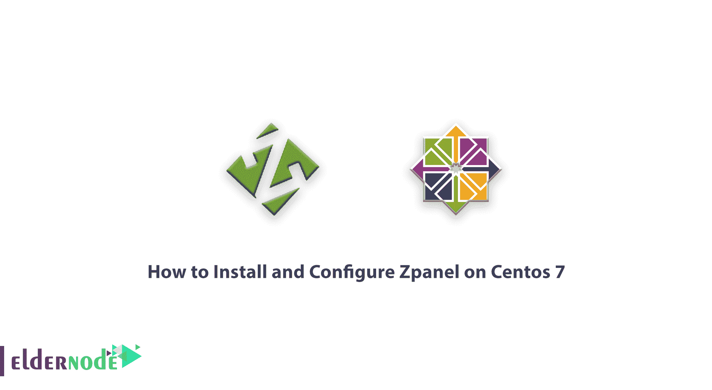
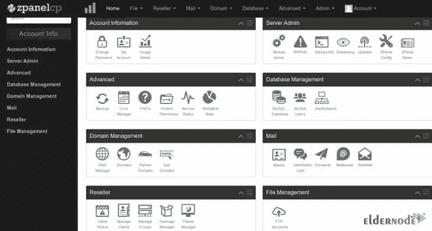

# 如何在 Centos 7 & 8 - Eldernode 博客上安装和配置 Zpanel

> 原文：<https://blog.eldernode.com/install-and-configure-zpanel-on-centos/>



ZPanel 是一个用强大的 PHP 语言编写的虚拟主机控制面板。该控制面板有不同的版本，与 Windows、Linux 和 Mac 操作系统兼容。这个控制面板也可以在一个免费的软件包中作为开源软件获得。尽管免费提供，但在免费提供的控制面板中，ZPanel 被证明在安全性方面更有前途。但是永远不要忘记，免费的控制面板也有问题和缺点。例如，在大多数情况下，它们不能提供很好的支持，解决一些问题可能会很困难和耗时。然而，在本文中，我们试图教你**如何在 Centos 7 & 8** 上安装和配置 Zpanel。你可以使用 [Eldernode](https://eldernode.com/) 中的套装来购买 [CentOS VPS](https://eldernode.com/centos-vps/) 服务器。

## 教程在 Centos 7 上安装和配置 z panel

### ZPanel 控制面板功能

**–**有一个网络化器

**–**圆形电子邮件服务

**–**对 phpMyAdmin 的支持

**–**备份工具

**–**完全 DNS 控制

**–**有 Cron 管理器

**–**密码保护

**–**账户加密

这些是该面板功能的一部分。安装后，您可以看到面板的所有功能。在本文的后续部分，我们将讨论如何安装 Zpanel 控制面板。

请注意，Zpanel 仅安装在干净的系统上。这意味着像 Apache T1 或 T2 MySQL T3 这样的网络服务不能预装。

## 在 Centos 7 & 8 上安装 Zpanel

第一步，您必须通过键入并执行以下命令来下载 Zpanel 安装脚本:

```
wget http://www.zvps.co.uk/sites/default/files/downloads/centos-6-3/package/installer-x86_64-install.sh.x.tar.gz
```

然后，在下一步中，您必须通过键入以下命令来解压缩下载的文件:

```
tar -xf installer-x86_64-install.sh.x.tar.gz
```

现在，您需要使用以下命令来发布 Zpanel 安装许可:

```
chmod +x installer-x86_64-install.sh.x
```

最后，为了能够启动 Zpanel，您可以使用以下命令:

```
/installer-x86_64-install.sh.x
```

## 如何在 Centos 7 & 8 上配置 Zpanel

在 CentOS 7 上成功完成 Zpanel 的安装后，您将进入配置步骤。安装程序要求您输入 MySQL 密码后，您必须按照与 **root 密码**相同的方式输入。
安装结束时，显示 Zpanel 管理员密码。需要注意的是，管理员 Zpanel 的用户名是**扎德明**。

现在你需要**重启**服务器一次。

有两种方法可以访问 Zpanel 控制面板仪表板。第一种方法是在浏览器搜索栏输入**http://zpanel.yourdomain.com**。只需输入您的域名，而不是您的域名。第二种方法是使用 IP 地址你可以在地址 **http://IP 地址**中输入你想要的 IP，在浏览器的搜索栏中输入并运行。



## 结论

Zpanel 是一个完整的控制面板，通过简单的管理环境被用户广泛使用。这个控制面板有不同的版本，可以安装在 Linux、Windows 和 Mac 操作系统上。在本文中，我们试图教你如何在 Centos 7 & 8 上安装和配置 Zpanel。想在这个操作系统上安装 CWP 可以参考[如何在 CentOS 7](https://blog.eldernode.com/install-cwp-on-centos-7/) 上安装 CWP 一文。