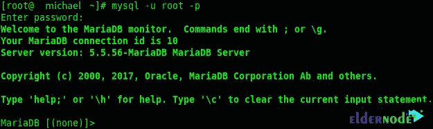
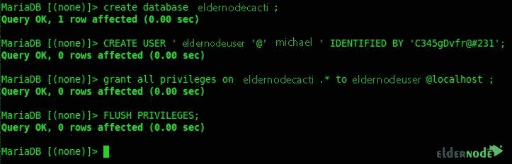

# 如何在 Centos 8 - Eldernode 博客上安装和配置 Cacti

> 原文：<https://blog.eldernode.com/install-and-configuring-cacti-on-centos-8/>


了解如何在 Centos 8 上安装和配置 Cacti。使用网络监控软件的重要性和必要性是任何一个网络专家都无法隐瞒的。因为可以实时获知服务器、交换机、路由器，或者换句话说，所有网络设备的状态，如果出现问题，可以在最短的时间内解决。Cacti 是一个基于 web 的开源工具，用于监控计算机网络。在本文中，我们试图向您介绍如何在 Centos 8 上安装和配置 Cacti。你可以访问 [Eldernode](https://eldernode.com/) 提供的套装来购买 [CentOS VPS](https://eldernode.com/centos-vps/) 服务器。

## 教程在 Centos 8 上安装和配置 Cacti

### 仙人掌有什么特点？

Cacti 软件使用 [SNMP](https://blog.eldernode.com/install-and-configure-snmp-service/) 协议连接到您的设备，并在您设置的时间间隔内检查它们。这款软件基于 PHP/MySQL，主要安装在 Linux 操作系统上，使用 RRDTool 软件来呈现其图形。该软件还允许您向客户提供监控面板。在该软件中，您可以指定用户登录后可以访问哪些端口。以下是仙人掌的一些特征:

**–**标准快速调查

**–**支持多种数据采集方式

**–**高级图形模式支持

**–**使用 ACL 管理用户的能力

**–**为管理网络监控和配置提供直观简单的 web 界面

## 在 Centos 8 上安装和配置 Cacti

第一步登录后，必须先禁用 **SELinux** 。这是在使用以下命令打开 SELinux 文件后完成的:

```
vim /etc/sysconfig/selinux
```

在文件中找到 SELINUX = enforcing 后，将其替换为 SELINUX = disabled。保存文件后，您可以使用以下命令重新启动系统:

```
reboot
```

第二步是安装 [EPEL](https://blog.eldernode.com/how-fix-epel-repository-error-centos-7/) 库。我们建议您到 Fedora 站点复制这个文件的最新版本，并在下面的命令中替换它。

```
rpm -Uvh https://dl.fedoraproject.org/pub/epel/epel-release-latest-8.noarch.rpm
```

此外，通过参考 [Remi](http://rpms.remirepo.net/enterprise/) 站点，您可以复制最新版本的链接并将其放入以下命令中:

```
wget http://rpms.famillecollet.com/enterprise/remi-release-8.rpm
```

现在，您可以使用以下命令来安装存储库并列出它们:

```
rpm -Uvh remi-release-7.rpm
```

```
yum repolist
```

从现在开始，必须采取 6 个步骤来安装和配置 cacti。这些步骤包括:

**1。**安装 Apache

**2。**安装 SNMP 和 RRDTool

**3。**安装 [MariaDB](https://blog.eldernode.com/whats-mariadb-how-it-works/) 服务器

**4。** PHP 和需要的包

**5。**创建一个 Cacti 数据库

**6。**数据库优化

跟随我们在这篇文章中全面解释这 6 个步骤。

### 如何安装 Apache

您可以使用以下命令安装 Apache:

```
yum install httpd httpd-devel
```

您也可以通过键入并执行以下命令来启动该服务:

```
systemctl start httpd
```

### 如何安装 SNMP 和 RRDTool

要安装 SNMP 和 RRDTool，只需键入并运行以下命令。然后会询问您是否要继续安装。您必须在此输入“ **Y** ”:

```
yum install net-snmp net-snmp-utils net-snmp-libs rrdtool
```

现在，您也可以使用以下命令开始运行 SNMP:

```
systemctl start snmpd
```

### 如何安装 MariaDB 服务器

安装 MariaDB 服务器是安装和配置 cacti 之前必须完成的步骤之一。为此，键入并执行以下命令:

```
yum install mariadb-server
```

输入以下命令启动 MariaDB 服务器:

```
systemctl start mariadb
```

要保护和完成 MariaDB 服务器安装，请键入以下命令:

```
mysql_secure_installation
```


### PHP 安装教程

您可以使用以下命令来安装 PHP 和所需的包:

```
yum --enablerepo=remi install php-mysql php-pear php-common php-gd php-devel php php-mbstring php-cli php-intl php-snmp
```

首先，使用以下命令登录到数据库服务器:

```
mysql -u root -p
```



现在，您需要键入并执行以下命令来创建数据库:

```
MariaDB [(none)]> create database eldernodecacti;
```

您还必须通过执行以下命令来创建用户:

```
MariaDB [(none)]> CREATE USER 'eldernodeuser'@'michael' IDENTIFIED BY '[[email protected]](/cdn-cgi/l/email-protection)#231';
```

使用以下命令，您可以授予权限:

```
MariaDB [(none)]> grant all privileges on eldernodecacti.* to [[email protected]](/cdn-cgi/l/email-protection);
```

您也可以使用以下命令刷新权限:

```
MariaDB [(none)]> FLUSH PRIVILEGES;
```



为了能够创建数据库用户，您必须首先能够访问 **mysql.time_zone_name** 。所以你要在 mysql 数据库中输入 mysql_test_data_timezone.sql。为此，请使用以下命令:

```
mysql -u root -p mysql < /usr/share/mysql/mysql_test_data_timezone.sql
```

现在，您需要使用以下命令登录到 MariaDB:

```
mysql -u root -p
```

您必须使用以下命令允许 cacti 数据库用户访问:

```
MariaDB [(none)]> GRANT SELECT ON mysql.time_zone_name TO [[email protected]](/cdn-cgi/l/email-protection);
```

您也可以使用以下命令刷新权限:

```
MariaDB [(none)]> flush privileges;
```


### 了解如何优化数据库

在安装 cacti 之前，您需要做的最后一步是优化数据库。键入以下命令以优化参数:

```
vim /etc/my.cnf.d/server.cnf
```

现在，您需要在 mysqld 部分添加以下命令行:

```
collation-server = utf8_general_ci  init-connect='SET NAMES utf8'  character-set-server = utf8  max_heap_table_size = 128M  max_allowed_packet = 16777216  tmp_table_size = 64M  join_buffer_size = 64M  innodb_file_per_table = on  innodb_buffer_pool_size = 512M  innodb_doublewrite = off  innodb_additional_mem_pool_size = 80M  innodb_lock_wait_timeout = 50  innodb_flush_log_at_trx_commit = 2
```


执行上述步骤后，您可以借助以下命令重新启动 MariaDB 服务:

```
systemctl restart mariadb.service
```

## 如何在 Centos 8 上安装和配置 Cacti

在准备和安装所有先决条件之后，现在是使用以下命令安装 cacti 的时候了:

```
yum -y install cacti
```

然后，通过键入以下命令，您可以将 cacti 数据库文件导入到创建的数据库中:

```
cd /usr/share/doc/cacti-1.1.38
```

现在您需要将 SQL 文件导入其中:

```
mysql -u root -p eldernodecacti < cacti.sql
```

应该注意，Cacti 配置文件包含数据库、密码细节等等。您可以通过输入以下命令轻松编辑它:

```
vim /usr/share/cacti/include/config.php
```

现在，您需要像以下命令一样编辑数据库详细信息:

$ database _ type = ' mysql
$ database _ default = ' eldernodecacti '；
$ database _ hostname = ' Michael '；
$ database _ username = ' eldernodeuser '；
$database_password = ' [【邮件保护】](/cdn-cgi/l/email-protection)# 231’；
$ database _ port = ' 3306 '；
$ database _ SSL = false；

下一步是在 cacti 中设置 cron，您必须首先使用以下命令打开它:

```
vim /etc/cron.d/cacti
```

然后，您必须取消对下面一行的注释，并**保存**该文件:

```
*/5 * * * * apache /usr/bin/php /usr/share/cacti/poller.php > /dev/null 2>&1
```

另一个重要步骤是在 cacti 中配置 Apache，您必须首先用以下命令打开配置文件:

```
vim /etc/httpd/conf.d/cacti.conf
```

打开配置文件后，现在需要将“**要求主机 localhost** ”改为“**要求全部授予**”,**允许从 localhost** ”改为“**允许从全部**”。


键入并运行以下命令来更改时区:

```
vim /etc/php.ini
```

您现在可以输入您的时区:

```
date.timezone = your time Zone
```

完成上述步骤后，您必须重新启动 Apache、MariaDB 和 SNMP。要**重启 Apache** ，键入并运行以下命令:

```
systemctl restart httpd.service
```

您还必须运行以下命令来**重启 MariaDB** :

```
systemctl restart mariadb.service
```

最后，为了**重启 SNMP** ，您必须运行以下命令:

```
systemctl restart snmpd.service
```

在安全性方面，配置防火墙是必要的。因此，您可以使用以下命令来配置防火墙:

```
firewall-cmd --permanent --zone=public --add-service=http
```

```
firewall-cmd --reload
```

## 如何开始安装仙人掌

现在已经到了最后一步，开始安装 cacti。要访问 Cacti web 界面，请在浏览器中输入以下 URL:

http://Your-Server-IP/cacti

在打开的页面中，勾选**接受 GPL 许可协议**，点击**下一步**。


点击下一页的**下一页**。

下一个窗口指定安装类型以及数据库规格。再次点击**下一个**。

在下一页上，确认所需的选项。请注意，在继续之前，所有内容都必须正确无误。


在其余页面中，点击**下一页**直到结束，最后点击**完成**。

## 结论

使用网络[监控](https://blog.eldernode.com/website-and-server-monitoring-tools/)软件的重要性和必要性，任何一个网络高手都不会隐瞒。您可以实时了解服务器、交换机和路由器的状态，也就是所有网络设备的状态，如果出现问题，您可以在最短的时间内解决问题。这就是我们在本文中试图教您如何在 Centos 8 上安装和配置 Cacti 的原因。