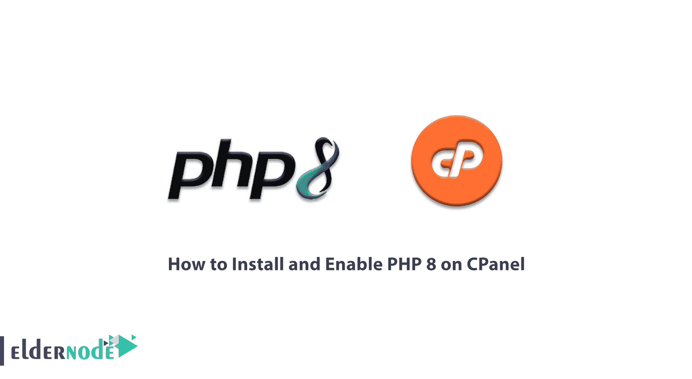
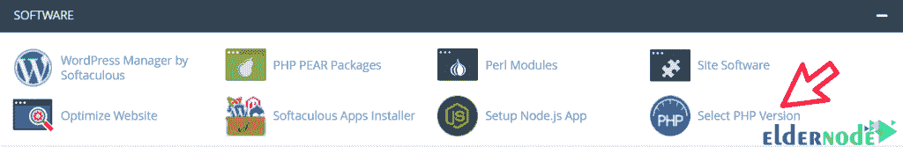
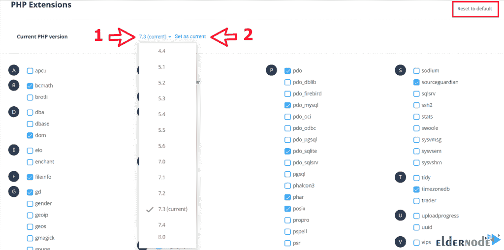

# 如何在 CPanel - Eldernode 博客上安装并启用 PHP 8

> 原文：<https://blog.eldernode.com/install-and-enable-php-8-on-cpanel/>



随着 PHP 最新版本 PHP 8.0 的发布，我们面临着新的特性和更新。这个版本中最重要的变化之一是包含了 PHP 的 JIT 编译器。说到 PHP 8.0，用户期望很高。因为通过提供实时选项，这是 PHP8.0 最重要的特性之一，它使人们能够不需要在一个项目中使用几种不同的编程语言。在本文中，我们试图学习如何在 CPanel 上安装和启用 PHP 8。你可以访问 [Eldernode](https://eldernode.com/) 提供的包来购买 [VPS 托管](https://eldernode.com/vps-hosting/)服务器。

## **教程在 CPanel 上安装并启用 PHP 8**

由于实时系统在今天被广泛使用，互联网也趋向于这一特征。用户也倾向于尽快获得内容。其他几种语言也有能力实现这一功能。比如 JavaScript 用的是 [Node.js](https://blog.eldernode.com/install-node-js-centos-7/) 和 [Python](https://blog.eldernode.com/python-3-6-installation-tutorial-in-debian-9/) 用的是 Tornado，但是 PHP 一直是这个特性的例外，会在 PHP 8 中进化，使用 JIT 编译器。在下一节中，我们将提到 PHP 8 的一些特性。

### **PHP 8 的好处和特点**

以下是 PHP 8 的一些特性和优势:

**1。对联合类型的支持:**联合类型允许您将多个类型分配给单个参数、属性或返回。

**2。准时制(JIT)编译器:**JIT 编译器编译部分代码和运行时，以提高 web 页面的响应时间。

**3。Named Arguments:**Named Arguments 允许您为输入数据指定一个名称，并在您的代码中调用它，而不是参数的顺序。

**4。属性:**属性在 PHP 代码中充当注释，允许您添加元数据。

跟随本文学习如何在 Cpanel 上安装 PHP 8。

### **在 CPanel 上安装 PHP 8**

通过安装 EasyApache 测试存储库，您可以在 [CPanel](https://blog.eldernode.com/tag/cpanel/) 服务器上使用 PHP 8 (ea-php80)。因此您可以很容易地使用下面的命令来安装测试存储库:

```
yum install ea4-experimental
```

### **如何在 CPanel 上启用 PHP 8**

模板和插件在更新后可以兼容较新的 PHP 版本。然而，在某些情况下，PHP 版本与某些模板和插件不兼容，这种不兼容会给网站带来问题。由于模板和插件不断更新，学会改变 PHP 版本对网站所有者来说至关重要。在这一节中，我们将学习如何在 Cpanel 中启用 PHP 8 或更改 PHP 版本。

要更改 PHP 版本，首先，登录 CPanel。然后在软件部分选择选择 PHP 版本选项。注意，这个选项在 CPanel 的某些版本中可能是“ **Multi PHP Manager** ”。



进入“**选择 PHP 版本**后，会看到如下所示的页面。要选择 PHP 版本，点击 PHP 版本选项前面的数字，ie 8，选择想要的版本。



选择 PHP 版本后，如果你愿意，你可以从底层激活你的插件。为此，找到插件的名称，然后选中它旁边的框。

最后，点击**设置为当前**，在网站上设置新版本的 PHP。现在，为了确保这个版本与您的网站兼容，请打开您的网站主页。

***注意:*** 如果遇到错误，试试其他版本。如果您希望设置恢复到原始状态，请单击重置为默认值选项。

## 结论

PHP 8 是 PHP 编程语言的新版本，除了修复以前版本的缺陷和不足之外，还带来了不同的特性和功能。在本文中，我们试图指出 PHP 8 中存在的一些独特的特性和可能性。然后我们谈到了如何在 Cpanel 上安装 PHP 8。如果想在 DirectAdmin 控制面板上安装 PHP 8，可以参考[教程在 Directadmin](https://blog.eldernode.com/install-and-enable-php-8-on-directadmin/) 上安装并启用 PHP 8 的文章。