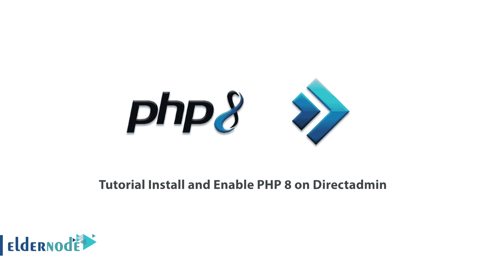

# 教程在 Directadmin - Eldernode 博客上安装并启用 PHP 8

> 原文：<https://blog.eldernode.com/install-and-enable-php-8-on-directadmin/>



PHP 8.0 是 PHP 最新的主要更新。此版本包括许多新功能和优化，包括命名参数、联合类型、属性、构建属性升级、匹配表达式、空安全运算符、JIT 和系统类型改进、错误管理和兼容性。在本文中，我们试图向您介绍在 Directadmin 上安装和启用 PHP 8 的教程**。您可以访问 [Eldernode](https://eldernode.com/) 中的套装来购买 [VPS Hosting](https://eldernode.com/vps-hosting/) 。**

## **如何在 Directadmin** 上安装并启用 PHP 8

PHP 8 于 2020 年 11 月 26 日正式发布！这个版本提供了一组强大的优化和功能。PHP 8 提供了最有趣的变化，并允许用户编写更好的代码和构建更强大的程序。在下一节中，我们将提到这个版本提供的一些新特性。然后我们学习如何在 [Directadmin](https://blog.eldernode.com/tag/directadmin/) 上安装和启用 PHP 8。请和我们在一起。

### **PHP 特性 8**

以下是 PHP 8 的一些特性和增强功能:

1.比较字符串和数字

2.参数列表中的尾随逗号

3.不兼容的方法签名

4.物业推广

5.Saner 数字字符串

6.内部函数的一致类型错误

7.算术/按位运算符的更严格的类型检查

8.抽象特征方法的验证

9.匹配表达式 v2

10.从负索引开始的数组

11.命名参数

12.空安全运算符

### **在 Directadmin** 上安装 PHP 8

在这一节中，我们将学习一种在带有 Directadmin 面板的服务器上安装 [PHP](https://blog.eldernode.com/upgrade-php-version-on-linux-server-and-directadmin/) 8 的简单方法。为此，只需按顺序执行以下步骤。第一步，你必须以 **root** 的身份登录控制台。然后进入**目录**:

```
cd /usr/local/directadmin/custombuild
```

然后，您必须使用 [nano](https://blog.eldernode.com/how-to-install-and-use-nano-text-editor/) 编辑器编辑配置文件:

```
nano options.conf
```

现在您需要使用下面的命令将 PHP 8 设置为您想要的版本:

```
php4_release=8.0
```

**保存**配置文件并退出。

在此步骤中，您必须通过执行以下命令来下载最新的软件包:

```
./build update
```

最后，您需要使用以下命令编译 PHP:

```
./build phpn
```

### **如何在 Directadmin** 上启用 PHP 8

在上一个步骤中安装了 PHP 8 之后，您必须在本节中启用它。重新编译后，您可以在域设置中选择 php8。

要设置它们，请转到 Directadmin 帐户管理面板和域配置部分，并选择您的域。

最后，在左上角，你必须选择 PHP 版本。


## 结论

在 PHP 8 中，我们看到了一些新的变化，使得 PHP 成为值得学习和使用的语言之一。这也使得它在开发者中更受欢迎。也许 PHP 最大的变化之一是 JIT 编译器，它使 PHP 变得更快。在本文中，我们试图向您介绍在 Directadmin 上安装和启用 PHP 8 的教程。