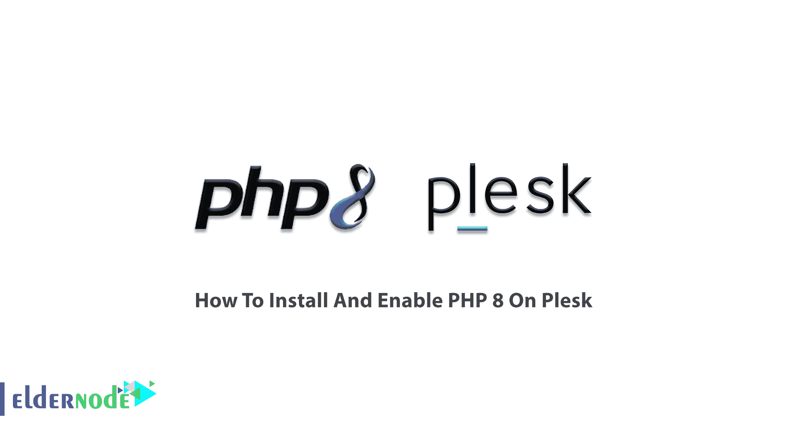
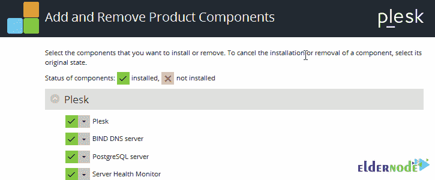
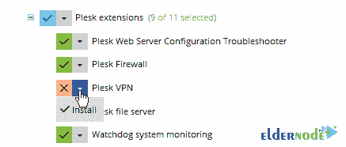
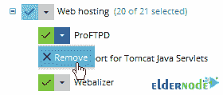
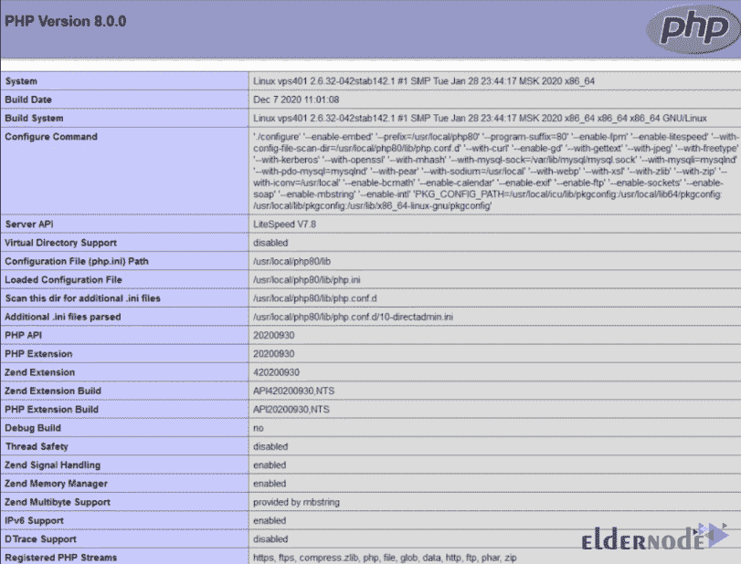

# 如何在 Plesk - Eldernode 博客上安装和启用 PHP 8

> 原文：<https://blog.eldernode.com/install-and-enable-php-8-on-plesk/>

Plesk 是一个全面的控制面板，像 cPanel 等其他面板一样具有许多功能。用户可以随意选择此功能面板，因为它支持各种功能和组件。Plesk 有自己的组件，如防火墙、各种不同的 PHP、电子邮件服务管理等等。默认情况下不会安装它们，在初始安装期间也不需要安装它们。但是如果过一段时间你需要一个组件呢？在本文中，您将学习**如何在 Plesk** 上安装和启用 PHP 8。找到您喜欢的主持计划的[副总裁，并购买一个由](https://eldernode.com/vps-hosting/)[长老节点](https://eldernode.com/)团队全天候支持的计划。

## **教程在 Plesk** 上安装并启用 PHP 8

Plesk 是一款网络托管和服务器数据中心自动化软件，带有为 Linux 和 [Windows](https://blog.eldernode.com/tag/windows/) 开发的控制面板。Plesk 的用户管理模式是为[专用](https://blog.eldernode.com/tag/dedicated-server/)和共享主机设计的。作为管理员，您将能够设置新网站、经销商帐户、电子邮件帐户，并通过基于 web 的界面编辑和创建 DNS 条目。

### **如何在 Plesk** 上添加和删除组件

Plesk 支持多种 PHP 版本和处理器类型。让我们看看 Plesk 管理员如何在服务器上安装 PHP。以下步骤是解决方案。

1-进入 [Plesk](https://blog.eldernode.com/tag/plesk/) 面板的管理员环境。

2-从右边的栏和系统概述部分，点击 Plesk 版本。从打开的弹出窗口中，选择添加或删除组件选项。

3-然后，你会看到 Plesk 的所有组件。

绿色图标表示组件已安装，粉色图标表示组件未安装。蓝色图标表示未安装该组中的所有组件。如您所见，安装了所有组件的组标有绿色图标，未安装组件的组标有一个乘法符号。

4-选择您考虑的组件并点击**安装**。

5-当您选择了首选组件后，点击**继续**。

6-等待组件下载和安装。

7-安装完成后，您将看到消息“产品和组件的所有操作都已成功完成”。

8-点击 **OK** 重定向到 Plesk 控制面板管理器的主页。

要标记要移除的组件，请单击组件名称>**移除**旁边的图标。此外，您可以将组中的所有组件标记为删除。当您标记了所有想要安装或移除的组件后，点击**继续**开始安装或移除。

但是如果您决定不做任何更改就退出 Plesk 安装程序，请点击**取消修改**。

## **如何在 Plesk** 上启用 PHP 8

PHP 是一种广泛使用的开源 web 编程语言，适合 web 开发，可以嵌入到 HTML 中。Plesk 提供了对多个 PHP 版本和处理程序类型的现成支持。

PHP 模块中的各种变化已经发生，内容管理系统和插件需要使用最好的选项和模块来改进。当你安装和使用一个插件时，你可能会遇到一个 PHP 版本不兼容的错误。要解决这个问题，你可以在你的面板中改变 PHP 版本，让插件或内容管理系统继续工作，没有任何问题。

按照以下步骤在 Plesk 控制面板上设置 PHP:

1-登录 Plesk

2-进入工具&设置> PHP 设置

3-您将看到所有支持的版本，选择您的首选版本。

4-选择您考虑的版本，设置您的首选性能和常用设置，然后单击“保存”。过一会儿，版本会改变，你会被重定向到主页面。然后，您会在 PHP 设置部分看到版本已经更改。

## 结论

在本文中，您学习了如何在 Plesk 上安装和启用 PHP 8。为了完善您对 Plesk 的了解，请阅读更多文章，并在 [Eldernode Community](https://community.eldernode.com/) 上与您的朋友分享。