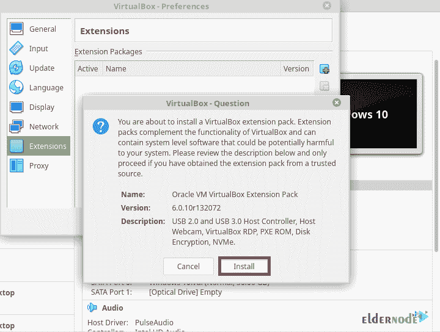

# 教程在 VirtualBox - Eldernode 博客上安装和启用 USB

> 原文：<https://blog.eldernode.com/install-and-enable-usb-on-virtualbox/>


VirtualBox 是一种开源软件，它充当管理程序并创建一个虚拟机，用户可以在其中运行另一个操作系统。您可以在 Windows、Linux、macOS 和 OpenSolaris 上安装 VirtualBox。如果您的数据中心依赖于 VirtualBox，而您的虚拟机依赖于 USB，您需要启用 USB 才能使用它。加入我们的教程**在 VirtualBox** 上逐步安装和启用 USB。

## **如何在 VirtualBox 上安装并启用 USB**

您可以使用 VirtualBox 在物理机上运行虚拟机。这样，您就不必重新安装在该物理机上运行的操作系统。您可能会注意到，USB 不支持您的虚拟机，除非您在数据中心依赖 VirtualBox 时没有手动启用 USB。在这种情况下，如果您需要将数据备份到外部驱动器或在不在同一子网上的虚拟机之间传输数据，您需要通过 USB 共享数据。

让我们假设你已经在你的 Windows 上安装了 VirtualBox 或者在你的 [Windows](https://blog.eldernode.com/tag/windows/) 或者 Linux 访客操作系统上安装了 [Linux VPS](https://eldernode.com/linux-vps/) 主机操作系统和 VirtualBox 访客附件。这样你需要设置一个 **VirtualBox 扩展包**，然后设置 **VirtualBox USB** 驱动。请和我们一起浏览本指南的步骤，并在 VirtualBox 上**访问 USB。**

### **安装 VirtualBox 扩展包**

首先，你需要安装最新版本的扩展包。要获取所有支持平台的文件，请转到 [VirtualBox 下载](https://www.virtualbox.org/wiki/Downloads)页面。下载完成后，按照以下路径完成 VirtualBox 扩展包的安装过程。

1-打开 **VirtualBox** > >在菜单中点击**文件** > > **首选项**。


2-现在，点击**扩展**选项卡，然后点击 **+** 按钮。


3-导航至保存扩展包的位置，并选择**安装**按钮。



4-在这一步，你需要滚动浏览 **Virtualbox 许可证**，然后点击“**我同意**按钮来安装它。


5-键入您的 **Sudo 密码**并允许安装完成。要继续，点击**认证**按钮。


最后，您可以看到安装了 VirtualBox 扩展包。


### **如何为用户启用 USB 访问**

在这一部分中，VirtualBox 必须能够访问 USB 子系统。为此，您需要将一个用户添加到 **vboxusers** 组，以允许它访问 USB 子系统。因此，打开终端并运行以下命令:

```
sudo usermod -aG vboxusers <USERNAME>
```

其中**用户名**是用户名。运行命令时，请记住注销并重新登录。

要检查您的用户帐户属于哪个组，请使用以下命令:

```
groups yourusername
```

### **如何在 VirtualBox** 中激活 USB 支持

要启用 USB 支持，首先，打开 **VirtualBox** ，回到需要访问 USB 设备的虚拟机，点击**设置**。


在虚拟机**设置**窗口中，点击 **USB** 。在那里，你必须看到可用的 **USB** 设备。要添加一个**新设备**，点击 **+** 符号。


当添加 USB 设备并启动虚拟机时，它可以访问 USB 设备上的数据。但是，您可以随时启用更多 USB 设备，并允许访问多个 USB 设备。为此，返回虚拟机的**设置**窗口，点击 **USB** 并添加下一个设备。

就是这样！您将能够重复这一过程，直到虚拟机可以访问所有必要的 USB 设备

## 结论

在本文中，您了解了如何在 VirtualBox 上安装和启用 USB。从现在开始，当你启动你的虚拟机，你可以看到你的 USB 设备。当 USB 被 VirtualBox 使用时，您的主机操作系统看不到 USB 设备。