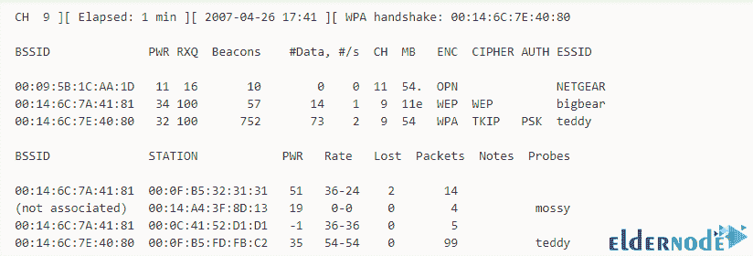

# 如何在 Kali Linux - Eldernode 博客上安装运行 Airodump-ng

> 原文：<https://blog.eldernode.com/install-and-run-airodump-ng-on-kali-linux/>


Airodump-ng 包含在 Aircrack-ng 包中，原始 802.11 帧用于捕获该包。用于 WEP IV 收集的 Airodump-ng 适用于 Aircrack-ng。该工具可以记录通过连接到计算机的 GPS 接收器发现的接入点的坐标。在本文中，我们试图学习如何在 Kali Linux 上安装和运行 Airodump-ng。你可以访问 [Eldernode](https://eldernode.com/) 提供的包来购买 [Linux VPS](https://eldernode.com/linux-vps/) 服务器。

## **教程在 Kali Linux 上安装运行 Airodump-ng**

**Airodump-ng** 是 [aircrack-ng](https://blog.eldernode.com/aircrack-ng-on-ubuntu-20-10/) 的无线包记录工具。如前所述，airodump-ng 使用来录制原始 802.11 帧包，以便通过 aircrack-ng 使用它们。此外，如果你有一个连接到计算机的 GPS 接收器，airodump-ng 可以记录接入点的坐标。Airodump-ng 编写一个文本文件，其中包含所有接入点和客户端的详细信息。除了给出的解释之外，airodump-ng 还编写了几个文件，其中包含了所看到的所有接入点和客户端的详细信息。跟随我们继续本教程。

### **在 Kali Linux** 上安装并运行 Airodump-ng

有趣的是，这个程序已经安装在 Kali Linux 上，但是 Airodump-ng 工具位于 aircrack-ng 服务中。因此，使用 Airodump-ng 的先决条件是安装 aircrack-ng。成功安装 aircrack-ng 后，您可以使用以下命令来熟悉 Airodump-ng 工具的功能。

```
[[email protected]](/cdn-cgi/l/email-protection):~# airodump-ng --help
```

通过执行上述命令，您将看到以下输出。您可以通过在 Airodump-ng 工具中执行以下任何命令来执行所需的任务。

### **在 Kali Linux 上使用 Airodump-ng:**

**用法:** airodump-ng <选项> <接口> [，<接口>，…]

***选项:***
**–IVs:**仅保存捕获的 IVs
**–GPSd:**使用 GPSd
**–写入<前缀> :** 转储文件前缀
**-w:** 同–写入
**–信标:**记录转储文件中的所有信标
**–更新<秒> > :** 跳频信道之间的毫秒时间
**–柏林<秒> :** 不再接收数据包时从屏幕上移除 AP/client 之前的时间(默认:120 秒)
**-r <文件> :** 从该文件读取数据包
**-x <毫秒> :** 主动扫描模拟

*****–输出格式*****

****<格式> :** 输出格式。可能的值:pcap、ivs、csv、gps、kismet、netxml、log CSV
**–忽略-负一:**删除表示
**固定频道<接口> :** -1 的消息**

*****–写间隔*****

****<秒> :** 输出文件写入间隔秒
**–后台<启用> :** 覆盖后台检测。**

*****滤镜选项:*****

****–加密<套件> :** 按密码套件
**过滤 AP–网络掩码<网络掩码> :** 按掩码过滤 AP
**–bssid<BSSID>:**按 BSSID 过滤 AP
**–essid<ESSID>:**按 ESSID 过滤 AP
**–ESSID-regex<regex<****

**默认情况下，airodump-ng 在 2.4 GHz 信道上跳频。因此，您可以使用以下选项在其他频道录制:**

****–HT20:**将频道设置为 HT20(802.11n)
**–HT40-:**将频道设置为 HT40-(802.11n)
**–HT40+:**将频道设置为 HT40+ (802.11n)
**–信道<信道> :** 在特定信道上捕获
**–频段<abg>:**airodump-ng 应跳频的频段
**-C <频率> :** 使用这些频率以 MHz 为单位跳频
**–C switch<方法> :** 设置信道切换方法
**0****

****–帮助:**显示该使用屏幕**

### ****运行 Airodump-ng 时显示哪些字段？****

**在本节中，我们打算通过提供一个运行 airodump-ng 的示例来解释本节中显示的字段。看下图:**

****

**第一行显示当前频道、运行时间、当前日期，以及是否检测到 WPA/WPA2 握手。还应注意，“ **WPA 握手:00:14:6C:7E:40:80** ”表示成功捕获了 BSSID 的 WPA/WPA2 握手。以下是对这些字段的解释:**

****BSSID:** 接入点的 MAC 地址。在客户端部分，BSSID 为“(不关联)”意味着客户端不与任何 AP 关联。**

****PWR:** 板卡上报的信号电平。**

****RXQ:** 使用此命令，您可以通过过去 10 秒内成功接收的数据包(管理和数据帧)的百分比来衡量接收质量。**

****信标:**AP 发送的通告数据包的数量。**

****# Data:** 捕获的数据包数量，包括数据广播包。**

****#/s:** 过去 10 秒内测量的每秒数据包数量。**

****CH:** 取自信标包的信道号。**

****MB:**AP 支持的最大速度。**

****ENC:** 正在使用加密算法。**

****密码:**检测到的密码。**

****AUTH:** 使用的认证协议。**

****ESSID:** 显示无线网络名称。**

****站:**搜索要连接的 AP 的每个关联站的 MAC 地址。**

****速率:**站点的接收速率，其次是发送速率。**

****丢失:**基于序列号的过去 10 秒内丢失的数据包数量。**

****数据包:**客户端发送的数据包数量。**

****注意:**关于客户端的附加信息，例如捕获的 EAPOL 或 PMKID。**

****探测器:**这些是客户端当前未连接时尝试连接的网络。**

## **结论**

**Airodump-ng 是一个以“**形式存储包的工具。IVS** 、**。PCAP** 文件来显示有关无线网络的信息。在本文中，我们试图学习如何在 Kali Linux 上安装和运行 Airodump-ng。我们还解释了执行 Airodump-ng 工具命令时可用的字段。**