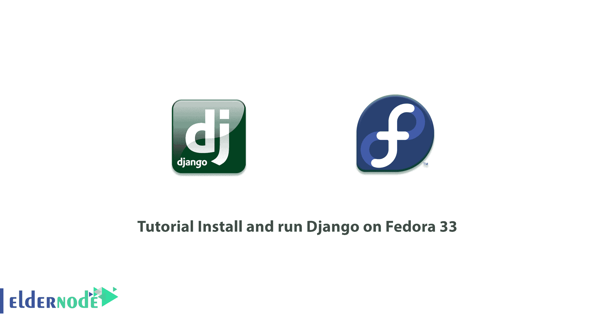

# 教程在 Fedora 33 - Eldernode 博客上安装并运行 Django

> 原文：<https://blog.eldernode.com/install-and-run-django-on-fedora/>



Django 是 Python 中 web 编程的高级框架或平台。该平台为程序员和开发人员实现了 web 应用程序的“快速开发”和实用设计。Django 库允许用户用更少的代码更快地生成更好的应用程序。由于 Django 是由这方面的专家开发的，所以可以解决网站开发中的大部分问题。事实上，有了 Django，你只需要专注于编程。所以没有必要创造新的解决方案。Django 是免费的，是开源框架的一部分。在本文中，我们将向您介绍在 Fedora 33 上安装和运行 Django 的教程**。如果你想购买一台 [Linux VPS](https://eldernode.com/linux-vps/) 服务器，你可以访问 [Eldernode](https://eldernode.com/) 中的软件包。**

## **如何在 Fedora 33 上一步步安装运行 Django**

Django 框架是使用 [Python](https://blog.eldernode.com/python-3-9-on-eldernode-linux/) 编程语言实现的。这使得网页设计对程序员来说更容易。开发人员可以使用 Python 语法规则来验证和存储代码。此外，他们可以在不编写代码的情况下执行一些活动，并加快网站开发过程。它的设计规则被编程以最小化开发一个网站所需的时间。开发人员可以使用 Django 特性快速设计网站，满足广泛的商业需求。大多数没有时间实现项目目标的 Python 作者都使用 Django 框架。

在下一节中，我们将研究 Django 最重要的特性。然后我们会教你如何在 [Fedora 33](https://blog.eldernode.com/install-fedora-on-vps-server/) 上安装运行。请加入我们。

### **Django 的好处(在 Fedora 上安装并运行 Django)**

使用 Django 库的好处如下:

**1-支持对象关系映射| ORM**

Django 平台在“数据模型”和“数据库引擎”之间架起了一座桥梁。它还支持大量的数据库管理系统，如 [MySQL](https://blog.eldernode.com/install-mysql-on-linux-ubuntu-20-04/) ，Oracle， [PostgreSQL](https://blog.eldernode.com/tutorial-postgresql-installation-ubuntu-20/) 等等。Django 还通过该平台的一个名为 Django-nonrel 的特别分支支持 NoSQL 数据库。目前，Django 支持的 NoSQL 数据库只有 [MongoDB](https://blog.eldernode.com/secure-mongodb-ubuntu-20/) 和谷歌应用引擎平台。

**2-多语言支持**

Django 平台通过平台内部的国际化系统支持多语言网站的开发。这允许程序员和开发人员开发内在支持多种世界语言的网站。

**3-支持各种 web 开发平台和框架**

Django 平台提供了对 Ajax、RSS、缓存等平台的内置支持。

**4-管理图形用户界面| GUI**

Django 平台为程序员和开发人员提供了一个现成的用户界面，用于网站管理活动及其组件。

**5-开发环境**

Django 库附带了一个轻量级 Web 服务器。因此，它简化了开发和测试“端到端”应用程序的过程。

### **用 PIP/PIP3** 在 Fedora 33 上安装 Django

在开始安装 Django 之前，需要在 Fedora 系统上安装 Python 3。为此，您可以使用以下命令:

```
sudo dnf -y install vim python3 python3-pip
```

需要注意的是，在这个方法中，我们希望在带有 pip3 的 Fedora 33 上安装 Django。在此之前，您应该通过运行以下命令来检查您的 Python 版本:

```
python3 -V
```

现在您需要通过执行以下命令来安装 pip3:

```
sudo dnf -y install python3-pip
```

```
pip3 -V
```

```
pip 18.0 from /usr/lib/python3.7/site-packages/pip (python 3.7)
```

成功安装 pip3 后，现在应该使用以下命令**安装 Django** :

```
pip3 install --user Django
```

注意，安装 Django 会给你一个 **Django-admin** 命令来管理项目:

```
which django-admin
```

```
~/.local/bin/django-admin
```

您还可以使用以下命令检查 **Django-admin 版本**:

```
django-admin --version
```

### **从 Git**T3 安装 Django 到 Fedora 33 上

在这一节中，我们将教你如何使用 **Git 源代码**安装 Django。有趣的是，您可以很容易地从源代码安装 Django。在这样做之前，您必须使用下面的命令**安装 Git** :

```
sudo dnf -y install git
```

您还可以通过执行以下命令来检查 Django 开发的主要分支。注意，这将在您的当前目录中创建一个 Django 目录。

```
git clone https://github.com/django/django.git
```

最后，您需要输入 Django 代码来使 Django-admin 工具命令可用。为此，请运行以下命令:

```
pip3 install -e django/
```

## **如何在 Fedora 33 上一步步运行 Django**

在这一节中，我们将研究如何运行 Django 以及如何创建 Django 测试应用程序。您可以按照下面的说明创建 Django 测试应用程序:

```
mkdir projects
```

```
cd projects
```

```
django-admin startproject test_app
```

```
cd test_app
```

正如您在上面的命令中看到的， **test_app** 是我们 Django 项目的名称。然后，有必要通过执行以下命令来执行挂起的迁移:

```
$ python3 manage.py migrate
```

您可以使用 Django 应用程序目录中的以下命令创建 Django 项目超级用户帐户:

```
$ python3 manage.py createsuperuser
```

执行上述命令后，会询问您关于您的**用户名**、**邮箱、**和**密码**的问题。然后成功创建超级用户。

### **如何允许外部访问 Django web 应用**

需要注意的重要一点是，Django 默认不允许外部访问程序。因此，您需要首先定义 ACL。

```
$ vim test_app/settings.py
```

然后在下一步中，您需要编辑 **ALLOWED_HOSTS** 行，将您的 IP 或计算机 LAN 子网列入白名单。

```
ALLOWED_HOSTS = ['your computer IP']
```

最后，在成功完成上述所有步骤后，您现在可以启动 Django 应用服务器了:

```
$ python3 manage.py runserver 0.0.0.0:8090
```

请注意，如果您成功完成了本教程的步骤，您可以通过打开下面的地址看到成功安装的消息。然后你可以通过输入你的用户名和密码登录。

```
http://[server IP/hostname]:8090
```

## 结论

在本教程中，我们试图教你如何在 Fedora 33 上安装和运行 Django。需要注意的是，如果你愿意，可以参考文章[如何在 Ubuntu 20.04](https://blog.eldernode.com/install-django-on-ubuntu-20/) 上安装 Django。