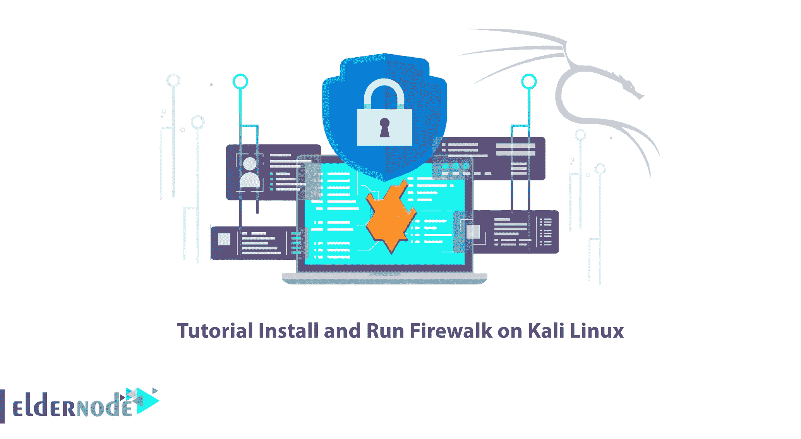

# 教程在 Kali Linux - Eldernode 博客上安装和运行 Firewalk

> 原文：<https://blog.eldernode.com/install-and-run-firewalk-on-kali-linux/>



Firewalk 网络安全工具有助于评估包过滤设备(如防火墙系统中使用的设备)的安全配置。本文将向您介绍 Firewalk，并教您如何在 Kali Linux 上安装和运行 Firewalk。如果你打算购买一台 [**Linux VPS**](https://eldernode.com/linux-vps/) 服务器，你可以查看 [Eldernode](https://eldernode.com/) 网站上提供的软件包。

## **如何在 Kali Linux 上安装运行 Firewalk**

### **什么是 Firewalk？**

Firewalk 是一种网络安全工具，它试图了解 IP 转发在第 4 层传递的是什么协议。它发出的 TCP/UDP 数据包的 TTL 比目标网关大一跳。网关可以允许或拒绝流量。如果网关允许流量，数据包将被转发到 ICMP_TIME_EXCEEDED 消息过期并引出的下一跳。但是如果网关不允许该流量，相应的数据包将被丢弃，并且看不到响应。应该使用跳数来获得正确的 IP TTL 值，该值在超出目标网关一跳时过期。这与 traceroute 命令的工作方式相同。这个工具是一个开源项目，在 BSD 许可下发布。

Firewalk 是在 1998 年基于对 traceroute 的研究而开发的。Firewalk 最初由迈克·d·希夫曼和戴维·戈德史密斯设计，主要由迈克·d·希夫曼维护。

在这篇来自 [Kali Linux 培训](https://blog.eldernode.com/tag/kali-linux/)系列的文章的续篇中，我们打算一步一步地教你如何在 Kali Linux 上安装 Firewalk。

## **在 Kali Linux 上安装 Firewalk**

在这一步中，您将学习如何在 Kali Linux 上安装 Firewalk。只需按照说明输入下面的命令。

首先，**使用以下命令更新您的系统**包:

```
sudo apt update
```

现在，您可以通过运行以下命令来安装 Firewalk :

```
sudo apt install firewalk
```

### **如何在 Kali Linux 上运行 Firewalk**

现在我们将教你在 Kali Linux 上运行 Firewalk。你可以很容易地做到这一点，只要按照下面的步骤。

通过运行以下命令，您可以运行该工具并通过 eth0 接口扫描端口:

```
firewalk -S8079-8081 -i eth0 -n -pTCP Gateway-IP Target-IP
```

在上面的命令中， **-S** 指定要测试的端口号，而-i 指定 eth0 等网络接口。

如果您想**检查 Firewalk** 的其他选项，使用以下命令:

```
firewalk -h
```

## 常见问题解答

[sp _ easy agreement]

## 结论

Firewalk 有助于主动侦察网络安全，并帮助您了解哪些第 4 级协议将在您的路由器或防火墙中通过或拒绝。这个工具对于在测试过程中检查防火墙非常有用。在本文中，我们教您如何在 Kali Linux 上安装和运行 Firewalk。我希望这篇教程对你有用，并且你喜欢它。如有疑问，可在评论中联系我们。