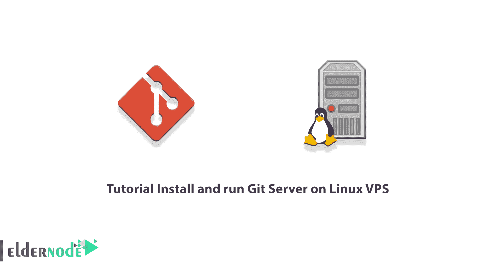

# 教程在 Linux VPS - Eldernode 博客上安装和运行 Git 服务器

> 原文：<https://blog.eldernode.com/install-and-run-git-server/>



只需提供一个虚拟 VPS 服务器，Git Server 就可以用作编程和开发团队的开源且经济高效的解决方案。防止文件冲突、版本控制、集中管理和 Git 服务器是一些好处。在这篇文章中，我们将教你如何在 Linux VPS 上安装和运行 Git 服务器。需要注意的是，如果你想买一个 [Linux VPS](https://eldernode.com/linux-vps/) 服务器，可以在 [Eldernode](https://eldernode.com/) 看到可用的包。

## **如何在 Linux VPS 上安装运行 Git 服务器**

### **Git 服务器简介**

Git 服务器具有版本控制功能。此功能允许您始终查看每个文件的更改历史。Git 服务器文档和日志允许您查看每个人在什么时间对每个文件做了什么更改。版本控制是 Git 服务器如此受项目经理欢迎的原因之一。

Git 将所有主要项目文件存储在主服务器上。对于团队中打算编辑其中一个文件的每个成员来说，该文件的临时副本(工作副本)被下载到他的系统中，并且在工作完成之后，更改被应用到提交服务器。应该注意的是，Git 还能够检测团队成员之间对文件的干扰。

2 到 20 人的编程和开发团队可以使用虚拟服务器轻松设置他们的 Git 服务器。通过这样做，对虚拟服务器信息进行备份就足够了。这样，项目的信息安全将始终得到保证。

请注意，Git 服务器能够在发布和最终实现之前批准和监督团队成员所做的任何更改。每个团队成员将变更提交给 Git 服务器进行审查。Git 通过电子邮件或短信通知项目经理新的变更。如果获得批准，项目经理将批准变更，Git 服务器将在项目中发布它们。

## **在 Linux VPS 上安装设置 Git 服务器**

设置 Git 服务器允许您创建私有存储库，而不受免费提供者应用程序的限制。在这一节中，我们将解释如何在 Linux VPS 服务器上安装和设置 Git 服务器。

第一步是使用 **PuTTY 终端客户端**连接到您的 Linux VPS 服务器。为此，在完成与**主机名**、**端口**和**连接类型**相关的字段后，点击**连接**。


接下来，当 SSH 连接打开时，您应该看到一个终端请求，询问您的用户名。现在你需要输入你的**根服务器用户名**作为“root”。接下来，输入你的**密码**。您可以在客户门户网站上找到它。输入后，按**键输入**。

是时候**在服务器上安装 Git** 了。需要注意的是，如果你使用的是 [Debian](https://blog.eldernode.com/tag/debian/) 或者 [Ubuntu](https://blog.eldernode.com/tag/ubuntu/) ，通过以 Sudo 用户的身份运行以下命令，你可以刷新本地包概要文件并安装 git:

```
sudo apt update
```

```
sudo apt install git
```

您还可以使用以下命令在 [CentOS](https://blog.eldernode.com/tag/centos/) 服务器上安装 git 包:

```
sudo yum install git
```

接下来，您可以**创建一个新用户**来管理 Git 存储库:

```
sudo useradd -r -m -U -d /home/git -s /bin/bash git
```

需要注意的是，用户主目录被设置为 **/home/git** 。知道所有的存储库都存储在这个列表中也很重要。注意，因为我们没有为“git”用户设置密码，所以只能使用 **ssh 密钥**登录。

在下一步中，您可以使用以下命令转到“git”用户:

```
sudo su - git
```

然后，您可以通过运行以下命令来创建 SSH 目录并正确设置权限:

```
mkdir -p ~/.ssh && chmod 0700 ~/.ssh
```

那么您应该创建一个名为 **~/的文件。ssh/authorized_keys** 将保存授权用户的 ssh 密钥:

```
touch ~/.ssh/authorized_keys
```

```
chmod 0600 ~/.ssh/authorized_keys
```

您现在已经准备好**创建您的第一个 Git 存储库**。您需要运行以下命令来启动一个新的空存储库:

```
git init --bare ~/projectname.git
```

最后，您可以根据自己的喜好命名列表。

### **如何在 Linux VPS 上配置 Git 服务器**

在前一节安装 Git 服务器之后，我们现在想在这一节讨论如何配置它。应该注意的是，为了能够将本地 git 更改推送到 git 服务器，您必须将您的**本地用户的 SSH 密钥**添加到远程“Git”用户的 **authorized_keys** 文件。请注意，如果您的本地系统中已经有一对 SSH 密钥，您可以使用以下命令显示公钥:

```
cat ~/.ssh/id_rsa.pub
```

***注意:*** 如果您得到一条错误消息说“**没有这样的文件或目录**，这意味着您的本地机器上没有生成 SSH 密钥对。

基于此，您可以使用下面的命令来生成一个**新的 SSH 密钥对**:

```
ssh-keygen -t rsa -b 4096 -C "[[email protected]](/cdn-cgi/l/email-protection)"
```

在执行上述命令之后，您需要复制它的输出并将其返回到 Git 服务器控制台。在服务器上，打开您的**文本编辑器**，**将您从本地机器上复制的公钥**粘贴到 **~/中。ssh/authorized_keys** 文件:

```
sudo nano /home/git/.ssh/authorized_keys
```

应该注意，如果您有一个现有的未版本化的项目，请导航到项目目录。现在您可以创建项目目录，如果您是从零开始，可以导航到该目录:

```
cd /path/to/local/project
```

在这一步中，您应该初始化一个 git 存储库:

```
git init .
```

最后，您应该使用以下命令将 git remote 添加到您的本地存储库中:

```
git remote add origin [[email protected]](/cdn-cgi/l/email-protection)_server_ip:projectname.git
```

***注意:*** 在上面的命令中，必须用 git 服务器的主机名或 ip 地址替换 git_server_ip。

### **如何验证正确的 Git 服务器设置**

在这一部分，您可以检查所有设置是否正确。为此，**通过运行以下命令创建一个测试文件**:

```
touch test_file
```

然后，您必须使用以下命令在临时区域中添加更改:

```
git add .
```

现在，您需要在以下命令的帮助下提交命令:

```
git commit -m "descriptive message"
```

在下一步中，您应该将本地存储库的更改推送到远程存储库:

```
git push -u origin master
```

要添加一个新的协作者，只需将其公共 SSH 密钥复制到“git”用户的~/中。ssh/authorized_keys 文件。

## 结论

Git 服务器能够批准和监督团队成员在发布和最终实施以及项目经理的批准和监督之前所做的任何更改。在本文中，我们试图在第一步向您介绍 Git 服务器。然后我们教你在 Linux VPS 上安装和设置 Git 服务器。最后，我们解释了如何配置和测试它。