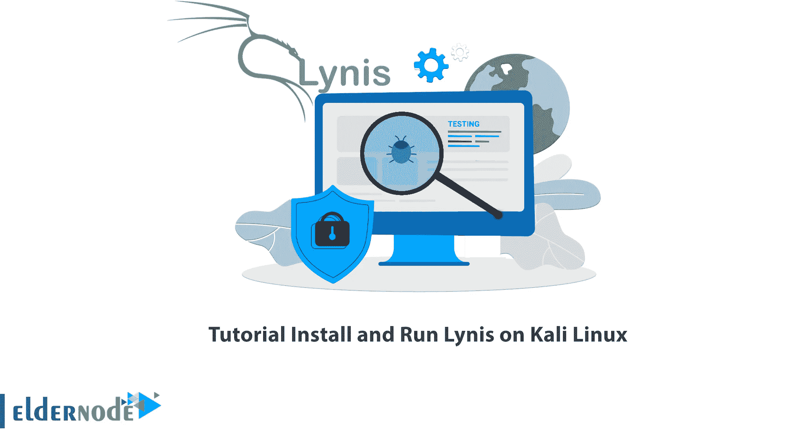

# 教程在 Kali Linux - Eldernode 博客上安装和运行 Lynis

> 原文：<https://blog.eldernode.com/install-and-run-lynis-on-kali-linux/>



如果您是系统管理员或管理在线服务器，您需要一本关于 web 服务器安全实现的好指南。Lynis 是一个安全工具，帮助您评估运行 Unix 系统的安全性。本文将教你如何在 Kali Linux 上安装和运行 Lynis。如果你想购买一台 [**Linux VPS**](https://eldernode.com/linux-vps/) 服务器，你可以查看 [Eldernode](https://eldernode.com/) 网站上提供的软件包。

## **如何在 Kali Linux 上安装运行 Lynis**

### **Lynis 是什么？**

Lynis 是一个开源安全审计工具，适用于运行 Linux、macOS 或基于 Unix 的操作系统的系统。它对支持系统强化和合规性测试的系统执行广泛的健康扫描。这个工具是在 GPL 下授权的，从 2007 年开始就可以使用了。它通过搜索操作系统设置、系统文件、工具、服务和引导程序、内核、内存、用户设置等来检查和报告漏洞。

Lynis 管理基于 Unix/Linux 的系统上的软件修补、恶意软件扫描和漏洞检测。该工具对于网络和系统管理员、安全专业人员以及渗透测试人员非常有用。

### **Lynis 特征**

–自动安全扫描

–基于 ISO2700 和 PCI-DSS 等标准的合规性测试

–漏洞检测

–组件和配置管理

–软件补丁管理

–渗透测试

–入侵检测

## **在 Kali Linux 上安装 Lynis**

在这一步，我们将教你如何在 [Kali Linux](https://blog.eldernode.com/tag/kali-linux/) 上安装 Lynis。为此，请运行以下命令。首先，您应该使用以下命令**更新您的系统**:

```
apt update
```

在更新您的系统之后，运行下面的命令来**在 Kali Linux 上安装 Lynis** :

```
apt install lynis
```

同样在第二种方法中，您可以通过输入以下命令使用 apt-get 安装它**:**

```
apt-get install lynis
```

如果你想用 aptitude 安装 Lynis **，你需要先用**安装 aptitude** 。因为 aptitude 默认不安装在 Kali Linux 上。为此，请运行以下命令:**

```
apt install aptitude
```

然后，您可以使用 aptitude 通过以下命令**安装 Lynis:**

```
aptitude install lynis
```

### **如何在 Kali Linux 上运行 Lynis**

使用各种方法成功安装 Lynis 后，现在输入以下命令启动 Lynis:

```
lynis -h
```

### **如何在 Kali Linux 上卸载 Lynis**

要卸载 Lynis，只需运行以下命令:

```
apt remove lynis
```

## 常见问题解答

[sp _ easy agreement]

## 结论

Lynis 可以帮助自动审计和扫描系统配置。此外，它还为专业审计人员提供了系统信息和安全问题的概述。在本文中，我们教您如何在 Kali Linux 上安装 Lynis。我希望这篇文章对你有用，你喜欢它。