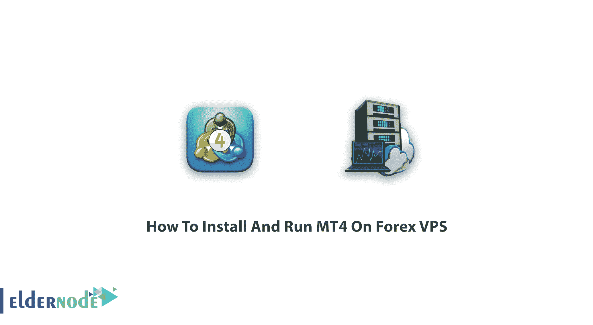
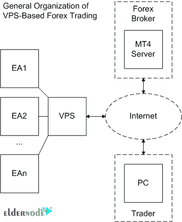
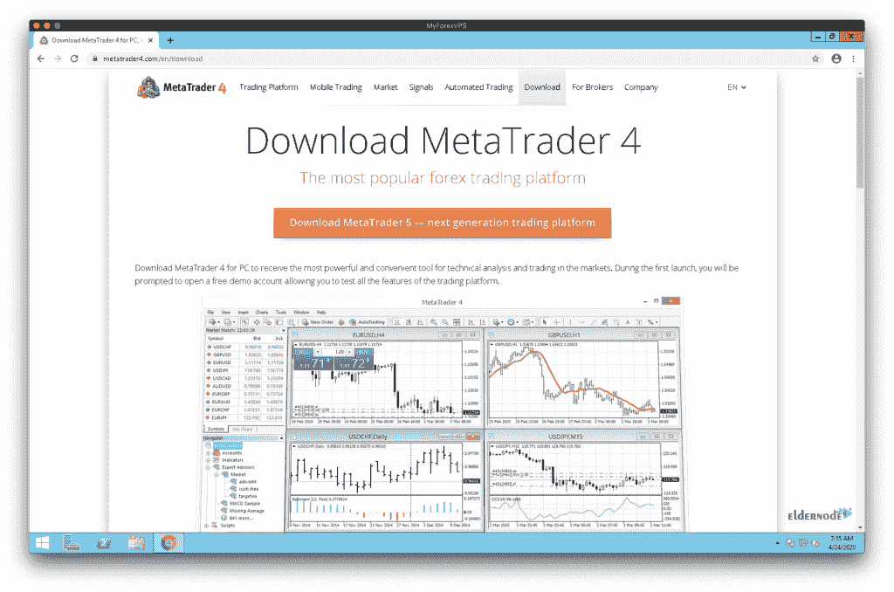
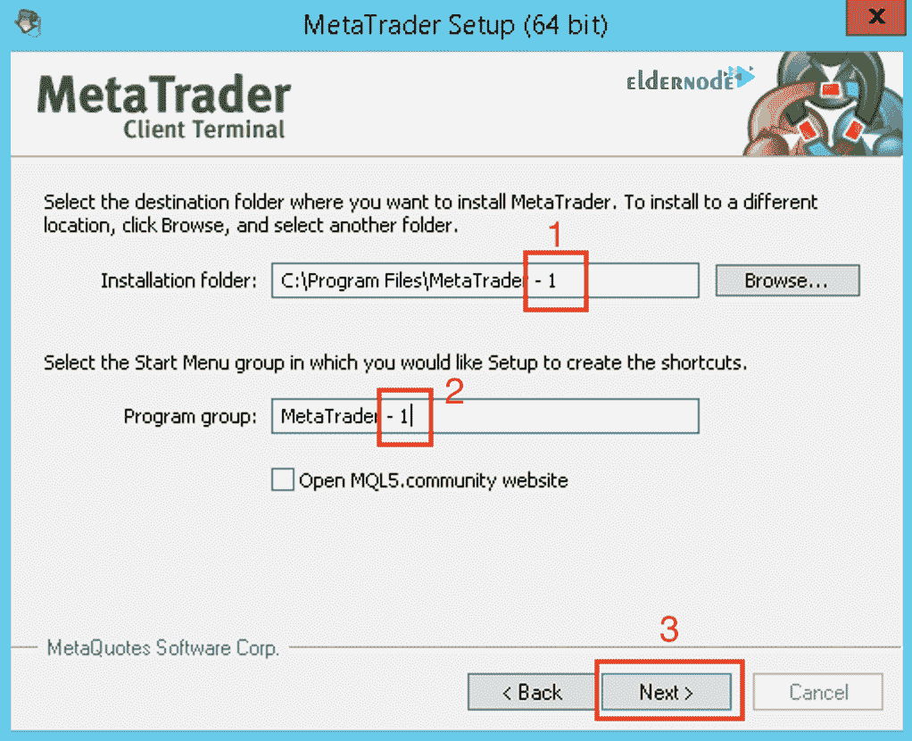

# 如何在 Forex VPS - Eldernode 博客上安装和运行 MT4

> 原文：<https://blog.eldernode.com/install-and-run-mt4-on-forex-vps/>

了解如何逐步在 Forex VPS 上**安装和运行 MT4。 **M** eta **T** rader 4 是由 MetaQuotes 软件开发并于 2005 年发布的最流行的外汇电子交易平台。在交易和竞争的世界中， [Eldernode](https://eldernode.com/) 的支持团队将与您一起寻找您最好的 [Forex VPS](https://eldernode.com/forex-vps/) 来启动您的业务，并通过网络连接从任何地方连接到您的平台。因此，让我们看看如何使用 NT4，它正被数百万有广泛需求的交易者使用，以获得分析金融市场和使用专家顾问的帮助。**

### MetaTrader 4 功能

看看支持语言 4 编程语言的最高安全和技术标准平台的特性。MQL4 基于流行的 C++，其灵活性有助于创建以下内容:

**1-** 用户友好

**2-** 灵活

**3-** 安全

**4-** 快速响应

**5-** **E** 专家 **A** 顾问(EAs)

**6-** 自定义指示器

**7-** 脚本

**8-** 库

您可以在下图中看到 VPS 在交易中使用的一般方案:

## 教程在 Forex VPS 上安装和运行 MT4

继续和我们一起研究如何利用和享受最广阔的**外汇**交易机会。MetaTrader 4 可以在 macOS 和 Linux 上运行。使用 MetaTrader 4，您将体验到灵活方便的交易，包括 3 种执行模式、2 个市价单、4 个挂单、2 个止损单和一个跟踪止损单。外汇是一个全球货币交易市场，其交易量超过所有其他金融市场。外汇交易每天 24 小时通过全球信息网络进行。要记录数据和进行自动交易，你需要一台可靠的、网速非常快的电脑，它可以 24 小时 7 天不间断地与互联网连接。交易可以在你的电脑关机的情况下进行。虽然 MT5(桌面、移动和网络版)于 2009 年推出，但 MT4(桌面、移动和网络版)仍然是世界上最受欢迎的外汇交易平台。有了 [VPS](https://eldernode.com/vps/) ，你可以比你的电脑更快地执行你的所有交易，因为它在传递订单、减少延迟和滑点方面明显更快，滑点会增加损失和不可预测性。

您更喜欢在 **Forex VPS** 上运行 **MT4** 来使用它的几个好处，例如 24/7 访问互联网和电源，24/7 访问专业客户支持，以及随时随地访问您的 MT4 帐户。你是专业交易者还是新手并不重要，但是，你选择了 MT4 这个所有赚钱交易都实现的地方。此外，你更喜欢使用外汇，因为它从不睡觉，你可以随时跟踪你的交易。拥有一个外汇 VPS 就像拥有一台电脑[专用于](https://eldernode.com/dedicated-server/)你的外汇交易需求。

## 如何在 Forex VPS 上安装 MT4

第一步是从 MyForexVPS 连接到您的外汇 VPS。要下载 MetaTrader4，你有一些不同的方法，我在这里解释一下:

**1-** 通过其网站下载 meta trader 4:【mettrader4.com 

**2-** 从你的经纪人网站下载 Metatrader4。

2-1:由于经纪人版本的 MT4 通常预先配置了经纪人的交易服务器，你可以去你的经纪人网站，登录你的客户区找到 MT4 的安装文件。

2-2:安装链接会发送到您的电子邮件，因此您可以在 VPS 上的 Google Chrome 中打开电子邮件，并将安装文件下载到 VPS。

2-3:复制可能存在于您的家庭/办公室计算机上的 MT4 安装文件，并将其粘贴到 VPS 桌面上。然后，转到下载部分。

(1)通过向下滚动找到下载按钮

(2)下载后点击文件。

现在，按 Run 继续安装 MT4。

因为您可能会在 VPS 上安装 MT4 平台的多个实例，所以现在是时候配置设置了。

(1)点击设置

当您决定在 VPS 上安装多个 MT4 平台时，您需要考虑用于每个平台的独特文件夹。如果这是您安装的第一个 MT4 平台，建议您在路径(1 和 2)中添加“–1”，并且对于每个新平台，只需将“–1”索引增加 1，这样每个平台都有其唯一的文件夹。点击点击下一个 (3)当你编辑路径，然后，安装将开始。等待几秒钟。

安装完成后，单击“完成”。

通过上述步骤后，您的 MT4 平台就从 MyForexVPS 安装并全天候运行在您的 VPS 上了。

从现在开始你可以继续**可选**，这是配置 MT4 运行在便携模式的方式。建议您在 VPS 上以所谓的“便携”模式运行 MT4。如果这样做，MT4 会将其所有数据存储在安装 MT4 的文件夹中。要查看 MT4 平台数据文件夹的位置，即单击文件(1)，然后打开日期文件夹(2)。放置专家顾问和指标的文件夹。

Data 文件夹的路径不同于默认情况下 MT4 的安装位置，如下图所示:

现在，您可以切换到便携模式，完全关闭(退出)MT4 平台。接下来，在 MT4 上找到快捷方式，点击右键，选择属性。看到当前的目标路径是:

" C:\ Program Files \ meta trader \ terminal 64 . exe "

添加一个空格和/portable 来修改它。您应该会看到修改后的路径结尾应该是这样的:

" C:\ Program Files \ meta trader \ terminal 64 . exe "/portable

点击确定保存设置。

如果您选中它，您可以看到 Data 文件夹现在位于 MT4 安装文件夹中。

结论

在本文中，您学习了如何在 Forex VPS 上安装和运行 MT4。从现在开始，你可以使用强大的 MetaTrader 4 交易系统来执行任何复杂的策略。Metatrader 是一种连接不同交易平台的软件，允许通过电脑或智能手机进行交易。如果你有兴趣阅读更多内容，可以找到我们关于如何在 VPS 上安装和配置 Kali Linux 的文章。

Conclusion

In this article, you learned How To Install And Run MT4 On Forex VPS. From now on you are ready to use the powerful MetaTrader 4 trading system which allows you to implement strategies of any complexity. Metatrader is a kind of software that connects to the different trading platforms and allows to trade in them through a computer or smartphone. In case you are interested to read more, find our article on [How to Install and Configure Kali Linux on VPS](https://blog.eldernode.com/install-and-configure-kali-linux-on-vps/).