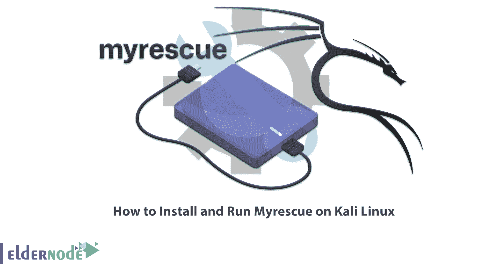

# 如何在 Kali Linux - Eldernode 博客上安装和运行 Myrescue

> 原文：<https://blog.eldernode.com/install-and-run-myrescue-on-kali-linux/>



如果你已经尝试了所有的数据恢复工具，没有得到任何结果，我们建议你 Myrescue 服务。Myrescue 是一个从损坏的硬盘上保存可读数据的软件。在本文中，我们将回顾 Myrescue 的过程，您将学习如何在 Kali Linux 上安装和运行 Myrescue。您可以访问 [Eldernode](https://eldernode.com/) 网站，从提供的软件包中购买您的 [**Linux VPS**](https://eldernode.com/linux-vps/) 。

## **教程在 Kali Linux 上安装运行 Myrescue**

### **米雷斯库**简介

Myrescue 用于保存受损硬盘、CD-ROM、DVD、闪存驱动器等的可读数据。它与 **dd-rescue** 的用途相同，但功能不同。它首先检查磁盘损坏的部分，然后返回。该软件创建一个名为**块位图**的表格，将设备作为一个块复制到一个文件中，并检查一个块是否已被成功复制、尚未被管理或有错误。

Myrescue 有一个跳跃模式，所以它通过指数级增加台阶的大小来快速存在损坏的区域。被忽略的块在块位图中被标记为不受控制，以后可以重试，仍有机会挽救剩余的健康数据。

在这篇来自 [Kali Linux 培训](https://blog.eldernode.com/tag/kali-linux/)系列的文章的续篇中，我们打算教你如何在 Kali Linux 上安装 Myrescue。

## **如何在 Kali Linux 上安装 Myrescue**

您可以使用以下命令在 Kali Linux 上安装 Myrescue:

```
sudo apt install myrescue
```

### **如何在 Kali Linux 上运行 Myrescue**

在上一节中，您看到了如何在 Kali Linux 上安装 Myrescue。下面，我们将介绍 Myrescue 的不同工具在 Kali Linux 上运行它:

#### **在 Kali Linux 上运行 Myrescue**

这个工具用来保存硬盘。使用以下命令运行此工具:

```
myrescue --help
```

#### **在 Kali Linux 上运行 Myrescue-bitmap 2 ppm**

使用此工具可视化 myrescue 的块位图。为此，运行以下命令:

```
myrescue-bitmap2ppm -h
```

#### **在 Kali Linux 上运行 Myrescue-stat**

此工具用于阻止 myrescue 的位图统计。通过运行以下命令来使用它:

```
man myrescue-stat
```

## **常见问题**

[sp _ easy agreement]

## 结论

在本文中，您了解了 myrescue 机制，它试图以最小的损坏来保存硬盘。您还了解了 myrescue 的各种工具，并学习了如何在 Kali Linux 上安装和运行 Myrescue。