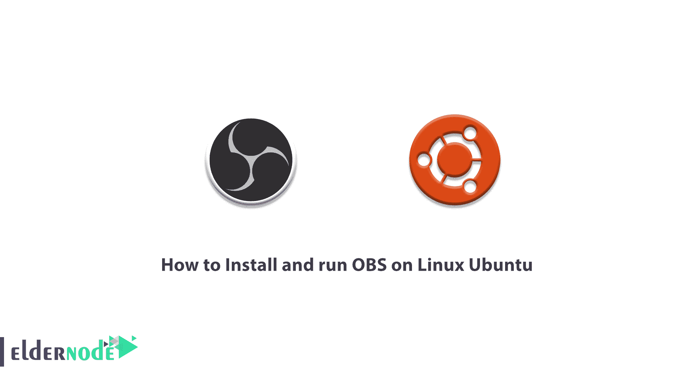
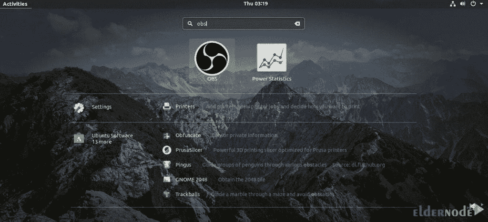
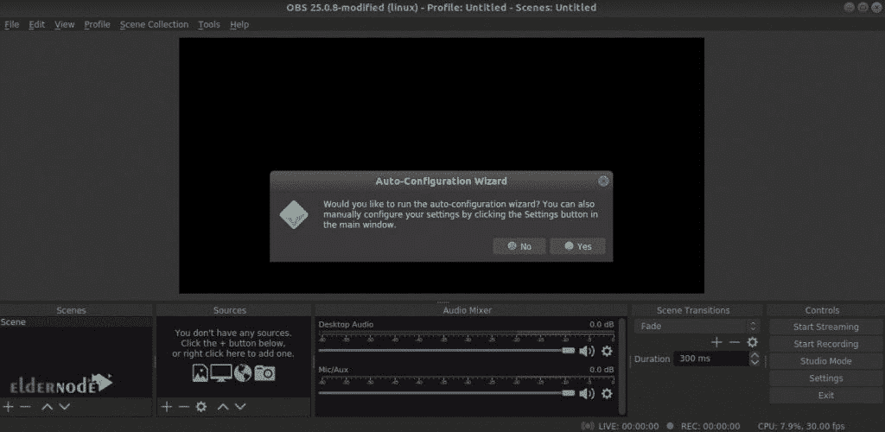
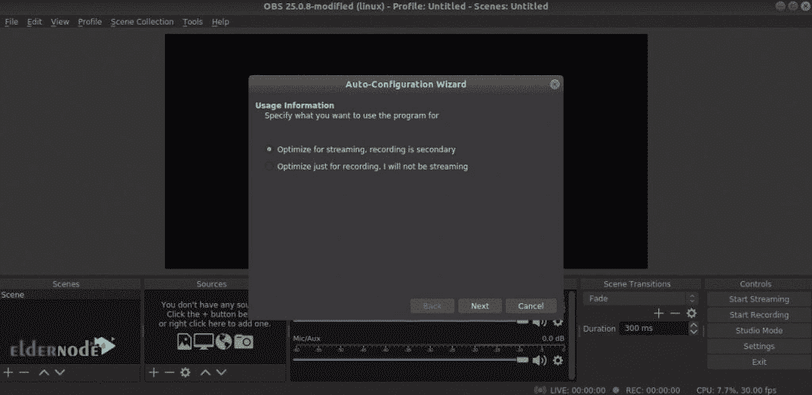
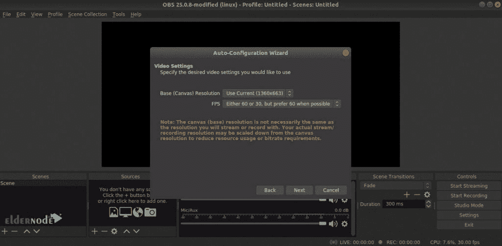
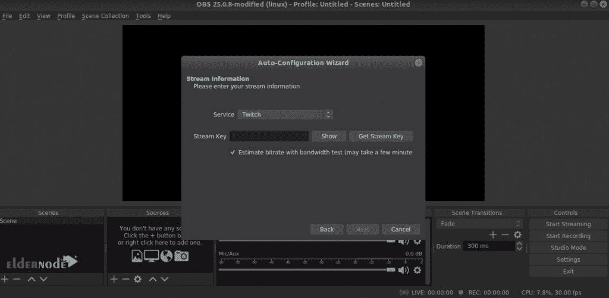
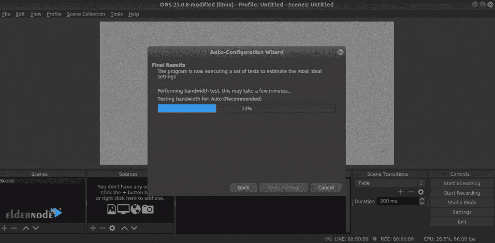

# 如何在 Linux Ubuntu - Eldernode 博客上安装和运行 OBS

> 原文：<https://blog.eldernode.com/install-and-run-obs-on-linux-ubuntu/>



OBS 是为需要在互联网上创建教学视频或流视频的游戏玩家、艺术家、软件开发人员或非专业用户设计的软件。使用 OBS Studio 程序，你可以从你的屏幕上录制一张唱片，然后用这个吸引人的软件在互联网上播放。OBS Studio 软件兼容 Twitch 等各种流媒体服务，启动迅速。在本文中，我们试着一步步学习如何在 Linux Ubuntu 上安装和运行 OBS。你可以在 [Eldernode](https://eldernode.com/) 看到购买 [Ubuntu VPS](https://eldernode.com/ubuntu-vps/) 服务器的套餐。

## **教程在 Linux Ubuntu 上安装运行 OBS**

运行 OBS Studio 软件后，您将会遇到一个简单而有吸引力的用户界面，它为您提供了所有必要的工具。该软件适用于各种流媒体服务。它也有一个简单和有吸引力的音频混合工具，具有过滤功能。该软件有助于改进和简化设置面板。在本文的剩余部分，加入我们来学习如何在 Linux [Ubuntu](https://blog.eldernode.com/tag/ubuntu/) 上安装和运行 OBS。

## **在 Linux Ubuntu 20.04 | 18.04** 上安装运行 OBS

在本文中，我们尝试使用两种方法来学习如何在 Linux Ubuntu 上安装和运行 OBS。第一步是使用 Ubuntu **包服务器**来完成。运行以下命令开始:

```
sudo apt update
```

然后，您可以使用以下命令轻松安装 OBS:

```
sudo apt install obs-studio
```

### **如何安装 OBS Snap**

建议您在安装应用程序时使用 snap 等通用 [Linux](https://blog.eldernode.com/tag/linux/) 包。请注意，这个特性在所有 Linux 选项中提供了相同的包管理特性。在本节中，我们将使用 **snap** 用于 OBS Studio，在下一节中，我们将使用 **flatpak** 。

在 Ubuntu 上，snappy 是默认安装的，但如果它没有安装，您可以通过运行以下命令轻松完成:

```
sudo apt update && sudo apt install snapd -y
```

在下一步中，您必须使用以下命令安装 **Snap 内核**:

```
sudo snap install core
```

现在**重启**系统一次以应用更改:

```
sudo systemctl restart snapd
```

现在，您可以通过运行以下命令来安装快照软件包:

```
sudo snap install obs-studio
```

### **如何安装 OBS flatpak**

在这一节中，我们将看看 Flatpak，它是另一种类型的 Linux 全局包。有趣的是，Snap 和 flatpak 的行为是一样的。唯一的区别是默认情况下，flatpak 包管理器没有安装在 Ubuntu 上。因此，您可以通过执行以下命令轻松安装它:

```
sudo apt update && sudo apt install flatpak
```

因为 Ubuntu 使用的是 [GNOME](https://blog.eldernode.com/install-gnome-environment-on-debian-8/) 桌面环境，所以建议您不使用命令行，直接通过 GNOME 运行以下命令来安装 flatpak:

```
sudo apt install gnome-software-plugin-flatpak
```

然后，您需要使用以下命令安装 Flathub 存储库:

```
flatpak remote-add --if-not-exists flathub https://flathub.org/repo/flathub.flatpakrepo
```

最后，通过执行以下命令直接从 Flathub 获取 flatpak 程序:

```
sudo flatpak install flathub com.obsproject.Studio
```

## **如何在 Linux Ubuntu 上运行 OBS**

如果您已经成功完成了上述安装步骤，现在就可以轻松运行 OBS Studio 了。为此，只需从“ **Activities** ”启动 OBS Studio。



第一次运行 OBS 的重要之处在于，系统会要求您运行自动配置向导。在本教程中跟随我们学习如何使用该向导:



为了能够以最佳方式完成您的工作，您必须首先根据您是想要**流式传输**还是**记录**来选择合适的选项。



如下图所示，在这一步中，您必须选择分辨率和帧速率。



最后，您需要输入您的流密钥。



在本例中，我们将选择 Twitch。如下图所示，输入密钥后，OBS 会执行带宽测试，以确定流的合适比特率。



## 结论

OBS Studio 软件是您可以用来流式传输的工具之一。在本文中，我们试图一步一步地学习如何在 Linux Ubuntu 上安装和运行 OBS。可以参考文章[如何在 CentOS 7/8 上安装 OBS](https://blog.eldernode.com/install-obs-on-centos/)和[如何在 Windows 10 RDP 上安装 OBS](https://blog.eldernode.com/install-obs-on-windows-10-rdp/)。