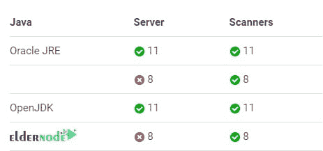
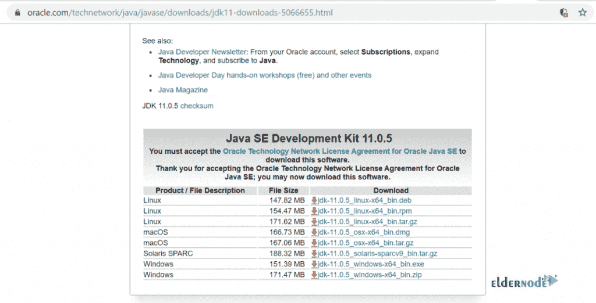
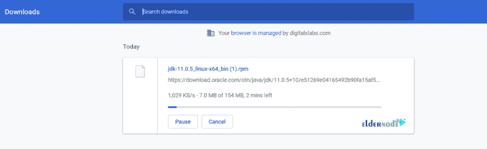
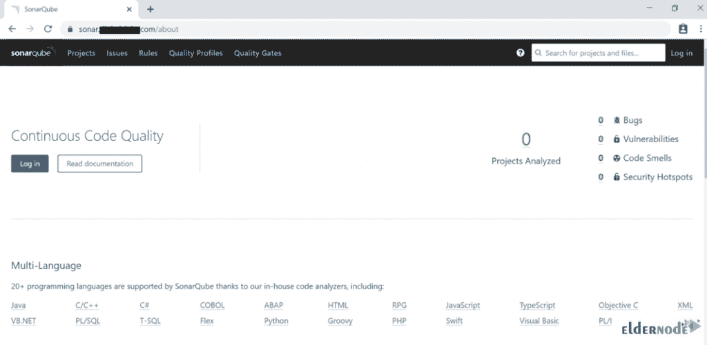
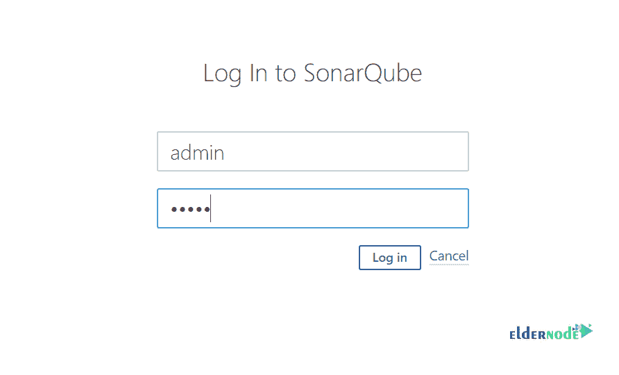
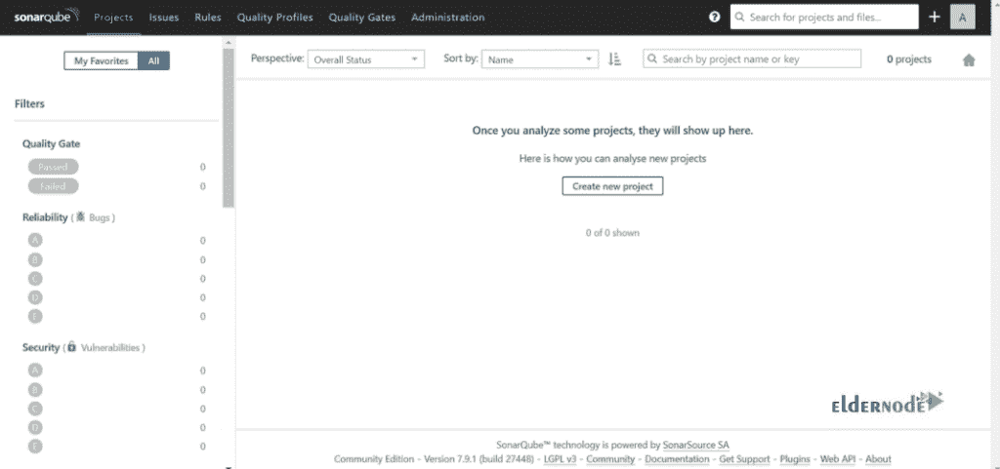

# 如何在 Centos 7 - Eldernode 博客上安装和运行 SonarQube

> 原文：<https://blog.eldernode.com/install-and-run-sonarqube-on-centos-7/>


了解如何**在 Centos 7** Linux 服务器上安装和运行 SonarQube。让我们了解一下这个最广泛使用的代码覆盖和分析工具。SonarQube 是一个开源平台工具，可以帮助你管理源代码的质量，代码分析等。购买您自己的 [CentOS VPS 7](https://eldernode.com/centos-vps/) 服务器，体验这款质量系统开发工具。

为了让本教程更好地发挥作用，请考虑以下**先决条件**:

**1-** 拥有 [sudo](https://blog.eldernode.com/create-new-sudo-user-centos-8/) 权限的非 root 用户。

**2-** 至少 2GB 内存才能高效运行。

**3-** 数据库 [Mysql](https://blog.eldernode.com/how-to-install-mysql-on-centos-8/) 或 PostgreSQL 或 Mariadb，视您的环境而定。

**4-** Java (Oracle JRE 11 或 OpenJDK 11)

*注意*:sonar cube 扫描器需要 JVM 的版本 8 或 11，sonar cube 服务器需要版本 11。官方不支持 Java 11 以上的版本。此外，它能够分析任何种类的 Java 源文件，而不管它们符合的 Java 版本。但是，您可以使用关键修补程序更新(CPU)版本。



此外，您可以查看[官方文件](https://docs.sonarqube.org/latest/requirements/requirements/)了解完整信息。

### sonar cube 特性

让我们来看看这个基于网络的平台的好处，它是用来测量和分析源代码质量的。

**1-** 检测并发出警报

**2-** 可持续性

**3-** 生产率

**4-** 提高质量

**5-** 提高开发者技能

**6-** 根据业务需求进行扩展

**7-** 实现持续的代码质量管理

有效地定义和增加需求

**9-** 鼓励创新

**10-** 通过供应商支持和服务降低风险

### 代码质量覆盖

**1-** 建筑和设计

**2-** 单元测试

**3-** 重复代码

**4-** 潜在的 bug

**5-** 复杂代码

**6-** 编码标准

**7-** 评论

## 教程在 Centos 7 上安装并运行 sonar cube

继续阅读本指南，了解如何安装一个适合您现有工具的工具，以便在您的代码库的质量或安全性面临风险时为您提供帮助。要开始，你需要对 Linux 进行系统设置。

**步骤 1** :如何更新系统

使用 root 用户运行以下命令来更新系统:

```
yum update
```

**第二步**:如何禁用 SELinux

您需要打开 SELinux 配置并编辑文件:

```
vim /etc/sysconfig/selinux
```

要继续，您应该将“SELINUX=enforcing”更改为“SELINUX= **disabled** ”。

现在，你可以保存退出文件。

**第三步**:如何给服务器设置主机名

```
vim /etc/hostname
```

如果您发现 vim 还不可用，您可以安装它。使用以下命令安装它:

```
yum install vim -y
```

是时候重启系统了:

```
reboot
```

**第四步**:如何添加系统设置

首先，编辑“sysctl.conf”文件:

```
vim /etc/sysctl.conf
```

然后，添加以下几行:

```
vm.max_map_count=262144  fs.file-max=65536
```

现在，您可以保存并关闭文件。

**第五步**:如何安装 Oracle Java 11

如果您还没有安装 Oracle Java 11，请从这里的[下载。](https://www.oracle.com/technetwork/java/javase/downloads/jdk11-downloads-5066655.html)



它会在您下载之前重定向到 oracle 登录。考虑一下，如果你有一个帐户，使用它，或创建一个新的。您也可以将 [rpm 包](https://blog.eldernode.com/tutorial-linux-rpm-command/)下载到您的机器上，并上传到 sonar 服务器。否则，按照以下路径操作:

**首先**，从网络浏览器下载复制下载链接。



**第二个**，进入您的服务器并通过键入以下命令进行下载:

```
wget https://download.oracle.com/otn/java/jdk/11.0.5+10/e51269e04165492b90fa15af5b4eb1a5/jdk-11.0.5_linux-x64_bin.rpm?AuthParam=1573886978_5511f6acaa0b321333446e8e838c1045
```

*注意*:如果您的系统中没有“wget”命令来安装它，您可以使用下面的命令作为替代命令。

```
yum install wget -y
```

然后，重命名下载的文件。

```
mv jdk-11.0.5_linux-x64_bin.rpm\?AuthParam\=1573886978_5511f6acaa0b321333446e8e838c1045 jdk-11.0.5_linux-x64_bin.rpm
```

最后，安装 Oracle JDK:

```
yum localinstall jdk-11.0.5_linux-x64_bin.rpm
```

安装完成后，您可以通过键入以下命令找到 Java 位置:

```
cd /usr/java/
```

接下来，您应该添加 java 环境变量:

```
vim /etc/bashrc
```

将以下几行添加到文件的末尾:

```
export JAVA_HOME=/usr/java/jdk-11.0.5/  export JRE_HOME=/usr/java/jdk-11.0.5/jre    PATH=$PATH:$HOME/bin:$JAVA_HOME/bin
```

现在，您可以检查 java 版本，然后保存并退出文件。

```
java -version
```

**第六步**:如何安装 PostgreSQL 10

运行以下命令安装存储库:

```
yum install https://download.postgresql.org/pub/repos/yum/reporpms/EL-7-x86_64/pgdg-redhat-repo-latest.noarch.rpm
```

*注意*:如果您需要查看基于 Redhat 的发行版的下载，请查看 postgresql.org 的。

要安装服务器:

```
yum install postgresql10-server postgresql10-contrib
```

要初始化数据库，请使用:

```
/usr/pgsql-10/bin/postgresql-10-setup initdb
```

然后，修改 pg_hba.conf 文件；将“peer”改为“ **trust** ”,将“idnet”改为“md5”。

```
vim /var/lib/pgsql/10/data/pg_hba.conf
```

现在，您需要在系统引导时启用 PostgreSQL，以便能够在引导时启动服务和设置:

```
systemctl enable postgresql-10
```

然后，检查服务状态，并通过键入以下命令来启动它:

```
systemctl status postgresql-10
```

```
systemctl start postgresql-10
```

使用下面的命令更改 Postgres 用户的默认密码。

```
passwd postgres
```

要切换到 Postgres 用户:

```
su - postgres
```

要创建新用户，请运行:

```
createuser sonar
```

并切换到 PostgreSQL shell:

```
psql
```

现在是时候为 SonarQube 数据库的新创建用户设置密码了:

```
ALTER USER sonar WITH ENCRYPTED password '[[email protected]](/cdn-cgi/l/email-protection)?Qn4';
```

此外，为 PostgreSQL 数据库创建一个新数据库。

```
CREATE DATABASE sonar OWNER sonar;
```

运行下面的命令退出 psql shell。

```
\q
```

并使用以下命令退出“postgres”用户。

```
exit
```

**第七步**:如何下载配置 SonarQube。

在这一部分中，您将把包下载到“opt”目录并更改该目录。

```
cd /opt
```

要下载最新版本的 LTS，请运行:

```
wget https://binaries.sonarsource.com/Distribution/sonarqube/sonarqube-7.9.1.zip
```

然后，解压缩下面的命令:

```
unzip sonarqube-7.9.1.zip
```

*注意*:如果 unzip 命令不可用，可以安装 unzip。

```
yum install unzip -y
```

要重命名文件夹，请使用:

```
mv sonarqube-7.9.1 sonarqube
```

运行以下命令修改“sonar.properties 文件”:

```
vim /opt/sonarqube/conf/sonar.properties
```

找出下面几行。然后取消注释并修改值。

```
sonar.jdbc.username=sonar  [[email protected]](/cdn-cgi/l/email-protection)?Q  sonar.jdbc.url=jdbc:postgresql://localhost/sonar
```

```
sonar.web.host=127.0.0.1  sonar.web.port=9000  sonar.web.javaOpts=-server -Xms512m -Xmx512m -XX:+HeapDumpOnOutOfMemoryError  sonar.search.javaOpts=-server -Xms512m -Xmx512m -XX:+HeapDumpOnOutOfMemoryError
```

配置弹性搜索存储路径:

```
sonar.path.data=/var/sonarqube/data  sonar.path.temp=/var/sonarqube/temp
```

现在，您可以保存并退出该文件。

使用以下命令为 sonar 创建一个用户:

```
useradd sonar
```

要设置密码:

```
passwd sonar
```

要修改文件夹权限:

```
chown -R sonar:sonar /opt/sonarqube
```

然后，创建以下文件夹并授予权限:

```
mkdir -p /var/sonarqube/data  mkdir -p /var/sonarqube/temp
```

```
chown -R sonar:sonar /var/sonarqube
```

要将 Sonarqube 设置为服务类型:

```
vim /etc/systemd/system/sonarqube.service
```

将以下内容添加到文件中:

```
Unit]  Description=SonarQube service  After=syslog.target network.target    [Service]  Type=forking  ExecStart=/opt/sonarqube/bin/linux-x86-64/sonar.sh start  ExecStop=/opt/sonarqube/bin/linux-x86-64/sonar.sh stop  LimitNOFILE=65536  LimitNPROC=4096  User=sonar  Group=sonar  Restart=on-failure    [Install]  WantedBy=multi-user.target
```

要在系统引导时重新加载“systemctl”守护程序并启用 sonar，请键入:

```
systemctl daemon-reload
```

```
systemctl enable sonarqube.service
```

要启动服务并检查其状态，请运行:

```
systemctl start sonarqube.service
```

```
systemctl status sonarqube.service
```

接下来，到日志文件位置运行:

```
cd /opt/sonarqube/logs/
```

**SonarQube** 维修日志

```
tail -f /opt/sonarqube/logs/sonar.log
```

**网络服务器**日志

```
tail -f /opt/sonarqube/logs/web.log
```

**弹性搜索**日志

```
tail -f /opt/sonarqube/logs/es.log
```

**计算引擎**日志

```
tail -f /opt/sonarqube/logs/ce.log
```

**第 8 步**:如何配置反向代理

在这一部分，您需要安装 Nginx，启动服务，并在系统启动时启用。

```
yum install -y nginx
```

```
systemctl start nginx  systemctl enable nginx
```

**第九步**:如何配置 SSL

使用以下命令启用 Epel repo 并安装 certbot。

```
yum install – y epel-release
```

```
yum install certbot python2-certbot-nginx
```

在下面，below 命令帮助您获取证书，并让 Certbot 自动编辑您的 Nginx 配置以服务于它，只需一个步骤就可以打开 HTTPS 访问。

```
certbot --nginx
```

然后，当命令询问时，根据需要添加细节。

安装完成后，打开 nginx.conf。

```
vim /etc/nginx/nginx.conf
```

看到 certbot SSL 配置后，将以下内容添加到位置块中。

```
location / {    proxy_pass "http://127.0.0.1:9000";  proxy_http_version 1.1;  proxy_set_header Upgrade $http_upgrade;  proxy_set_header Connection 'upgrade';  proxy_set_header Host $host;  proxy_cache_bypass $http_upgrade;    } 
```

现在，您可以保存并退出该文件。

键入以下命令来检查 Nginx:

```
nginx -t
```

然后，重新启动它:

```
systemctl restart nginx
```

**第十步** : DNS

在这一步中，您需要转到您的 DNS 管理器并为您的 sonar 服务器添加一条记录。

```
A   Domain Name   Server IP
```

**第 11 步**:如何修改防火墙规则

如果启用了防火墙，您可以使用以下命令打开 HTTPS 流量:

```
firewall-cmd --zone=public --permanent --add-service=https
```

```
firewall-cmd --reload
```

键入以下命令为特定 IP 打开 sonar:

```
firewall-cmd --permanent --zone=public --add-rich-rule='  rule family="ipv4"  source address="120.42.7.191/32"  port protocol="tcp" port="443" accept'
```

```
firewall-cmd --reload
```

**步骤 12** :如何浏览 Sonarqube

要做到这一点，你需要进入你的浏览器，输入你的域名，然后点击“登录”

```
eg:- https://sonar.example.com/
```



**步骤 13** :如何登录 SonarQube

默认用户名和密码是“admin”。



您会看到下面的仪表板页面:



## 结论

在本文中，您了解了如何在 Centos 7 上安装和运行 Sonarqube。从现在开始，您能够可靠地跟踪您的代码库健康状况。让它开始代码质量分析，使您的代码更可靠，更可读。如果您有兴趣阅读更多内容，请找到我们关于如何在 Centos 7 上安装和配置 Wazuh 的文章[。](https://blog.eldernode.com/install-and-configure-wazuh-on-centos-7/)