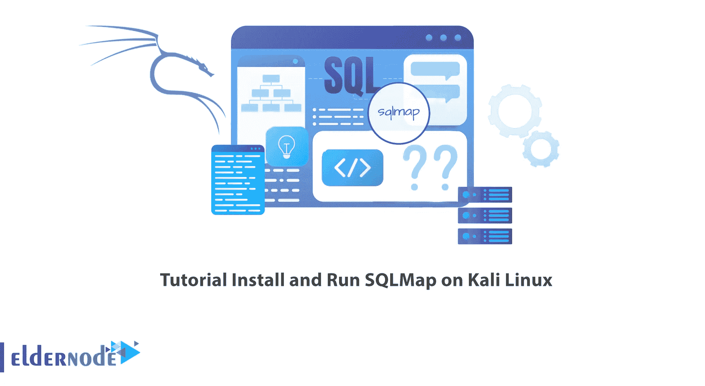

# 教程在 Kali Linux - Eldernode 博客上安装和运行 SQLMap

> 原文：<https://blog.eldernode.com/install-and-run-sqlmap-on-kali-linux/>



网络世界中最重要的攻击类型之一是 SQL 注入攻击，它在 URL 中注入 SQL 代码并执行所需的命令。有许多工具可以用来测试这种攻击的渗透能力，SQLMap 是最著名的 SQL 注入攻击工具之一。本文将教你如何在 Kali Linux 上安装和运行 SQLMap。如果你想购买一台 **[Linux VPS](https://eldernode.com/linux-vps/)** 服务器，你可以查看 [Eldernode](https://eldernode.com/) 网站上提供的软件包。

## **如何在 Kali Linux 上安装运行 SQLMap**

### **什么是 SQLMap？**

SQLMap 是 Python 编程语言中用于 SQL 注入的开源生成测试工具。默认情况下，它在 [Kali Linux](https://blog.eldernode.com/tag/kali-linux/) 中可用，并且有一个强大的检测引擎，可以很容易地检测到错误。这个强大的工具支持各种数据库，如 MySQL、Oracle、PostgreSQL、Microsoft SQL、IBM DB2、SQLite 等。

SQLMap 自动化了检测和利用 SQL 注入漏洞以及接管数据库服务器的过程。攻击者可以使用该工具进入数据库，甚至服务器。它可以选择向攻击者提供操作系统外壳，攻击者可以使用该外壳执行任意操作系统命令。这个工具是由 Bernardo Damele 和 Miroslav Stampar 开发的。

### **SQLMap 特性**

–使用登录直接连接到数据库，无需 SQL 注入

–支持各种 SQL 注入技术，如基于布尔、基于时间的盲、联合查询和基于错误。

–提取后在本地创建表格条目以提高可读性。

## **在 Kali Linux 上安装 SQLMap**

在这一节中，我们将教您如何在 Kali Linux 上安装 SQLMap。您可以通过运行以下命令来实现这一点。

首先，您应该通过输入以下命令来更新您的系统:

```
sudo apt update
```

现在运行下面的命令来安装 SQLMap。

```
sudo apt install sqlmap
```

此外，您可以使用 aptitude 安装 SQLMap，但是首先，您应该**安装 aptitude** ，因为 aptitude 在 Kali Linux 上不是默认安装的。为此，请输入以下命令:

```
sudo apt install aptitude
```

要使用 aptitude 安装 SQLMap，只需运行以下命令:

```
sudo aptitude install sqlmap
```

### **如何在 Kali Linux 上运行 SQLMap**

您可以使用以下命令**访问 SQLMap** :

```
sqlmap
```

为了**获得自动 SQL 注入**工具，使用以下命令:

```
sqlmap -h
```

### **如何删除 SQLMap 配置及其所有依赖关系**

您可以使用以下命令删除 SQLMap 配置、数据及其所有依赖项:

```
sudo apt-get -y autoremove --purge sqlmap
```

## 常见问题解答

[sp _ easy agreement]

## 结论

SQLMap 工具是最著名的 SQL 注入工具之一，它快速提供了测试通过 SQL 注入渗透到网站的可能性。它使用非常强大的检测引擎，可以快速检测与 SQL 相关的漏洞。在本文中，我们教您如何在 Kali Linux 上安装和运行 SQLMap。我希望这篇文章对你有用。如有疑问，可在评论中联系我们。