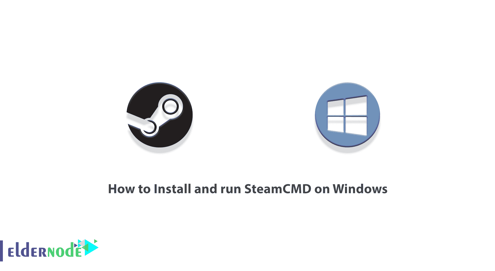

# 如何在 Windows - Eldernode 博客上安装并运行 SteamCMD

> 原文：<https://blog.eldernode.com/install-and-run-steamcmd-on-windows/>



SteamCMD (Steam 控制台客户端)是一个使用命令行界面安装和更新 Steam 上各种专用服务器的工具。它适用于使用 SteamPipe 内容系统的游戏。现在大部分游戏都已经从 HLDSUpdateTool 迁移到 SteamCMD 了。在这篇文章中，我们将教你如何在 Windows 上安装和运行 SteamCMD。您可以访问 [Eldernode](https://eldernode.com/) 中的套装，购买一台 [**专用服务器**](https://eldernode.com/dedicated-server/) 。

## **教程在 Windows 上安装运行 steam cmd**

在下一节中，我们将向您介绍 SteamCMD 并解释它是如何工作的。然后我们会一步步教你如何在 [Windows](https://blog.eldernode.com/tag/windows/) 上安装 SteamCMD。在最后一节，我们将向您展示如何运行 SteamCMD。请继续关注本文的其余部分。

## **在 Windows 上安装 steam cmd**

本节我们要讨论的是如何在 [Windows vps](https://eldernode.com/windows-vps/) 上安装 SteamCMD。为此，只需按顺序执行以下步骤。

第一步，需要为 SteamCMD 创建一个文件夹，比如 **C:/steamcmd** 。

然后你需要[下载 Windows 版的 SteamCMD](https://steamcdn-a.akamaihd.net/client/installer/steamcmd.zip) 。

现在您需要将下载到 Steamcmd 文件夹的 zip 文件的内容解压缩。

在下一节中，我们将一步步教你如何在 Windows 上运行 SteamCMD。

### **如何在 Windows 上运行 steam cmd**

在上一节中，我们解释了如何在 Windows 上下载和安装 SteamCMD。您现在可以运行它了。有两种方法可以做到这一点。

在运行 SteamCMD 软件的第一种方法中，你可以进入 SteamCMD 文件夹，点击**steamcmd.exe**。

第二种方法是通过**命令提示**。为此，您可以打开命令提示符，并使用以下命令启动 SteamCMD:

```
cd C:\steamcmd
```

```
steamcmd
```

运行 SteamCMD 后，您现在可以使用以下命令匿名登录来下载更多游戏服务器:

```
login anonymous
```

需要注意的重要一点是，有些服务器要求您使用 Steam 帐户登录。因此，我们建议您**为 SteamCMD 创建一个新的 Steam 用户名**。请注意，一个用户在任何时候只能登录一次:

```
login username
```

现在，你应该输入你的密码。

在下一步中，您可以使用以下命令启动 SteamCMD 并设置您的应用程序安装目录:

```
force_install_dir c:\steamcmd\csgoserver
```

## 结论

在本文中，我们首先尝试定义 SteamCMD。然后我们完整的教你如何在 Windows 上安装运行 SteamCMD。