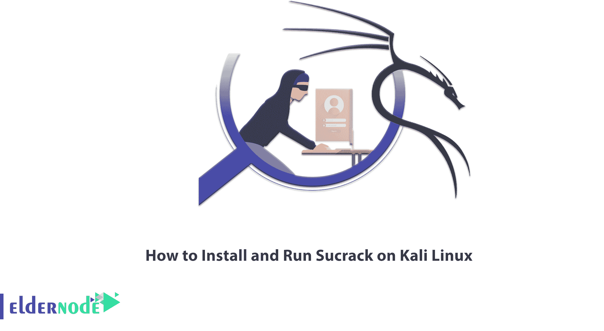

# 如何在 kali linux 上安装和运行 schrack

> 原文：<https://blog.eldernode.com/install-and-run-sucrack-on-kali-linux/>



破解是指绕过安全系统，修改软件，以删除不需要的功能来解锁和访问更多的功能，如受版权保护的功能。它在功能上类似于黑客攻击，但目标和方法不同。破解的工具之一就是 Sucrack。让我们了解一下什么是 Sucrack 以及**如何在 Kali Linux** 上安装和运行 Sucrack。如果你想购买 [**Linux VPS**](https://eldernode.com/linux-vps/) 服务器，你可以在 [Eldernode](https://eldernode.com/) 网站看到可用的软件包。

## **教程在 Kali Linux 上安装运行 Sucrack**

### **Sucrack 是什么？**

Sucrack 是一个多线程的 Linux 工具，用于通过 Su 破解本地用户帐户。如果您在帐户中的权限较低，但您在轮组中，则此工具对您很有用。要从用户那里获得密码，您需要通过连接到一个伪终端来实现 Su 工具；实际上，您不能使用简单的 shell 脚本从 STDIN 导入密码。这个工具是用 C 语言编写的，非常高效，可以同时进行多次登录。使用该工具会消耗大量 CPU 性能，并导致日志很快填满。Sucrack 可以在 FreeBSD、NetBSD 和 Linux 上运行。

## **在 Kali Linux 上安装并运行 Sucrack**

下面，我们将介绍在 [Kali Linux](https://blog.eldernode.com/tag/kali-linux/) 上安装 Sucrack 的三种方法:

1 –>如何使用 apt-get 在 Kali Linux 上安装 Sucrack

2 –>如何使用 apt 在 Kali Linux 上安装 Sucrack

3 –>如何使用 aptitude 在 Kali Linux 上安装 Sucrack

### 如何使用 apt-get 在 Kali Linux 上安装 Sucrack

运行以下命令**更新 apt 数据库**:

```
sudo apt-get update
```

然后运行下面的命令**安装 Sucrack** :

```
sudo apt-get -y install sucrack
```

### **如何使用 apt** 在 Kali Linux 上安装 Sucrack

首先运行以下命令**更新 apt 数据库**:

```
sudo apt update
```

接下来**使用以下命令安装 Sucrack** :

```
sudo apt -y install sucrack
```

### **如何使用 aptitude** 在 Kali Linux 上安装 Sucrack

要使用 aptitude 安装 Sucrack，如果在 Kali Linux 上默认没有安装 aptitude，请先安装它。然后使用下面的命令更新 apt 数据库:

```
sudo aptitude update
```

现在运行下面的命令来为 Sucrak 安装 aptitide:

```
sudo aptitude -y install sucrack
```

### **如何在 Kali Linux 上运行 Sucrack**

在您成功安装 Sucrack 之后，现在我们想教您如何运行它。为此，只需在 [Kali Linux](https://blog.eldernode.com/install-and-configure-kali-linux-on-vps/) 终端中输入以下命令:

```
sucrack -h
```

## 常见问题解答

[sp _ easy agreement]

## 结论

就这样，我们熟悉了 Sucrack，这是一个通过 Su 破解本地用户账号的工具。在本文中，我们还回顾了在 Kali Linux 上安装 Sucrack 的各种方法。