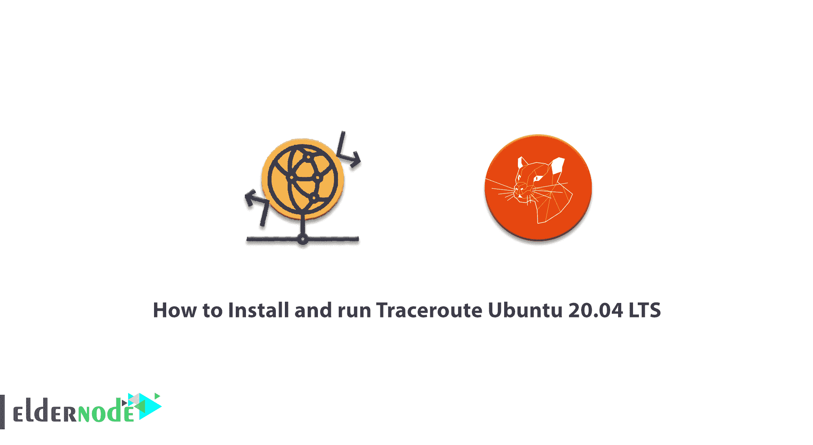

# 如何在 Ubuntu 20.04 上安装和运行 Traceroute——LTS-埃尔德诺德博客

> 原文：<https://blog.eldernode.com/install-and-run-traceroute-on-ubuntu-20-04/>



Traceroute 是一种网络检测工具。它用于跟踪网络上数据包从源到目的地的路径，并报告中间所有路由器的 IP 地址。Traceroute 还会记录数据包到达目的地的每一跳所花费的时间。在这篇文章中，我们试图向你学习如何在 Ubuntu 20.04 LTS 版上安装和运行 Traceroute。你可以在 [Eldernode](https://eldernode.com/) 看到购买 [Ubuntu VPS](https://eldernode.com/ubuntu-vps/) 服务器的套餐。

## **教程在 Ubuntu 20.04 上安装并运行 Traceroute LTS**

Traceroute 通常使用带有 TTL 值的互联网控制消息协议(ICMP)回应数据包。正在计算每一跳的响应时间。为了确保准确性，每一跳都要被询问几次(通常是三次)，以便更好地评估该特定跳的答案。Traceroute 使用 IP 地址报头中的 ICMP 消息和 TTL 端口来运行。Traceroute 工具通常作为工具包含在操作系统中，如 [Windows](https://blog.eldernode.com/tag/windows/) 和 Unix。基于 TCP 的 Traceroute 工具也是可用的。

Traceroute 是一种非常有用的工具，可用于确定响应延迟和打包环路之间的网络路径中的路由环路。这也有助于发现我们在去特定目的地时遇到的故障。在这篇文章的后续部分，加入我们来学习如何在 Ubuntu 20.04 LTS 上安装 Traceroute。

### traceroute 工具的描述

你可能对了解以下内容感兴趣。traceroute 工具使用 IP 数据包指定的路径到达网络主机或互联网。该工具显示数据包经过的路径中机器的 IP 号和主机名。还应注意，Traceroute 是一种网络故障排除工具。因此，如果用户遇到网络连接问题，跟踪器会告诉他们问题来自哪里。

### **在 Ubuntu 20.04 上安装 Traceroute | Ubuntu 18.04**

按照以下步骤在 Ubuntu 上快速安装 traceroute 指令。您可以简单地按照下面的步骤，并使用内置的 APT 包管理器将它放在您的命令行终端中。

第一步是使用以下命令进行更新:

```
sudo apt-get update -y
```

更新成功后，下一步是安装 Traceroute。您可以使用以下命令安装 Traceroute:

```
sudo apt-get install -y traceroutesudo apt-get install -y traceroute
```

最后，您应该检查系统报告中的任何相关错误。

### **如何在 Ubuntu 20.04 上运行 Traceroute**

成功安装 traceroute 后，您可以轻松运行它。您可以使用以下命令在 Ubuntu 上运行 traceroute:

```
traceroute example.com
```

注意，在上面的命令中，你必须输入你想要的目的地地址，而不是**example.com**。

需要注意的是，某些类型的 Linux 发行版要求用户在 **-I** 之后指定一个协议，比如下面的命令:

```
traceroute -I ICMP example.com
```

## 结论

当你连接到像 www.eldernode.com 这样的网站时，流量会通过各种路径和中介到达目的地。您还可以使用 Traceroute 查看每一站的延迟时间。如果你有时很难进入那个网站，但你知道那个网站工作正常，那肯定是有问题。Traceroute 命令会告诉您问题出在路径的哪一部分。从技术上讲，Traceroute 命令使用 ICMP 协议发送一系列数据包。这些数据包中的每一个都检查一个值，并有一个特定的时间。每当每个数据包的时间到达零时，路由器会将其返回并显示一条错误消息。通过这种方式发送数据包，Traceroute 可以确保每台路由器是否都在活动路径上。

在这篇文章中，我们试图；挣你如何在 Ubuntu 20.04 LTS 安装和运行 Traceroute。如果愿意可以参考 PowerShell 文章的[路由教程。](https://blog.eldernode.com/routing-tutorial-with-powershell/)