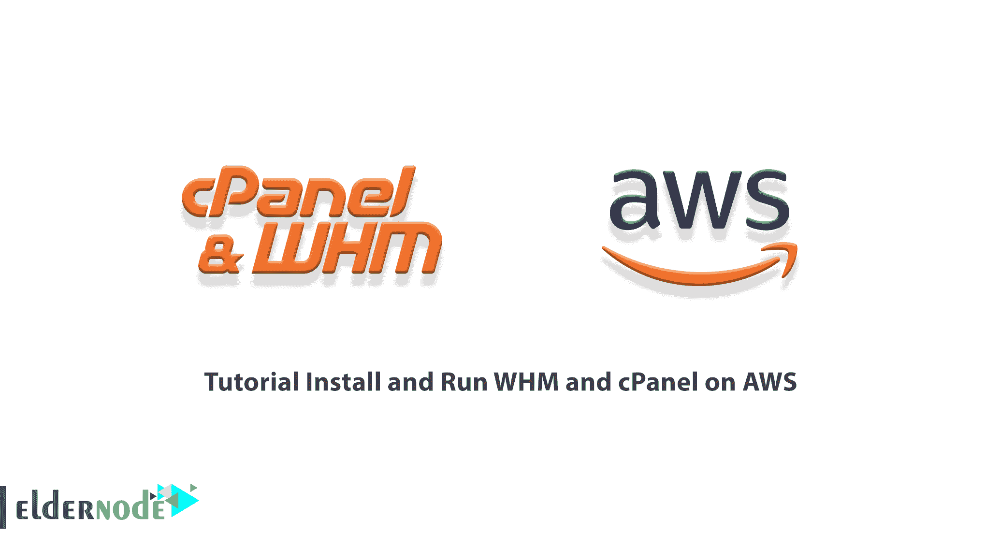
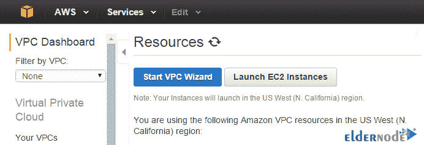
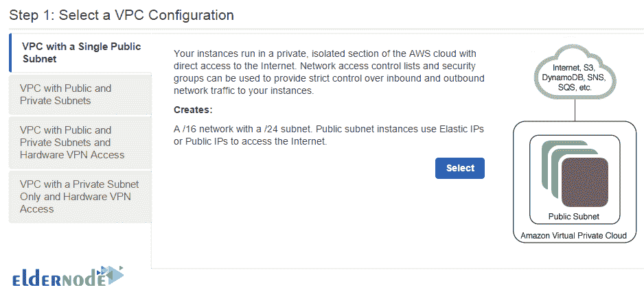
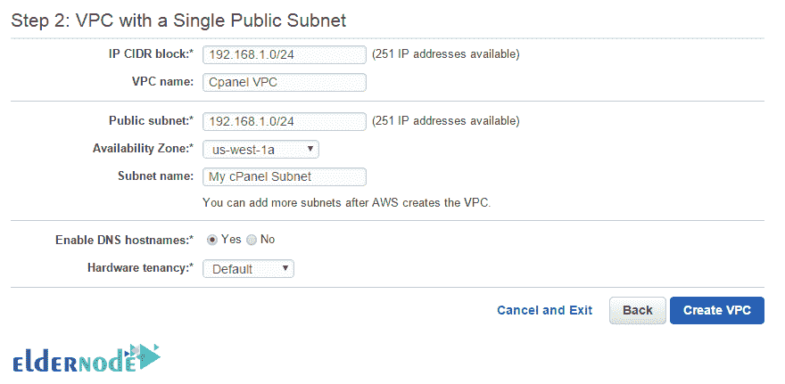
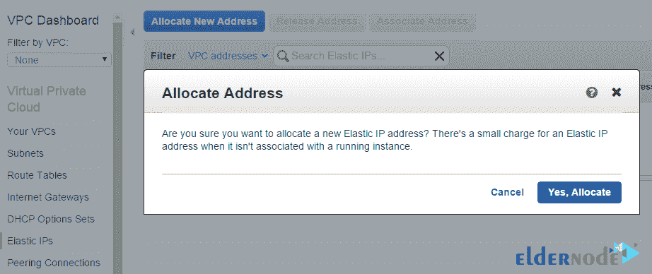
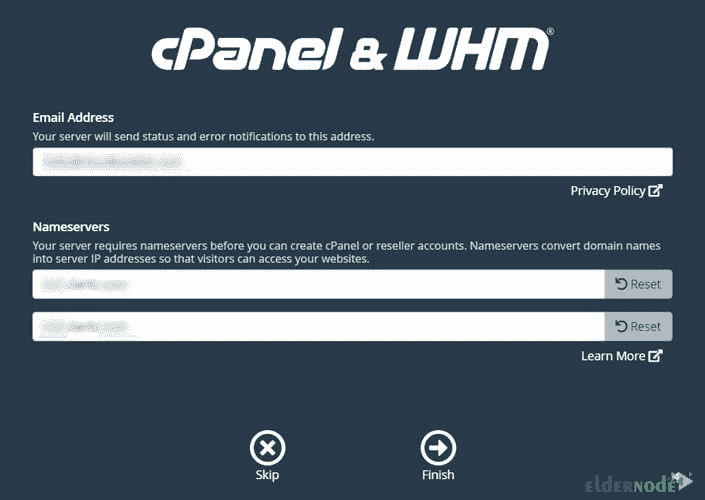
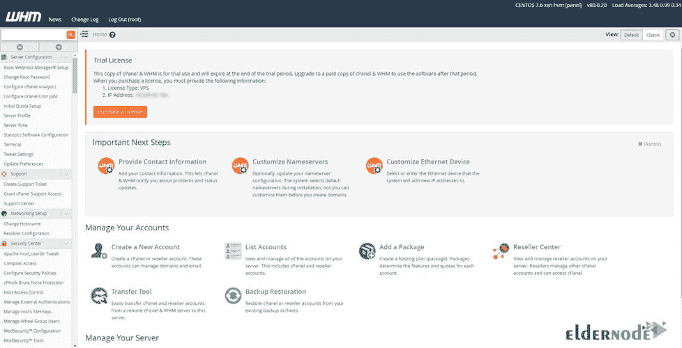

# 教程在 AWS - Eldernode 博客上安装并运行 WHM 和 cPanel

> 原文：<https://blog.eldernode.com/install-and-run-whm-and-cpanel-on-aws/>



AWS 代表亚马逊网络服务，由 Benjamin Black 和 Chris Pinkham 于 2004 年开发。AWS 为其用户和客户提供广泛的服务，包括计算、处理、服务器、网络、安全、存储、电子邮件、移动应用程序开发、数据库等。所有这些都是远程提供给客户的。在这篇文章中，我们将一步一步地教你如何在 AWS 上安装和运行 WHM 和 cPanel。如果你想购买一台 [**VPS 服务器**](https://eldernode.com/vps/) ，你可以访问 [Eldernode](https://eldernode.com/) 中提供的软件包。

## **如何在 AWS 上安装运行 WHM 和 cPanel**

### **AWS 简介**

你一定听说过亚马逊这个名字。但是你熟悉 AWS web 服务还是亚马逊？该公司是云或云服务领域的领先供应商之一。web 和应用程序开发人员可以使用 170 多种 AWS 服务，他们可以在任何地方访问这些服务。

Amazon Web Services 是一个在线平台，用于提供经济高效且可扩展的云计算方法。这个云平台提供了计算能力、数据库存储、内容制作等功能。在公司范围内甚至更大范围内。

以下是 AWS 的历史:

1.亚马逊网络服务于 2002 年推出。

2.AWS 产品于 2006 年推出。

3.首届以客户为中心的 AWS 展会于 2012 年开幕。

4.AWS 在 2015 年的售价为 64 亿美元。

5.2016 年，创收 100 亿美元被认为是这个平台的目标。

6.2016 年发布了 AWS 雪球和雪地摩托产品。

7.2019 年，发布了近 100 种新的云服务。

亚马逊为云应用提供了许多服务。以下是 AWS 生态系统的一些关键服务。该领域的亚马逊服务列表如下:

_ 计算服务

_ 保存

_ 数据库

_ 网络和内容交付

_ 安全工具

_ 开发者工具

_ 管理工具

### **什么是 WHM？**

术语 WHM 代表网络主机管理器。该软件是 cPanel 公司的产品，与 cPanel 一起为 web 主机管理员提供服务。WHM 和 cPanel 实际上是软件。这两个软件都安装在服务器上。两者之间的唯一区别是个人的访问级别和应用类型。

cPanel 控制面板是为最终用户和那些想推出自己的网站并从主机公司购买主机来上传网站的人准备的。但是，如果你想有一个托管机构，并出售托管，你会得到 WHM 访问。主服务器管理员还拥有更高级别的 WHM 访问权限。

WHM 有管理客户的工具，每个客户都有一个 cPanel。例如，服务器管理员登录到他的 WHM 帐户，为他的客户机创建 cPanel。然后，它划分硬件资源，如所需的用户空间、带宽、要托管的主机数量以及各种其他外围设备，并以 cPanel 帐户的形式将它们交付给用户。另一方面，任何想启动他们网站的人都必须登录 cPanel，它是由服务器管理员使用 WHM 控制面板创建的。

毫无疑问，WHM 是最强大的托管管理软件，尽管其许可证价格高，由于其性能和安全性，服务器管理员安装它没有任何延迟。

### **教程 cPanel** 设置 VPC(虚拟私有云)

在本节中，我们将向您展示如何在 [Cpanel](https://blog.eldernode.com/tag/cpanel/) 上设置 VPC。您必须首先登录 AWS web 控制台。然后，您需要遵循以下路径来创建一个 VPC:

**服务** > > **联网** > > **VPC** (VPC 仪表盘)

在下一步中，您必须点击**启动 VPC 向导**，如下所示:



点击**选择带有单个公共子网**的 VPC，如下图所示:



现在是时候进入你的 **CIDR** 和公共**子网**了:



在下一节中，我们将解释如何**创建 EC2 实例**。

### **如何创建 EC2 实例**

在本节中，我们将解释如何**创建 EC2 实例**。所以你得按照下面的步骤来。转到 AWS 控制台的 EC2 实例部分，使用以下步骤创建您选择的新实例:

1-选择一个 Amazon 机器映像(AMI)

2-选择实例类型

3-配置实例详细信息

4-添加您喜欢大小的存储空间

5-标记实例名

### **如何打造弹性 IP**

在这一节，我们将教你如何创建弹性 IP。要分配新的弹性 IP，您必须按顺序执行以下步骤。

第一步是进入 **VPC 仪表盘**。

然后，您可以从左栏中选择**弹性 IPs** 。

在主窗口中，点击**分配新地址**。

最后可以点击**是，分配**确认。



### **如何将弹性 IP 与实例** 绑定

在前一节学习了如何创建弹性 IP 之后，我们现在要教你如何将弹性 IP 与实例绑定。为此，只需遵循以下步骤。

第一步是转到 **EC2 仪表板**。

然后你需要在侧边栏的“**网络和安全**部分选择**弹性 IP 链路**。

现在你需要选择你的**弹性 IP** ，然后点击**关联地址**。

在最后一步中，您必须选择新创建的实例，并单击**关联**。

### **安装 cPanel 的先决条件&WHM**

在我们开始 cPanel & WHM 安装教程之前，我们需要解释一下安装 cPanel & WHM 的先决条件。请遵循以下步骤。

首先，您需要使用创建实例时生成的 **pem 文件**作为根用户登录到服务器。为此，您可以使用以下命令:

```
ssh -i server.pem [[email protected]](/cdn-cgi/l/email-protection)
```

现在，您需要使用以下命令更新系统中所有现有的软件包:

```
yum update
```

最后，您可以通过执行以下命令来**重启**系统:

```
reboot
```

下一步是**设置主机名**。您可以使用以下命令轻松地临时设置您的主机名:

```
hostname cpanel.example.com
```

完成上述步骤后，您现在可以通过编辑配置文件来进行更改。

您可以使用以下命令编辑 **RHEL** 和 **CentOS** 发行版的 **/etc/sysconfig/network** 配置文件:

```
HOSTNAME=cpanel.example.com
```

对于 **Ubuntu** 和 **Debian** 发行版，您可以编辑 **/etc/hostname** 配置文件:

```
cpanel.example.com
```

您还可以编辑 **/etc/hosts** 文件，将主机名与本地系统 IP 绑定:

```
10.0.0.100 cpanel.example.com
```

## **如何在 AWS 上安装 WHM 和 cPanel**

正确完成上述所有步骤后，我们来看看如何在 AWS 上安装 WHM 和 cPanel。至此，我们的系统已经准备好安装 cPanel 了。应该注意，您可以使用以下命令来完成安装过程。请注意，根据您的网络速度和系统配置，此过程需要一定的时间。

因此，您必须按顺序执行以下命令:

```
cd /home
```

```
yum install wget
```

```
wget -N http://httpupdate.cpanel.net/latest
```

```
sh latest
```

安装 cPanel 后，下一步需要**设置 NAT** 。需要记住的一点是，有时系统不会在您的实例中自动检测 NAT。因此，您可以使用以下命令来完成此操作:

```
/scripts/build_cpnat
```

现在，您可以在 WHM 中遵循以下路径，并检查用于设置共享 IPv4 虚拟主机的 IPv4 地址，以显示您的公共 IP 地址:

**首页** > > **服务器配置** > > **基本 cPanel & WHM 设置**

最后，您需要打开实例使用的 AWS 安全组中的所有输入端口。还应注意，您可以为输入网络打开某些端口。

### **如何运行 cPanel 和 WHM**

通过成功完成上述教程，你将能够设置 WHM 和 cPanel。现在，您可以使用以下 URL 轻松访问和运行 WHM 和 cPanel。

要访问 **WHM** ，您可以使用以下链接:

```
http://cpanel.example.com:2086
```

您也可以使用以下链接通过 SSL 访问 **WHM:**

```
https://cpanel.example.com:2087
```

您可以使用以下链接访问 **cPanel** :

```
http://cpanel.example.com:2082
```

最后，您可以使用下面的链接通过 SSL 访问 **cPanel:**

```
https://cpanel.example.com:2083
```

现在你需要打开你最喜欢的浏览器之一，进入**https://cpanel.yourdomainname.com:2087**。需要记住的一点是，一些浏览器可能会显示一条关于 HTTPS 的警告信息，并且不允许你访问 WHM 页面。注意，在这种情况下，你必须**使用你的 IP 地址**而不是域名**(https://PUBLIC _ IP _ ADDRESS:2087)**。



如上图所示，您必须输入用户名**作为 root** 。您还需要输入通过运行 passwd 命令创建的**密码**。这样你就能进入 WHM。下一步，你必须输入你的**电子邮件地址**。最后，点击**完成**。



如果你按照本文中的说明完成了所有步骤，你将被带到 WHM 主页。

## 结论

在本文的开始，我们试图向您介绍 AWS。然后我们讨论了整个 WHM。在下一步中，我们解释了在 AWS 上安装 WHM 和 cPanel 的所有先决条件。然后我们已经完全教会了你如何在 AWS 上安装和运行 WHM 和 cPanel。如果你愿意，可以参考 Linux 和 VPS 上的 [CPanel 和 WHM 安装教程。](https://blog.eldernode.com/cpanel-and-whm-installation-tutorial/)