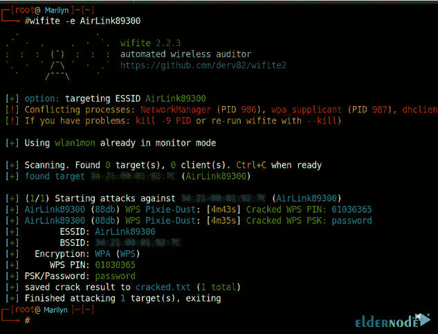
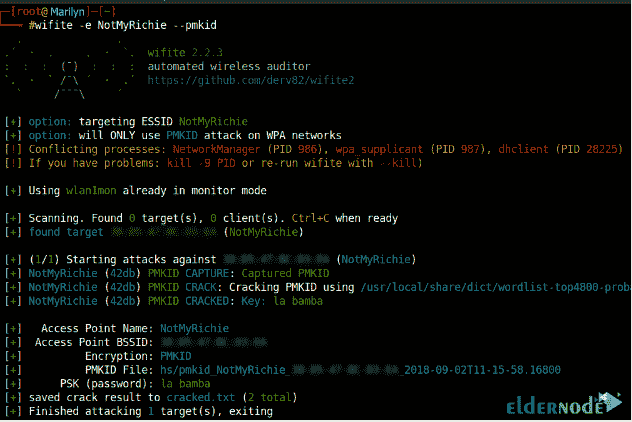
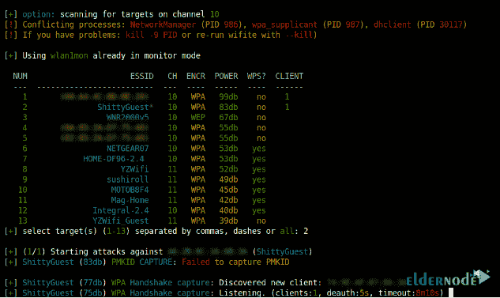
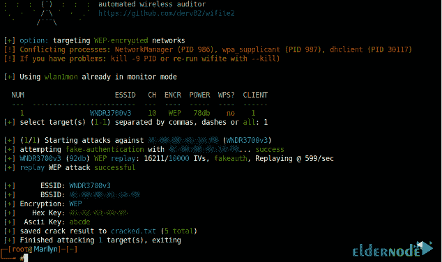
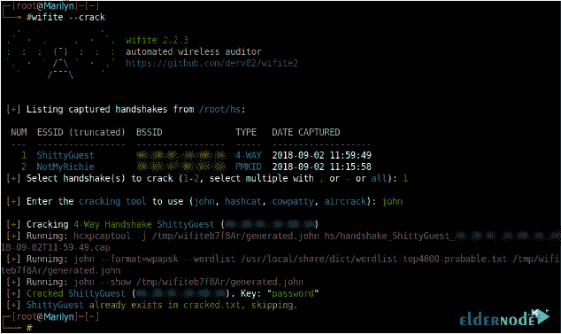

# 如何在 Kali Linux - Eldernode 博客上安装和运行 WiFite

> 原文：<https://blog.eldernode.com/install-and-run-wifite-on-kali-linux/>


之前给大家介绍过 **Kali Linux** 。它包含了大量的渗透测试工具。今天，您将了解该系列的另一个工具。WiFite 是 GNU 通用公共许可证版本 2 下的一个渗透测试工具，在本文中，我们将介绍如何**在 Kali Linux** 上安装和运行 Wifite。您可以自定义 WiFite，只需几个参数即可实现自动化，并连续攻击多个有线等效隐私、保护无线电脑网络安全系统和 Wi-Fi 保护设置加密网络。它被设计成使用所有这些最新的方法来检索无线接入路由器的密码。一旦你开始运行 WiFite，你可以选择你的目标，然后它会开始捕捉或破解密码。您不再需要记忆命令参数和开关，WiFite 将为您运行现有的无线审计工具。你可以找到你喜欢的 [Linux VPS](https://eldernode.com/linux-vps/) 包，并继续学习如何在你自己的服务器上使用这个工具。

## **教程在 Kali Linux 上安装 wifi te**

### WiFite 特性

**1-** 在 dB 中对目标进行分类时，WiFite 能够根据信号强度首先破解最近的接入点。

**2-** 自动解除隐藏网络客户端的身份验证，以显示 SSIDs。

它有如此多的过滤器来指定具体攻击什么。

**4-** 超时、包/秒和其他设置可自定义。

**5-** WiFite 可以在攻击前将 MAC 改为随机地址，作为匿名特性。攻击完成后，变回原样。

**6-** 将所有抓取的 WPA 备份到 wifite.py 的当前目录。

**7-** 它在所有客户端之间循环，并以智能 WPA 取消认证的方式广播取消认证。

你可以用 Ctrl+C 轻松地停止攻击，然后继续攻击下一个目标，甚至跳到破解并退出。

**9-** 您可以在退出时查看会话摘要，并看到破解的密钥。

**10-** 你会发现所有保存到 cracked.txt 的密码

**11-***上有内置更新程序。/wifite.py-upgrade*

### 所需工具

**1-** 具有“监控模式”功能和数据包注入的无线网卡。

**2-** 支持一些程序的最新版本，需要安装这些程序才能让 WiFite 正常工作，如 *python* 、 *iwconfig* 、 *ifconfig* 、 *Aircrack-ng* 、 *airmon-ng* 、 *aircrack-ng* 、*air play-ng*、 *airodump-ng* 、*packet TF*

**3-** 它所使用的程序套件，强制 WiFite 以 root 用户身份运行。虽然以 root 用户身份运行下载的脚本不是一个好主意，但是您可以使用 Kali Linux bootable Live SC、可引导 USB 棒或虚拟机。如果您使用虚拟机，您需要准备一个无线 USB 加密狗，因为它们不能直接访问硬件。

## **一步一步学习在 Kali Linux 上安装并运行 wif ite**

WiFite 是为最新版本的 [Kali Linux](https://blog.eldernode.com/tag/kali-linux/) 设计的。如果你使用的是最新版本的*必备工具*，WiFite 可以支持其他 pen-testing 发行版，比如 BackBox 或者 [Ubuntu Server](https://eldernode.com/ubuntu-vps/) 。现在您已经对 WiFite 足够熟悉了，是时候看看在 Kali Linux 上安装它有多容易了。

## **如何在 Kali Linux 上安装 wifi te**

运行以下命令安装 WiFite:

```
sudo apt-get install wifite
```

它将安装 WiFite 和所有软件包。

此外，您可以通过运行以下命令将 WiFite 安装到您的计算机上(从任何终端):

```
sudo python setup.py install
```

这样你就在你的终端路径里安装了 ***wifite*** 到 ***/user/bin/wifite*** 。

使用以下命令安装依赖项:

```
sudo apt-get install
```

```
sudo apt-get install aircrack-ng
```

```
sudo apt-get install reaver
```

```
sudo apt-get install pyrit
```

```
sudo apt-get install tshark
```

## **如何在 Kali Linux 上运行 wif ite**

键入以下命令运行 WiFite:

```
git clone https://github.com/derv82/wifite2.git
```

```
cd wifite2
```

```
sudo ./Wifite.py
```

### 截图

**1-** 使用 ***金甲虫*** 的仙尘攻击破解 WPS PIN，然后使用 ***恶霸*** 获取 WPA 密钥



**2-** 使用 PMKID 攻击破解 WPA 密钥



**3-** 解开并破解一个隐藏的接入点



**4-** 破解脆弱的 WEP 密码



**5-** 使用开膛手约翰破解预先捕获的握手



## 如何从 Kali Linux 中卸载 WiFite】

如果您决定卸载 WiFite，您需要在安装部分记录您通过上述命令安装的文件，并删除这些文件:

```
sudo python setup.py install --record files.txt \
```

```
cat files.txt | xargs sudo rm \
```

```
rm -f files.txt
```

如果您希望使用 pip install 而不是 python setup.py install，请删除所有文件并撤消安装手动完成的任何其他工作。但是，如果您不知道所有文件的列表，请记录已安装文件的列表。为此，请键入以下命令:

```
python setup.py install --record files.txt
```

然后，当您想要卸载时，使用 xargs 进行删除:

```
xargs rm -rf < files.txt
```

就是这样！至此，您已经阅读了对 WiFite 的简要介绍，以及安装、运行和删除它的方法。请随意购买您喜欢的 VPS，然后我们会在您身边学习如何在上面安装和配置 Kali Linux。

## 结论

在本文中，您了解了如何在 Kali Linux 上安装和运行 WiFite。2011 年 2 月，《纽约时报》称 WiFite 为“对 Wi-Fi 用户构成更大威胁的新黑客工具”。现在检测到的错误更少了，而且它不会让进程在后台运行，而这在以前的版本中是一个问题。享受这一工具的速度和准确性，并达到你认为的目的。如果你有兴趣阅读更多内容，可以找到我们的相关文章[如何在 Kali Linux](https://blog.eldernode.com/install-nishang-on-kali-linux/) 上安装 Nishang。