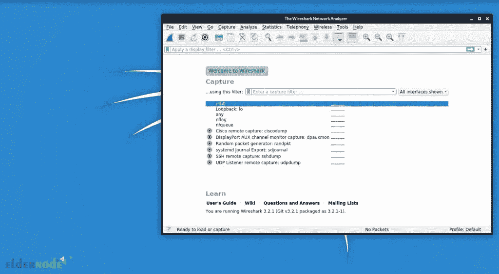

# 教程在 Kali Linux - Eldernode 博客上安装和运行 Wireshark

> 原文：<https://blog.eldernode.com/install-and-run-wireshark-on-kali-linux/>


如果您想检查和排除网络问题，您可以使用 Wireshark，这是一个完全先进的应用程序，用于捕获和分析网络流量。对于 IT 专业人员来说，很少有工具像网络数据包捕获工具 Wireshark 这样有用。本文将教你如何在 Kali Linux 上安装和运行 Wireshark。如果你想购买一台 [**Linux VPS**](https://eldernode.com/linux-vps/) 服务器，你可以查看 [Eldernode](https://eldernode.com/) 网站上提供的软件包。

## **如何在 Kali 服务器上安装运行 Wireshark**

### **Wireshark 是什么？**

Wireshark 软件是一款开源的免费网络流量控制软件，用于安全和网络等各个领域。它用于各种目的，如网络培训、分析、通信协议开发和网络故障排除。该软件可以在各种平台上运行，包括 Windows、Linux 和 Unix。在 Wireshark 软件的帮助下，您可以捕获网络数据包并在粒度级别显示它们。该工具允许您检查和过滤网络流量，放大问题的根本原因，并帮助进行网络分析，最终确保网络安全。

Wireshark 由 Gerald Combs 于 1998 年创立，一个由网络专业人员和软件开发人员组成的全球组织支持 Wireshark 并不断更新新的网络技术和加密方法。

### **Wireshark 特性**

–实时捕获和离线分析

–深入检查数百种协议

–多平台

–丰富的 VoIP 分析

–支持多种协议的解密

–读写多种不同的捕获文件格式

–标准三窗格数据包浏览器

在这篇来自 [Kali Linux 培训](https://blog.eldernode.com/tag/kali-linux/)系列的文章的续篇中，我们打算教你如何在 Kali Linux 上安装 Wireshark。

## **在 Kali Linux 上安装 Wireshark**

在开始安装之前，**使用以下命令更新您的系统**:

```
sudo apt update
```

然后运行以下命令**安装 Wireshark** :

```
sudo apt install wireshark-common
```

现在按下 **y** 开始安装。

您可以使用以下命令**检查 Wireshark** 和**分析系统中网络流量**的实用程序:

```
wireshark -h
```

```
tshark -h
```

### **如何在 Kali Linux 上运行 Wireshark**

您可以从以下路径查看 Wireshark 的图形界面:

点击**搜索**栏中的 **Kali Wireshark 菜单**–>键入**Wireshark**–>点击**输入**–>在必填字段中输入 **root 密码**。

这将打开 Wireshark 窗口。你可以在下面的图片中看到这条路线:



## 常见问题解答

[sp _ easy agreement]

## 结论

Wireshark 是网络分析和数据包调查的最佳工具之一。借助这个工具，你可以知道你的网络周围发生了什么。本文教您如何在 Kali Linux 上安装和运行 Wireshark。我希望你喜欢这个教程，它对你有用。