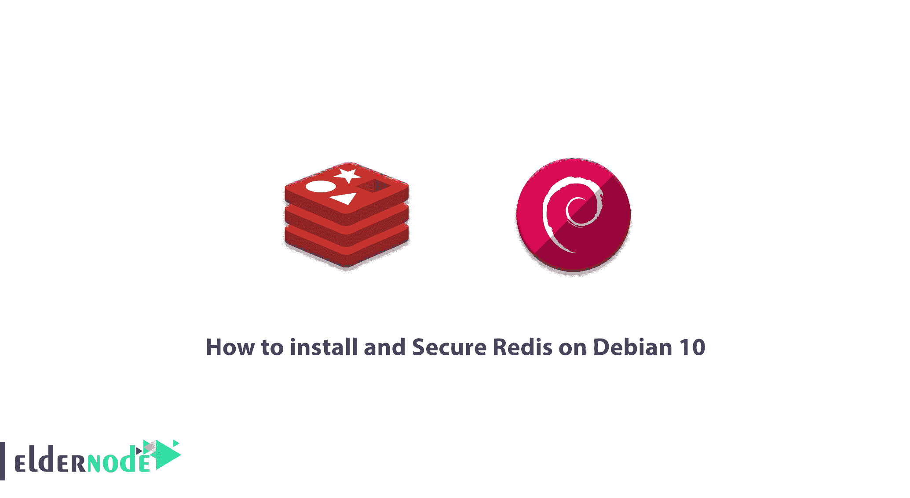

# 如何在 Debian 10 - Eldernode 博客上安装和保护 Redis

> 原文：<https://blog.eldernode.com/install-and-secure-redis-on-debian-10/>



Redis 代表远程词典服务器。Redis 是一种存储在 RAM 中的数据结构，信息临时存储在其中。Redis 用键值系统存储数据。由于这个特性，由于数据之间没有复杂的关系，访问和检索这些信息变得更加容易。在本文中，我们试图教你如何在 Debian 10 上安装和保护 Redis。如果你想买一台 [Linux VPS](https://eldernode.com/linux-vps/) 服务器，请查看 [Eldernode](https://eldernode.com/) 中提供的软件包。

## **教程在 Debian 10 上安装并保护 Redis**

Redis 与 T2、MySQL 和甲骨文等数据库有很大不同。因为它不包含列、行、表和函数。Redis 也不使用 Select、Insert、Update 和 Delete 命令。相反，Redis 使用字符串、列表、集合和散列等数据结构来对信息进行排序。另外，知道与 Redis 的交互是通过命令完成的也不错。在这篇文章的后续部分，加入我们来学习如何在 Debian 10 或 Debian 9 上安装和保护 Redis。

### **在 Debian 10 | Debian 9** 上安装并保护 Redis

要在 Debian 10 上开始安装和保护 Redis，第一步是更新系统。因此，您必须运行以下命令，然后重新启动系统:

```
apt-get update -y
```

```
apt-get upgrade -y
```

鉴于 Redis 默认在 [Debian](https://blog.eldernode.com/tag/debian/) 10 仓库中，安装起来并不困难。只需运行以下命令:

```
apt-get install redis-server -y
```

在下一步中，您需要启动 Redis 服务并激活它。通过在重启系统后这样做，Redis 将开始工作:

```
systemctl start redis-server
```

```
systemctl enable redis-server
```

要检查 Redis 服务器的状态，请运行以下命令:

```
systemctl status redis-server
```

因为 Redis 在本地主机的端口 6379 上侦听，所以您可以通过运行以下命令来检查状态:

```
ps -ef | grep redis
```

重要且实用的一点是，您可以检查 Redis 的连接状态。因此，您可以通过运行以下命令来实现这一点:

```
redis-cli
```

上述命令的输出将类似于以下内容:

```
127.0.0.1:6379>
```

检查 Redis 连接的另一种方法是使用 ping 命令:

```
127.0.0.1:6379> ping
```

如果一切正常，您将在输出中看到以下命令:

```
PONG
```

### **如何将 Redis 配置为缓存**

通过编辑以下命令中的路径，可以将 Redis 配置为缓存。我们用了一个 nano 编辑器来做这个。

```
nano /etc/redis/redis.conf
```

打开 redis.conf 文件后，您需要将以下命令放在它的底部。然后保存文件并重新启动系统以使更改生效。

```
maxmemory 64mb
```

```
maxmemory-policy allkeys-lru
```

```
systemctl restart redis-server
```

### **教程配置 Redis 认证**

因为可以在 Redis shell 中运行任何命令，所以需要为客户端配置 Redis 身份验证。完成此操作后，在执行命令之前，您将需要一个密码。要使用 nano 编辑器验证密码，请打开 **redis.conf** 文件:

```
nano /etc/redis/redis.conf
```

在打开的文件中，查找以下命令:

```
# requirepass foobared
```

您可以取消密码并用您的密码替换它，如下例所示。对文件进行更改后，**保存**并**重启**系统以应用更改:

```
requirepass Bdre26%!c
```

```
systemctl restart redis-server
```

通过执行以下命令进入 Redis shell:

```
redis-cli
```

从这一步开始，要打开 Redis 文件，必须通过输入密码执行以下命令:

```
127.0.0.1:6379> AUTH Bdre26%!c
```

然后，您可以像以前一样轻松地输入以下命令:

```
127.0.0.1:6379> INFO server
```

### **如何重命名特定命令**

根据安全问题，您可以更改一些命令。第一步是通过执行以下命令进入 Redis shell:

```
redis-cli
```

```
127.0.0.1:6379> AUTH Bdre26%!c
```

在下一步中，您需要通过运行以下命令来恢复 Redis 密码:

```
127.0.0.1:6379> config get requirepass
```

使用 nano 编辑器或您喜欢的编辑器打开 Redis 配置文件，以便您可以更改它:

```
nano /etc/redis/redis.conf
```

打开配置文件后，搜索以下命令:

```
# rename-command CONFIG b840fc02d524045429941cc15f59e41cb7be6c52
```

在这一步中，您必须替换所需的字符串。**更改后保存**文件。然后**重启**系统:

```
rename-command CONFIG H2sW_Config
```

```
systemctl restart redis-server
```

在下一步中，您可以通过执行以下命令连接到 Redis:

```
redis-cli
```

```
127.0.0.1:6379> AUTH Bdre26%!c
```

在下一步中，您必须使用新命令而不是前一个命令。以下命令与 rename 命令相同。

```
127.0.0.1:6379> H2sW_Config get requirepass
```

最后，您可以通过运行以下命令退出 Redis:

```
127.0.0.1:6379> exit
```

## 结论

Redis 很好用，这个特性导致了很多开发者使用它。但是 Redis 的好处并不止于此。Redis 的强项是这项技术的速度，由于它是用 C 编写的，我们看到 Redis 的速度有了显著的提高。有了 Redis，花费在服务器上的资源更少了，用户需要提供成本有效的基础设施。Redis 支持大多数世界领先的编程语言。JavaScript、Java、Go、C、C++、C#、Python、Objective C、PHP 等语言都很好的兼容了 Redis，Redis 可以说满足了广大开发者的需求。在本文中，我们试图向您学习如何在 Debian 10 上安装和保护 Redis。