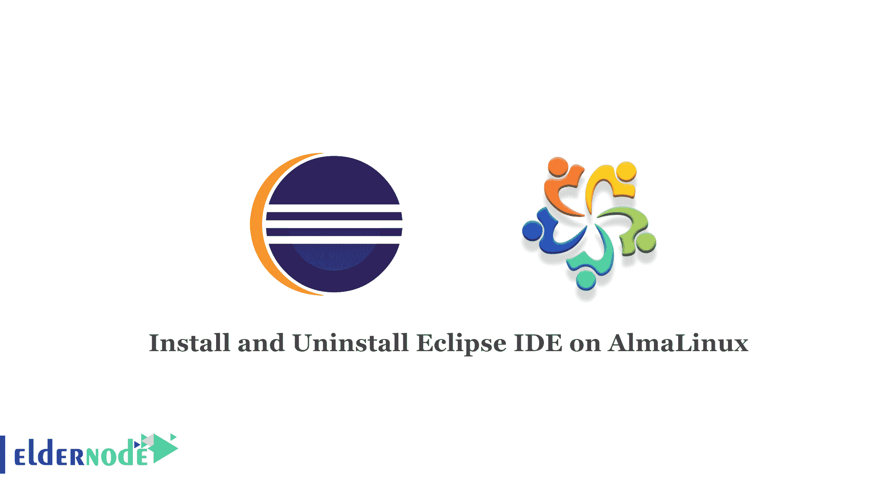

# 在 AlmaLinux 8.4 - Eldernode 博客上安装和卸载 Eclipse IDE

> 原文：<https://blog.eldernode.com/install-and-uninstall-eclipse-ide-on-almalinux/>



Eclipse 是一个用于各种编程和元语言的集成开发环境(IDE ),主要基于 Java 的编程是在这个平台上完成的。Eclipse 被定义为使用各种编程语言(如 Python、C/C++、Java、Ruby 等)开发基于计算机的应用程序的平台。在本文中，我们将一步步教你如何在 AlmaLinux 8.4、8.5 上安装和卸载 Eclipse IDE。想买一个便宜的有即时激活功能的 Linux VPS，在[的 Eldernode](https://eldernode.com/) 上订购你需要的东西。

## **如何在 AlmaLinux 上安装卸载 Eclipse IDE**

Eclipse 用于开发 Java 应用程序，但也可以用于开发其他编程语言的应用程序，如 HTML、CSS 或 PHP。

### Eclipse IDE 特性:

*   有限的依赖性
*   不同类型的插件，如静态分析、代码风格检查、系统版本检查
*   支持基于企业的 Java 工具
*   支持 JPA 工具，JSF 工具，网络服务开发，也可以编辑 XML 文件
*   使用 Eclipse 进行建模
*   支持基于 spring 的应用

### **在 AlmaLinux 8.4 上安装 Eclipse IDE | alma Linux 8.5**

a)您应该通过输入以下命令来更新您的系统:

```
sudo dnf update
```

b)现在您需要通过执行以下命令在您的 [AlmaLinux](https://blog.eldernode.com/install-and-use-almalinux/) 系统上安装 Java:

```
sudo dnf install java-11-openjdk-devel
```

c)然后，您可以使用以下命令验证 Java 版本:

```
java -version
```

d)您可以通过以下命令从官方页面下载最新的 eclipse 安装程序:

```
wget https://www.eclipse.org/downloads/download.php?file=/oomph/epp/2021-03/R/eclipse-inst-jre-linux64.tar.gz
```

接下来，您可以通过以下命令提取 Eclipse Tar 文件:

```
tar -xvf eclipse-inst-jre-linux64.tar.gz
```

```
cd eclipse-installer/
```

```
sudo ./eclipse-inst
```

现在，您应该选择您想要的 IDE 包并单击 Install。

### **如何在 AlmaLinux 8.4 上卸载 Eclipse IDE | alma Linux 8.5**

您可以通过以下命令卸载 Eclipse IDE:

```
sudo apt-get purge eclipse
```

```
rm -r ~/.eclipse/
```

## 结论

本文教您如何在 AlmaLinux 8.4、AlmaLinux 8.5 上安装和卸载 Eclipse IDE。可以在 Eclipse 中开发高级客户端应用程序，并且可以在平台上安装额外的插件。我希望这篇教程对你有用。