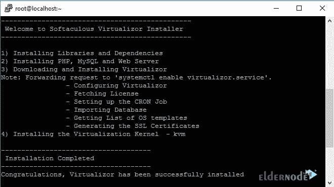
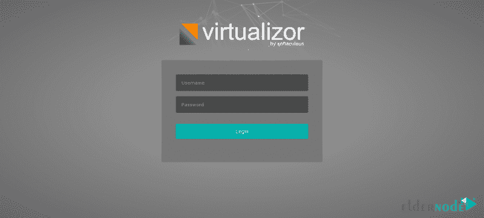

# 如何在 CentOS 7 - Eldernode 上安装和卸载 Virtualizor

> 原文：<https://blog.eldernode.com/install-and-uninstall-virtualizor-on-centos/>


Virtualizor 是 Softaculous Ltd .开发的一款功能强大的基于 web 的 VPS 控制面板。无论您是管理员还是最终用户，Virtualizor 都是为您设计的，只需点击一下鼠标即可在服务器上部署和管理 VPS。管理员可以即时创建 VPS。由于该模块支持非标准功能，最终用户可以启动、停止、重启和管理他们的 VPS。Virtualizor 非常适合操作，因为它支持 OpenVZ、Xen PV、Xen HVM、XenServer 和 Linux KVM 虚拟化。在本文中，您将学习如何在 CentOS 7 上安装和卸载 Virtualizor。要购买一个便宜的 [CentOS VPS](https://eldernode.com/centos-vps/) ，可以在 [Eldernode](https://eldernode.com/) 上订购你需要的东西。

## **教程在 CentOS 7 上安装 Virtualizor**

作为管理员，您需要为经销商创建计划和定价，并为额外的资源利用率设置资源定价。使用 Virtualizor 可以让你做到这一点，因为它有一个内置的计费面板和三个内置的支付网关。如果您启用它，您还可以在 WHMCS 上开发票。

### **在 CentOS 7 上安装 Virtualizor 的先决条件**

为了让本教程更好地工作，请考虑以下先决条件:

_ CentOS 7.x / 8.x(测试版)

_ yum

_ 用于创建 VPS (DomUs)磁盘的存储

_ 安装 KVM 的 64 位操作系统

## **如何在 CentOS 7 |** **CentOS 8** 上安装 Virtualizor

要创建物理硬件的虚拟副本，您需要虚拟化。它允许你同时运行一个不同于物理机器的操作系统。Virtualizor 是一个完整的虚拟化解决方案，支持所有主要的操作系统，包括 [Linux](https://blog.eldernode.com/tag/linux/) 和 Windows。

按照以下步骤在 CentOS 7 上安装 Virtualizor。

首先，打开一个 Shell 终端并通过 SSH 连接到您的服务器。然后，运行以下命令:

```
wget -N http://files.virtualizor.com/install.sh
```

```
chmod 0755 install.sh
```

```
./install.sh [[email protected]](/cdn-cgi/l/email-protection) kernel=kvm
```

***注意:*** 不要忘记更换正确的邮箱地址。

预计安装将立即开始。然后，您可以看到如下所示的内容:



安装完成后，按“ **y** ”重启系统。


### **如何在 CentOS 7 |**CentOS 8上访问 Virtualizor

成功安装后，您可以登录到 Softaculous Virtualizor 管理面板。为此，请访问以下 URL:

```
https://Your-Server-IP:4085/
```

```
http://Your-Server-IP:4084/
```

使用服务器的根详细信息登录。



成功登录后，您可以看到控制面板。


### 如何在 CentOS 7 上使用 Virtualizor

由于 Virtualizor 使用 4081–4085 端口，如果防火墙对此有限制，您必须允许这些端口。

对于 CentOS 7，运行:

```
firewall-cmd --zone=public --permanent --add-port=4081-4085/tcp
```

```
firewall-cmd --zone=public --permanent --add-port=5900-6000/tcp
```

但是如果您喜欢使用 Webuzo 模板来创建 VM，那么您需要允许端口 2002-2005

要创建任何虚拟机，您应该定义您的存储。为此，请遵循以下路径查看向导:

导航到 Virtualizor 管理面板>存储>添加存储

## **如何卸载 CentOS 7 上的 Virtualizor**

如果您出于任何原因希望卸载 Virtualizor，请使用以下命令将其删除:

```
service virtualizor stop
```

```
service virtnetwork stop # For KVM only
```

```
rm -rf /usr/local/emps
```

```
rm -rf /usr/local/virtualizor
```

```
rm -rf /var/virtualizor
```

## 结论

在本文中，您了解了如何在 CentOS 7 上安装和卸载 Virtualizor。为 CentOS 安装 Softaculous Virtualizor 非常简单，现在您可以使用最强大的云面板。我们不希望你遇到严重的问题，但是，让我们知道任何可能的问题。