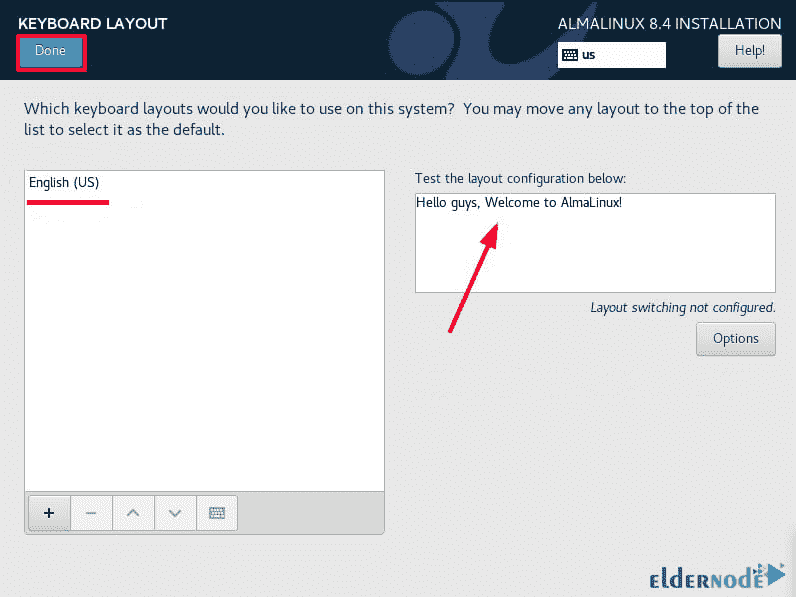
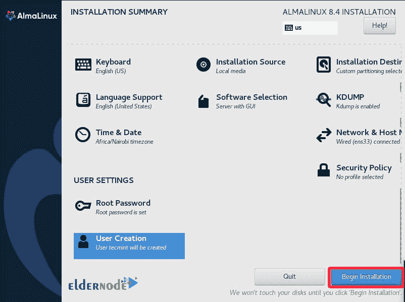

# 如何安装和使用 alma Linux 8.4[完整版] - Eldernode 博客

> 原文：<https://blog.eldernode.com/install-and-use-almalinux/>

![How To Install and Use AlmaLinux 8.4 [Complete]](img/4db704e7d6c957a0159123a90362edcc.png)

AlmaLinux 发行版是由 CloudLinux 操作系统的创建者构建的 RHEL 8 的二进制分支。至少在 2029 年之前，AlmaLinux 是取代 CentOS 的有力选择。在本文中，我们将一步一步地教你如何安装和使用 AlmaLinux 8.4 。如果你想买一个 [**Linux VPS**](https://eldernode.com/linux-vps/) 服务器，你可以在 [Eldernode](https://eldernode.com/) 看到可用的软件包。

## **教程安装使用 AlmaLinux 8.4**

### **alma Linux 简介**

[AlmaLinux](https://blog.eldernode.com/cloudlinux-almalinux-will-replace-centos/) 是一个开源的、基于社区的 Linux 操作系统，它填补了稳定版 [CentOS](https://blog.eldernode.com/tag/centos/) Linux 停产后留下的空白。AlmaLinux OS 是由社区指导和构建的 RHEL 1:1 二进制兼容分支。作为一个独立的、完全免费的操作系统，AlmaLinux 每年从 CloudLinux Inc .和其他赞助商那里获得 100 万美元的支持。

有趣的是，AlmaLinux 操作系统是一个公司服务器操作系统，是一个稳定的 Linux 发行版，带有长期支持窗口的常规版本。您可以依赖 AlmaLinux 来运行任何重要的工作负载。

另一个要点是 AlmaLinux 操作系统基金会的成员、他们的赞助商和合作伙伴以长期投资和支持承诺来支持 AlmaLinux 操作系统。这样做是为了确保分发不受限制并且具有成本效益。

### **安装 AlmaLinux 的先决条件**

_ 一个 AlmaLinux 8.4 的 [ISO 镜像文件。](https://mirrors.almalinux.org/isos.html)

_ 一个 16 GB 的 USB 驱动器，用作可引导的安装介质。

***注意:***ISO 下载完成后，您可以使用 UNetbootin 或 Etcher 工具从 ISO 映像制作可引导的 USB 驱动器。

_ 至少 15GB 硬盘空间和 2GB 内存。

## **开始安装 AlmaLinux 前如何配置**

在这一节中，我们想完整地教你如何在安装 AlmaLinux 8.4 之前配置 AlmaLinux。为此，您必须仔细遵循以下步骤。

### **如何启动 AlmaLinux**

将 AlamLinux 文件下载到可引导的 USB 驱动器后，连接并重启系统。请注意，BIOS 中的引导设置是从 USB 驱动器引导的。

请注意，当您的计算机启动时，您会看到一个带有安装选项的黑屏。你需要选择第一个选项**安装 AlamLinux 8.4** ，如下图所示，然后按**回车**:

完成上一步后，将显示重启消息:

如下图所示，安装程序启动基本指令:

### **如何设置安装 AlmaLinux 的语言**

在下一部分，您必须**选择您想要安装 AlmaLinux 的语言**并点击**继续**:

### **将键盘配置为 alma Linux**

下一步是设置键盘。为此，点击“**本地化**部分中的“**键盘**图标:

如你所见，默认的键盘语言设置为**英语**。请注意，您可以测试文本在右侧文本框中的显示方式:

### **配置语言支持**

点击**语言支持**图标，启动语言支持。通过这样做，您将能够在安装完成后添加其他语言。所以选择语言支持选项后，点击**完成**:

*

### **如何为 AlmaLinux** 设置时间和日期

要进行**时间和日期**设置，首先点击它，如下图所示。然后点击世界地图，并设置您的位置。在下一步中，您需要设置相关的时间和日期。完成后，点击**完成**:

*

### **alma Linux 中的软件章节设置**

在下一部分，我们要配置软件部分。注意在“**软件**部分，有两个选项: **1)安装源**和 **2)软件选择**。您必须点击“**安装源**选项:

安装源已经设置为“**自动检测安装介质**”。所以只需点击**搞定**:

返回上一页，点击**软件选择**:

选择带有 GUI 的**服务器选项，如下所示。然后选择所需的环境，并从右侧面板中选择任何附加组件。完成后，点击**完成**:**

### **如何在 AlmaLinux 中设置分区**

在这一节，我们想教你如何分区。如下图所示，可以在“**安装目的地**”部分的“**系统**中找到

需要注意的一点是，默认情况下，分区设置为**自动**。这个设置非常适合新手。但是您可以手动进行分区以获得完全的控制。为此，选择“**定制**”选项并点击“**完成**”:

在**分区手动**窗口中，点击( **+** )按钮:

现在您需要填写**/引导挂载点**的详细信息，并点击“**添加挂载点**按钮:

与下图类似，对于根挂载点(/)，填写详细信息并单击“**添加挂载点**按钮:

*

查看您所做的设置后，点击**完成**:

在打开的窗口中，点击**接受更改**:

### **如何为 AlmaLinux** 配置网络和主机名

设置网络和主机名是另一件需要做的事情。您可以更改网络适配器，以便使用 DHCP 从 DHCP 服务器动态获取 IP 地址。

### **用户设置为 AlmaLinux**

与下图类似，您可以指定您的系统主机的名称，然后单击“**应用**”。然后点击**完成**保存所有修改。

按照下图配置主密码，点击 **Done** :

现在可以点击**用户创建**:

填写完必填字段后，点击 **Done** :

## **安装 AlmaLinux 8.4**

现在，您已经完成了前面几节中的预安装配置，我们现在转向如何安装 AlmaLinux。为此，点击“**开始安装**按钮:

*

您应该点击“**重启系统**按钮，以查看下图并移除 USB 安装介质:

通过完成以上步骤，AlmaLinux 安装就完成了。在下一节中，我们将看看如何设置和开始使用 AlmaLinux。请加入我们。

### **如何启动和使用 AlmaLinux**

在这一节中，我们想教你如何启动 AlmaLinux。重启系统时，Grub AlmaLinux 提供了两个选项。要开始，请选择第一个选项:

在下一步中，您必须点击"**执照** **信息**选项:

现在，选择接受许可协议的选项后，单击 **Done** :

最后，点击**完成配置**:

您应该通过查看下图来点击您的帐户:

在下一部分中，输入密码后，您必须点击**登录**:

如果正确完成了所有步骤，就可以进入 **AlmaLinux 桌面环境**:

## 结论

如前所述，AlmaLinux 是 RHEL 的二进制衍生产品，是 CentOS 的替代品。该脚本发行版已经发展到从 CentOS 8 迁移到 AlmaLinux，可以使用转换 Linux 而无需重新安装，但在此之前，要对整个操作系统及其内容进行完整备份。在本文中，我们试图教你如何安装和使用 AlmaLinux 8.4。