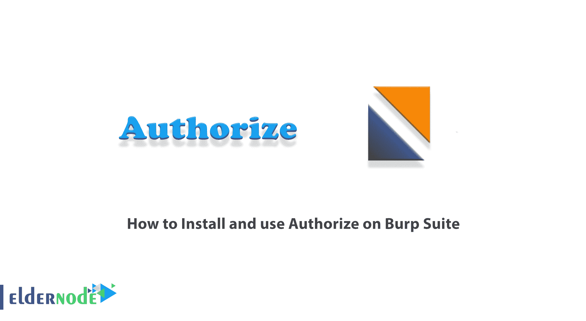
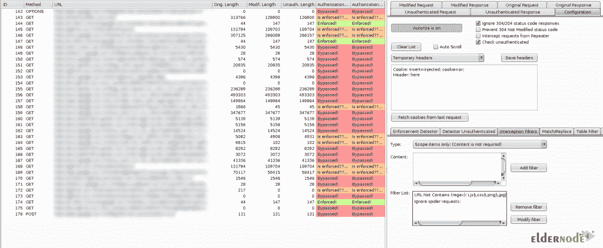
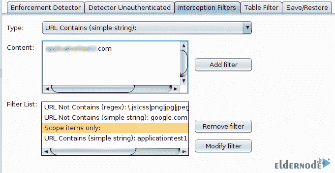

# 如何在 Burp Suite - Eldernode 博客上安装和使用 Authorize

> 原文：<https://blog.eldernode.com/install-and-use-authorize-on-burp-suite/>

Autorize 是一个自动附加检测程序的打嗝套件。Autorize 旨在通过执行自动授权测试来帮助安全测试人员。应该注意的是，在最近的版本中，Autorize 还执行自动验证测试。在本文中，我们将一步一步地教你如何在 Burp Suite 上安装和使用 Authorize。如果您想购买 [**VPS**](https://eldernode.com/vps/) **托管服务器**，可以访问 [Eldernode](https://eldernode.com/) 中的软件包。

## **教程在打嗝套件上安装和使用授权**

Autorize 无需任何配置即可工作，但也是高度可定制的，允许配置授权实施条件的粒度，以及插件必须测试哪些请求和不测试哪些请求。

在下一节中，我们将向您介绍 Autorize。然后我们将教你如何在[打嗝套件](https://blog.eldernode.com/tag/burp-suite/)上安装 Autorize。最后，我们将解释如何使用 Autorize。请继续关注本文的其余部分。

### **打嗝套件上有什么授权？**

Autorize 是一个扩展，旨在帮助渗透测试人员检测 autorize 漏洞。有趣的是，Autorize 是 web 应用程序渗透测试中比较耗时的任务之一。

除了权限之外，Autorize 还可以用于识别身份验证漏洞，即在没有 cookie 的情况下重复任何请求的可能性。给分机一个低权限用户的 cookies，用高权限用户导航网站就足够了。该扩展自动重复低特权用户会话的每个请求，并检测授权漏洞。

在这篇文章的后续部分，加入我们来教你如何在 Burp Suite 上安装 Autorize。

## **在打嗝套件上安装授权**

在这一节中，我们想教你如何在 Burp Suite 上安装和使用 Autorize。为此，只需遵循以下步骤。第一步是[下载打嗝套件](https://portswigger.net/burp)。

然后您需要在下一步[下载 Jython 独立 JAR](https://www.jython.org/download.html) 。

成功安装上述程序后，您现在应该按顺序执行以下步骤。打开打嗝后，您必须遵循以下路径:

打嗝>>扩展器>>选项>> Python 环境> >选择文件

现在您应该选择 **Jython 独立 JAR** 。

现在，您可以使用两种方法安装 Autorize。第一种方法是通过 **BApp Store** 安装 Autorize。但是在第二种方法中，你需要先下载 **Autorize.py** 。那么你应该遵循下面的路径:

打嗝>>扩展器>>扩展>>添加>>选择 Autorize.py

一旦你正确地完成了上述步骤，你现在可以通过参考**自动调整**选项卡来轻松地使用自动调整。

### **如何分步使用:**

在您成功完成上一节中的上述步骤后，我们现在想教您如何在 Burp Suite 上使用 Autorize。

第一步是**打开打嗝套件**。然后在**自动调整**选项卡中点击**配置**。然后，您应该将其复制到包含文本“**在此插入注入的标题**”的**文本框**。

如果不需要认证测试，您可以取消选中“**检查未认证的**”。

重要的一点是，如果您想要拦截通过中继器发送的请求，您可以选中“**拦截来自中继器**的请求”。

需要注意的是，如果你想让 Autorize 检查授权执行，你必须点击“**拦截关闭**”。这样做，你就可以开始拦截流量。

现在是时候配置浏览器代理设置，将流量传输到 Burp。下一步，你可以参考你想用高评价用户测试的节目。

如果你想用 Autorize 插件跟踪你想要的域，你需要使用**拦截过滤器**标签。要做到这一点，您可以在 Burp 域中指定黑名单/白名单/正则表达式或项目，这样不必要的域就不会被 Autorize 跟踪，您会更有组织性。

您可以在下图中看到如何使用该部分:

## 结论

Autorize 是 Burp Suite 的自动授权执行检测扩展。它帮助您检测授权漏洞。在本文中，我们试图教你如何在 Burp Suite 上安装和使用 Autorize。