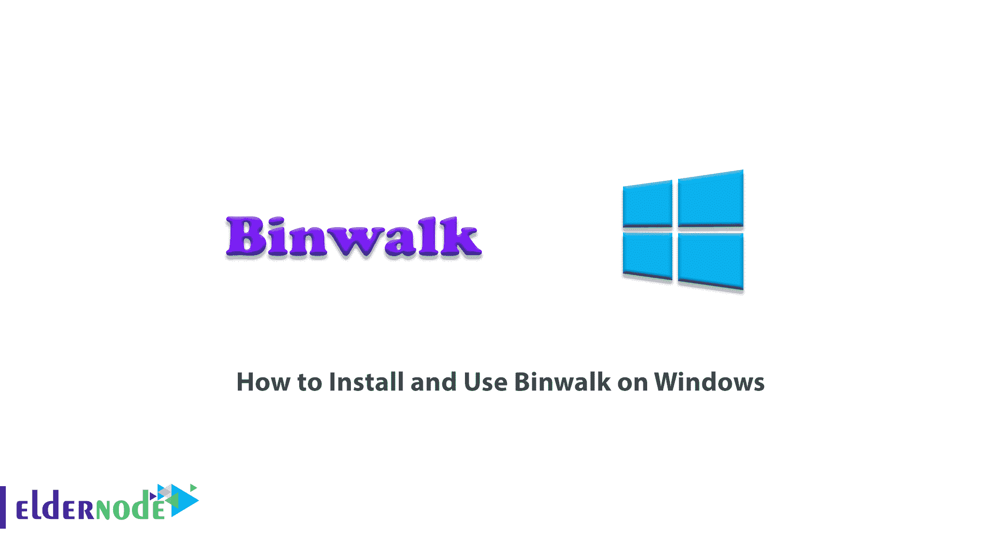
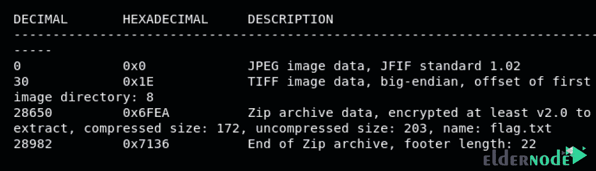

# 如何在 Windows - Eldernode 博客上安装和使用 Binwalk

> 原文：<https://blog.eldernode.com/install-and-use-binwalk-on-windows/>



Binwalk 是一个固件逆向工程工具。事实上，扫描目标，允许你检查和剖析固件。Binwalk 可以在 Linux、OSX、FreeBSD、Windows 操作系统上安装和运行。如果您想使用 Binwalk 的所有功能，建议您将它安装在 Linux 上。在这篇文章中，我们将教**如何在 Windows** 上安装和使用 Binwalk。你可以访问 [Eldernode](https://eldernode.com/) 提供的包来购买 [Windows VPS](https://eldernode.com/windows-vps/) 服务器。

## **教程在 Windows 上一步步安装使用 Binwalk**

Binwalk 是一个重定向程序，用于传递参数和 Binwalk 执行命令。例如，如果您通过 cmd 输入“ **binwalk file.bin** ”作为命令，该程序会将其作为“ **python Binwalk file.bin** ”运行。所以它很容易实现。在下一节，我们将教你如何在 [Windows](https://blog.eldernode.com/tag/windows/) 上安装 Binwalk。和我们在一起。

### **在 Windows 上安装 Binwalk**

要在 Windows 上安装 Binwalk，第一步需要下载安装 [Python](https://www.python.org/) 。下一步是安装 **python-lzma 模块**。成功完成上述步骤后，您现在应该可以从 GitHub 上的 [Binwalk repo](https://github.com/ReFirmLabs/binwalk) 下载 Binwalk zip 文件了。

然后你需要提取下载的文件并打开它。现在打开 **CMD** 。

在 CMD 环境中输入以下命令。通过执行此命令，将安装 Binwalk。

```
python setup.py install
```

下一步，你需要[下载 binwalk.py 脚本](https://github.com/jowinjohnchemban/binwalk/blob/master/binwalk.py)。请注意，该文件将放在桌面上的一个单独的文件夹中。

需要注意的是，你必须在上面的文件夹中打开 CMD。然后输入以下命令。通过在 CMD 中输入以下命令，安装了 **pyinstaller** 。

```
pip install pyinstaller
```

创建一个可执行文件(**)。exe** )必须输入以下命令:

```
pyinstaller --onefile binwalk.py
```

您可以通过转到当前文件夹找到可执行文件。然后你需要把它复制到“ **C:\Windows\System32** ”。

成功完成前面的步骤后，现在可以删除您在桌面上创建的文件夹了。

### **如何在 Windows 上使用 Binwalk**

在本节中，我们将向您展示一个如何使用 Binwalk 工具的示例。如果您遵循以下步骤，您将完全熟悉如何使用 Binwalk。正如你在下图中看到的，我们有一个名为**brain.jpg**的图像文件。


要使用 Binwalk 分析该图像，必须使用以下命令:

```
binwalk brain.jpg
```

通过执行上述命令，您将看到以下输出:



如你所见，这不是一个普通的图像。这个图像包含一个 ZIP 存档，其中有一个名为 **flag.txt** 的文件。您可以使用以下命令从映像中提取以下文件:

```
binwalk -e brain.jpg
```

需要注意的是，Binwalk 提取图片的内容，放在一个名为 **_brain.jpg.extracted** 的文件夹中。

## 结论

Binwalk 是快速分析和逆向工程工具，用于提取固件映像。在本文中，我们试图向您介绍如何在 Windows 上安装和使用 Binwalk。需要注意的是，如果想在 [Ubuntu](https://blog.eldernode.com/install-binwalk-on-ubuntu-20-04/) 和 [Kali Linux](https://blog.eldernode.com/introducing-and-install-binwalk-on-kali/) 发行版中安装 Binwalk，可以参考我们的文章。