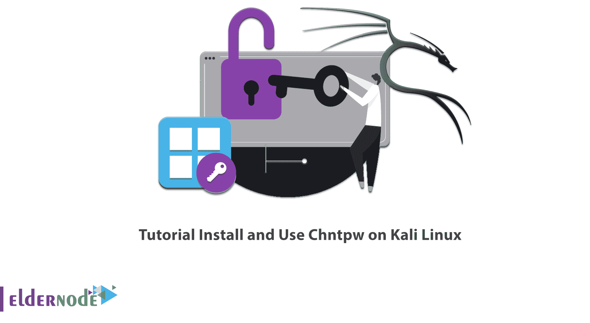

# Kali Linux - Eldernode 博客上的安装和使用 Chntpw 教程

> 原文：<https://blog.eldernode.com/install-and-use-chntpw-on-kali-linux/>



在本文中，我们将介绍另一个 Kali Linux 工具，它用于访问和更改密码。这个密码破解工具就是 **Chntpw** 。下面，我们将对 Chntpw 做一个简单的解释，然后你将学习**如何在 Kali Linux** 上安装和使用 Chntpw。如果你想购买一台 [**Linux VPS**](https://eldernode.com/linux-vps/) 服务器，请查看 [Eldernode](https://eldernode.com/) 网站上提供的软件包。

## **如何在 Kali Linux 上安装使用 Chntpw**

### **chnt pw**简介

Chntpw 是一个在 Kali Linux 中查看一些信息和更改密码的实用程序。该工具有 2 个编辑器；一个**简单的注册表编辑器**，它以相同的大小写入数据，一个**十六进制编辑器**，用于查看和解释注册表文件中的信息。

### **Chntpw 在什么情况下使用？**

Chntpw 可用于重置密码、将用户提升为管理员、为用户帐户添加锁或移除锁。它还可以用来从 **SAM** 中检索信息，如帐户、帐户类型、密码散列。该工具可以更改 SAM 中的值来重置或更改密码。

**注** : SAM(安全账户管理器)是一个存储数据的数据库。

在这篇来自 [Kali Linux 培训](https://blog.eldernode.com/tag/kali-linux/)系列的文章的续篇中，我们打算教你如何在 Kali Linux 上安装和使用 Chntpw。

## **如何在 Kali Linux 上安装 Chntpw**

您应该运行下面的命令在 Kali Linux 上安装 Chntpw:

```
apt install chntpw
```

## **如何在 Kali Linux 上使用 Chntpw**

Chntpw 工具用于重写密码。运行以下命令来使用它:

```
chntpw -h
```

让我们回顾一下 Chntpw 的不同工具:

### **在 Kali Linux 上使用 Reged**

此工具用于导出或导入和编辑操作系统的注册表配置单元。将它与以下命令一起使用:

```
reged -h
```

### **在 Kali Linux 上使用 Sampasswd**

该工具用于重置 SAM 用户数据库中用户的密码。通过运行以下命令来使用它:

```
sampasswd -h
```

### **在 Kali Linux 上使用 Samunlock**

您可以使用该工具解锁 SAM 用户数据库中的用户。运行以下命令来使用它:

```
samunlock -h
```

### **在 Kali Linux 上使用 Samusrgrp**

通过运行以下命令，使用此工具在 SAM 数据库文件的组中添加或删除用户:

```
samusrgrp -h
```

## **常见问题**

[sp _ easy agreement]

## 结论

在本文中，您了解了用于访问和更改密码的 Chntpw。您还学习了如何在 Kali Linux 上安装 Chntpw，以及如何使用 Chntpw 的不同工具。